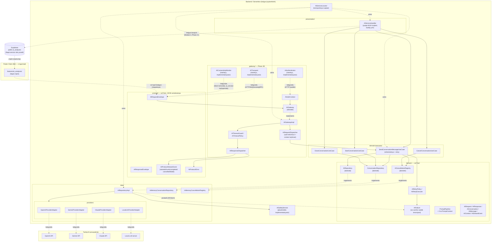
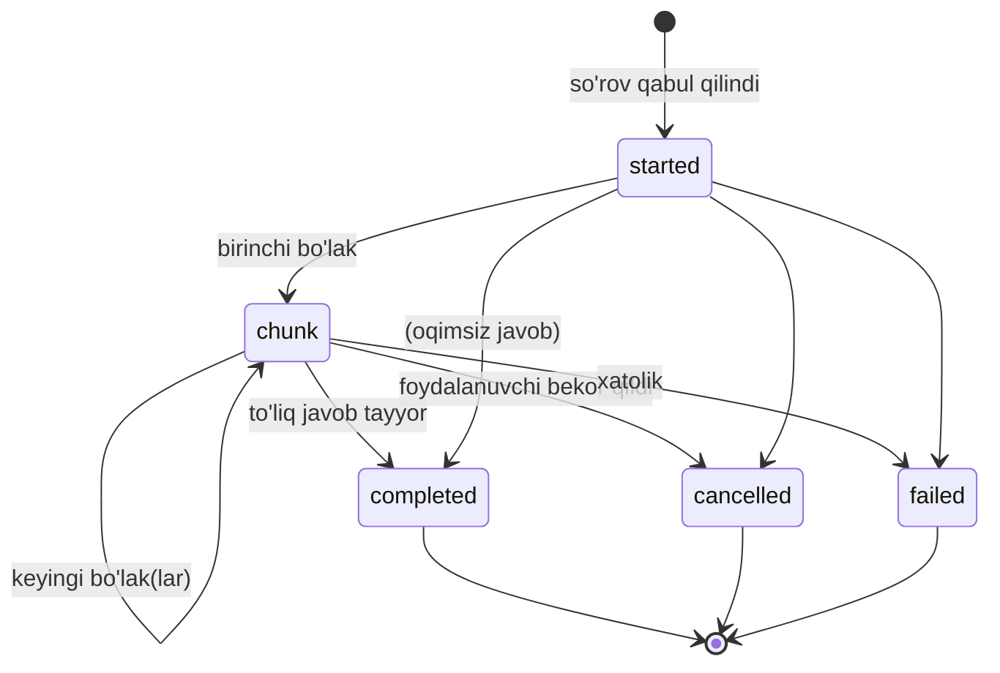

# AI_ARCHITECTURE.md — AI Service Foundation (Module 4, Phase 1–3B)

Bu hujjat `ai_service/` (repozitoriya ildizida, `lib/`dan tashqarida) qurilgan AI Service arxitekturasini tasvirlaydi. **Ko'lam: faqat poydevor va arxitektura — haqiqiy huquqiy fikrlash mantig'i yoki prompt mazmuni bu bosqichda yozilmagan.**

**Phase 2A yangilanishi:** Phase 1'dagi yagona `AISessionManager` klassi ikkita alohida, abstrakt shartnomaga ega qismga bo'lindi — `ConversationRepository` (suhbat tarixi/hayot davri) va `AICancellationRegistry` (bekor qilish kuzatuvi) — "Conversation Repository Contracts" bo'limiga qarang. `AIConversation`ga hayot davri holati (`AIConversationStatus`) va `close()` qo'shildi; `AIServiceHandler` endi oqim natijasini suhbat tarixiga avtomatik yozadi (quyidagi "Request Flow"ga qarang).

**Phase 2B yangilanishi:** `UserContext.role` va `CaseContext.caseType` xom `String`dan tur-xavfsiz enum'ga (`AIUserRole`, `AICaseType`) o'tkazildi; `CaseContext`ning invarianti kuchaytirildi (`caseType` endi mos ID bilan mos kelishi tekshiriladi). Yangi `ContextAssembler` — beshta kanonik context'ni (majburiy: System/User/Safety, ixtiyoriy: Case/Memory) tur-xavfsiz, kompilyatsiya vaqtida tekshiriladigan tarzda yig'uvchi yuqori daraja — "Prompt Pipeline / Context Assembler" bo'limiga qarang.

**Phase 2C yangilanishi:** Orkestratsiya mantig'i (suhbat tarixi bilan bog'lanish, qayta urinish) `AIServiceHandler`dan (kirish nuqtasi) `domain/usecases/`ga ko'chirildi — `AIServiceHandler` endi faqat delegatsiya qiluvchi "yupqa" (thin) qatlam. Xom `String message` o'rniga tur-xavfsiz `AIFailure` xatolik ierarxiyasi kiritildi (`isRetryable` xususiyati bilan); `ConversationRepository`/`AIConversation` endi umumiy `StateError` o'rniga aniq ajraladigan `ConversationNotFoundException`/`ConversationClosedException` tashlaydi. Yangi `AIRetryPolicy`/`AIRetryExecutor` — streaming-xavfsiz (allaqachon chiqarilgan `chunk`lardan keyin qayta urinilmaydi) qayta urinish mexanizmi. Quyidagi "AI UseCases & Orkestratsiya", "Xatolik Abstraksiyasi" va "Qayta Urinish Abstraksiyasi" bo'limlariga qarang.

**Phase 3A yangilanishi:** Yangi `protocol/` papkasi — Flutter klient ↔ backend orasidagi SIMLI (wire) shartnoma, `domain/`dagi ICHKI kontraktlardan (`AIRequest`/`AIResponse`/`AIStreamEvent`) ATAYLAB mustaqil. `AIRequestEnvelope`/`AIResponseEnvelope` (JSON serializatsiya bilan), `AIProtocolStreamEvent` (5 holat: `started`/`chunk`/`completed`/`cancelled`/`failed`), `AIProtocolError` (provayderdan mustaqil, barqaror xatolik kodlari) va `AIProtocolVersion` (kelgusi sxema yangilanishlari uchun). Quyidagi "Klient ↔ Backend Protokoli" bo'limiga qarang.

**Phase 3B yangilanishi:** Yangi `gateway/` papkasi — Phase 3A'da faqat SHAKL sifatida belgilangan simli protokolni haqiqiy, ijro etiladigan zanjirga ulaydi: `AIGateway`/`AIGatewayImpl` (yagona kirish nuqtasi: autentifikatsiya tekshiruvi → `AIRequestDispatcher` → `AITimeoutGuard` → `AIResponseDispatcher`), `AIRequestDispatcher` (soxtalashtirishga qarshi `userId` tekshiruvi + `context` tarjimasi), `AIResponseDispatcher` (ichki `AIStreamEvent`/`AIFailure` → simli `AIProtocolStreamEvent`/`AIProtocolError` to'liq tarjimasi), `AITimeoutGuard`/`AITimeoutPolicy` (muddat nazorati). `AIAuthenticator`, `AIConnectivityMonitor`, `AITransport` — talab bo'yicha **faqat interfeys, implementatsiyasiz** qo'shilgan (`AISafetyService` konventsiyasi). Yangi `AIUnauthorizedFailure`/`AIInvalidRequestFailure` (`domain/entities/ai_failure.dart`) va mos `unauthenticated`/`unauthorized` kodlari (`protocol/ai_protocol_error.dart`). Quyidagi "Backend Gateway" bo'limiga qarang.

**Architecture Review yangilanishi (texnik qarz yopildi):** Module 4, Phase 1–3B bo'yicha to'liq arxitektura ko'rib chiqish (enterprise architecture review) o'tkazildi — hech qanday Clean Architecture/bog'liqlik yo'nalishi buzilishi topilmadi. Ikkita ANIQLANGAN (lekin hujjatlashtirilmagan) texnik qarz moddasi yopildi: (1) `ai_service/`ning Flutter/`lib/`dan mustaqilligi endi faqat kod ko'rib chiqish intizomi bilan emas, avtomatik test bilan ta'minlanadi (`test/ai_service/architecture_boundary_test.dart`, quyidagi "Nega `lib/`dan tashqarida"ga qarang); (2) `AICancellationRegistry.register()`dagi concurrency chegara holati (bir xil suhbat uchun ikkinchi so'rov birinchisining tokenini jimgina "orphan" qilib qo'yishi) tuzatildi — endi eskisi aniq bekor qilinadi (quyidagi "AI Session / Conversation Repository Contracts"dagi "Cancellation"ga qarang).

## Nega `lib/`dan tashqarida

`docs/ARCHITECTURE.md`ning "AI Service" bo'limi va `docs/DATABASE.md`dagi `ai_analyses` jadvali uchun RLS talabi ("faqat service role yozadi") allaqachon aniq belgilagan: **Flutter klient AI provayderni hech qachon to'g'ridan-to'g'ri chaqirmaydi.** Agar `AIRepository`ning implementatsiyasi mobil ilova ichida bo'lganida, provayder API kalitlari (OpenAI/Gemini/Claude) ilova binarida saqlanishi kerak bo'lardi — bu `docs/SECURITY.md`, "Secrets Management" talabini bevosita buzadi va foydalanuvchiga AI so'rovini soxtalashtirish/AI xulosasini chetlab o'tish imkonini beradi (`docs/DEVELOPMENT_RULES.md`, 15–16-bandlar — AI xolisligi shu orqali kafolatlanadi).

Shu sababli `ai_service/` **backend/serverless muhitda** (Supabase Edge Function yoki alohida Dart xizmati) joylashtirilishi mo'ljallangan kod — hozircha shu repozitoriyada, lekin `lib/`dan butunlay mustaqil, hech qachon Flutter ilovasi tomonidan import qilinmaydigan holda saqlanadi (`ai_service/README.md`ga qarang).

**Avtomatik ta'minlangan (Architecture Review'dan keyin):** bitta umumiy `pubspec.yaml` ostida yotgani uchun bu chegara ilgari FAQAT kod ko'rib chiqish intizomi bilan ushlab turilardi — hech narsa `ai_service/` ichida tasodifiy `import 'package:flutter/...'` paydo bo'lishini avtomatik ushlay olmasdi. `test/ai_service/architecture_boundary_test.dart` endi shu bo'shliqni yopadi: `ai_service/`ning har bir faylini skanerlab, `package:flutter`, `dart:ui`, `lib/` yoki `package:adolat_ai` importlaridan birortasi topilsa, loyihaning yagona sifat darvozasi (`flutter test`) qizil bo'ladi.

## Component Diagram

**Muhim:** `Handler → DB` bog'lanishi hozircha **kelgusi bosqich** sifatida belgilangan — Module 4, Phase 1 faqat `AIServiceHandler` gacha bo'lgan zanjirni quradi (so'rovni qabul qilish → xavfsizlik tekshiruvi joyi → provayderga uzatish shakli). `ai_analyses` jadvaliga haqiqiy yozish integratsiyasi keyingi bosqichda qo'shiladi.

**Muhim (Phase 3B):** `GatewayImpl → ReqDispatch → SendUC` — `Handler → StartUC/SendUC/CancelUC/CloseUC` zanjiridan **butunlay mustaqil** ikkinchi yo'l. `AIServiceLocator.buildGateway()` `AIServiceHandler`ni umuman qurmaydi/ishlatmaydi — `AIRequestDispatcher`ni to'g'ridan-to'g'ri `SendConversationMessageUseCase`ga ulaydi (hozircha faqat xabar yuborish amali simli protokol orqali ochilgan, `StartUC`/`CancelUC`/`CloseUC` uchun mos konvert turi yo'q — yuqoridagi "Backend Gateway" bo'limiga qarang). `build()` va `buildGateway()` bir vaqtda chaqirilsa, ikkalasi MUSTAQIL `ConversationRepository` nusxasiga ega bo'ladi (suhbat holati ulashilmaydi) — amalda faqat bittasi ishlatilishi kutiladi.

## Request Flow

1. **Kirish nuqtasi** — `AIServiceHandler.handleRequest()` chaqiriladi (kelgusida: Edge Function HTTP so'rovi orqali). Handler hech qanday qaror qabul qilmaydi — darhol `SendConversationMessageUseCase`ga uzatadi (quyidagi "AI UseCases & Orkestratsiya"ga qarang).
2. **Foydalanuvchi xabari darhol tarixga yoziladi** — `ConversationRepository.appendMessage()` orqali, `role: user` bilan, so'rov muvaffaqiyatli bo'lishidan **qat'i nazar**. Suhbat topilmasa (`ConversationNotFoundException`) yoki allaqachon yopilgan bo'lsa (`ConversationClosedException`), usecase buni aniq `catch` qilib, mos `AIFailure` (`AIConversationNotFoundFailure`/`AIConversationClosedFailure`) bilan `AIStreamEvent.error` qaytaradi — provayderga umuman murojaat qilinmaydi.
3. **Bekor qilish tokeni** — shu so'rov uchun `AICancellationToken` yaratiladi va ro'yxatga olinadi (`AICancellationRegistry.register()`).
4. **Qayta urinish bilan o'ralgan domain chaqiruvi** — `AIRepository.sendMessage()` to'g'ridan-to'g'ri emas, `AIRetryExecutor.run()` orqali chaqiriladi (`AIContext` va `providerId` bilan). Xatolik `AIFailure.isRetryable` bo'lsa va hali hech qanday `chunk` chiqarilmagan bo'lsa, `AIRetryPolicy` bo'yicha avtomatik qayta uriniladi — quyidagi "Qayta Urinish Abstraksiyasi"ga qarang.
5. **Xavfsizlik tekshiruvi (joy ajratilgan)** — `AIRepositoryImpl` avval `AISafetyService.validateRequest()`ni chaqiradi. Hozircha implementatsiya yo'q — bu qadam **arxitektura darajasida** to'g'ri joyga qo'yilgan, shunda haqiqiy tekshiruv qo'shilganda boshqa hech narsa o'zgarmaydi. Rad etilsa, `AISafetyRejectionFailure` (hech qachon qayta urinilmaydi) bilan yakunlanadi.
6. **Provayderga uzatish** — `_providers[providerId]` xaritasidan mos `AIProviderAdapter` tanlanadi va `streamCompletion()` chaqiriladi. Ro'yxatdan o'tmagan provayder — `AIProviderNotConfiguredFailure` (qayta urinilmaydi).
7. **Oqim (stream)** — natija `Stream<AIStreamEvent>` sifatida qaytadi (`chunk`/`done`/`cancelled`/`error`, `error` endi tur-xavfsiz `AIFailure` olib yuradi). `chunk` bo'laklari suhbat tarixiga **yozilmaydi** (faqat oraliq holat); `done` kelganda to'liq javob `role: assistant` bilan tarixga yoziladi; `error`/`cancelled` holatida hech narsa yozilmaydi — muvaffaqiyatsiz javob tarixni "ifloslamaydi".
8. **Yakunlanish** — `done`/`error`/`cancelled` hodisasida `AICancellationRegistry.release()` (yoki `cancel()`) chaqirilib, bekor qilish tokeni tozalanadi.

Foundation bosqichida 5-qadam (xavfsizlik) har doim "xavfsiz" deb faraz qiluvchi test-double bilan, 6-qadam esa `UnimplementedError` bilan tugaydi (`ai_service/data/providers/*_adapter.dart`) — zanjirning **shakli** to'g'ri, **mazmuni** hali yo'q.

## Klient ↔ Backend Protokoli (Module 4, Phase 3A)

Yuqoridagi "Request Flow" — backend ICHIDAGI zanjir (`AIServiceHandler` dan boshlab). Bu bo'lim esa undan OLDINGI chegarani tasvirlaydi: Flutter klient bilan backend orasida SIMDAN (HTTP/WebSocket) qanday ma'lumot o'tishi kerakligi. Bu qatlam `ai_service/protocol/`da, **sof Dart, hech qanday Flutter/Riverpod bog'liqligisiz** — kelgusida backend haqiqiy Dart bo'lmagan muhitda (masalan boshqa til bilan yozilgan Edge Function) ishlasa ham, JSON shakli shu klasslarning `toJson()`/`fromJson()` natijasi orqali til-mustaqil hujjatlashtirilgan bo'ladi.

**Nega `domain/entities/`dagi `AIRequest`/`AIResponse`/`AIStreamEvent`dan ALOHIDA:** ular backend ICHIDAGI, `AIRepository` ↔ `AIProviderAdapter` orasidagi jarayon-ichi (in-process) shartnoma — serializatsiya kerak emas va `providerId`ni o'z ichiga oladi. `protocol/`dagi konvertlar esa klient ↔ backend chegarasi — ATAYLAB `providerId`siz (qaysi provayder ishlatilishi klientning emas, backendning qarori, `docs/adr/ADR-005`) va ichki domain modelidan mustaqil (`context` maydoni xom `Map<String, dynamic>`, `AIContext`ga bog'lanmagan — ikkalasi mustaqil evolyutsiya qila oladi).

**Bu bosqich (Phase 3A) faqat SHAKLNI belgilagan edi — hech qanday integratsiya kodi yo'q edi:** `protocol/` klasslari `presentation/ai_service_handler.dart`ga ulanmagan, HTTP/WebSocket handler yo'q, `AIStreamEvent` ↔ `AIProtocolStreamEvent` tarjimasi yo'q edi. **Yangilanish (Phase 3B):** `AIStreamEvent` ↔ `AIProtocolStreamEvent` tarjimasi endi `gateway/dispatch/ai_response_dispatcher.dart`da mavjud va testlangan (quyidagi "Backend Gateway" bo'limiga qarang) — lekin HTTP/WebSocket handlerning o'zi (haqiqiy transport) hamon yo'q, `AIGateway.handle()` faqat to'g'ridan-to'g'ri Dart chaqiruvi orqali ishga tushiriladi.

### So'rov (Request) Lifecycle

`AIRequestEnvelope` (`protocol/ai_request_envelope.dart`):

| Maydon | Vazifasi |
|---|---|
| `requestId` | Har bir so'rovning o'ziga xos identifikatori — javobni (`AIResponseEnvelope.requestId`) va oqim hodisalarini (`AIProtocolStreamEvent.requestId`) so'rov bilan bog'lash uchun |
| `conversationId` | Qaysi suhbatga tegishli |
| `userId` | Kim so'ramoqda (audit/RLS uchun — `docs/DATABASE.md`) |
| `message` | Foydalanuvchi xabari, xom matn |
| `context` | Xom `Map<String, dynamic>` — ichki `AIContext`dan mustaqil (yuqoridagi izohga qarang) |
| `attachments` | `List<AIAttachmentMetadata>` — fayl METADATASI (id/fileName/mimeType/sizeBytes/storageRef), fayl bayt(lar)i emas — alohida yuklash kanali orqali oldindan yuklanadi |
| `requestedAt` | Klient tomonidagi so'rov vaqti |
| `protocolVersion` | Standart holatda `AIProtocolVersion.current` |

**Muhim dizayn qarori:** `AIRequestEnvelope`da `providerId` maydoni YO'Q. Provayder tanlovi butunlay backend qarori — aks holda klient provayder tanlab, `docs/adr/ADR-005`dagi vendor-fallback strategiyasini chetlab o'tishi mumkin bo'lardi.

### Javob (Response) Lifecycle

`AIResponseEnvelope` (`protocol/ai_response_envelope.dart`):

| Maydon | Vazifasi |
|---|---|
| `responseId` | Javobning o'ziga xos identifikatori |
| `requestId` | Qaysi so'rovga javob (talab ro'yxatida aniq sanalmagan, lekin qo'shilgan — bir nechta parallel so'rovni ajratish uchun zarur) |
| `conversationId` | Qaysi suhbatga tegishli |
| `assistantMessage` | To'liq javob matni — **faqat `status == completed` bo'lganda** nolldan farqli bo'lishi mumkin (`assert` bilan majburlangan) |
| `status` | `AIProtocolStatus`: `completed`/`failed`/`cancelled` |
| `tokenUsage` | `AITokenUsage` — joy ajratilgan (barcha maydonlar hozircha `null`) |
| `latencyMs` | Joy ajratilgan (hozircha `null`) |
| `receivedAt` / `respondedAt` | Backend so'rovni qabul qilgan/javobni yakunlagan vaqt |
| `protocolVersion` | Javob qaysi sxema versiyasi bo'yicha shakllantirilgani |
| `error` | **faqat `status == failed` bo'lganda** majburiy (`assert` bilan majburlangan) |

Ikkala `assert` ham ichki `SendConversationMessageUseCase` konventsiyasi bilan bir xil qoidani simli protokol darajasida takrorlaydi: muvaffaqiyatsiz/bekor qilingan javob mazmun olib yurmaydi, faqat muvaffaqiyatli javob xatolik olib yurmaydi.

### Protokol Versiyalash

`AIProtocolVersion` (`protocol/ai_protocol_version.dart`) — butun `AIRequestEnvelope`/`AIResponseEnvelope`/`AIProtocolStreamEvent` sxemasi BITTA BIRLIK sifatida versiyalanadi (semver emas — oddiy butun son, `v1`, `v2`, ...). Har bir konvert o'zining `protocolVersion` maydonini olib yuradi, shuning uchun:

- Backend migratsiya davrida bir nechta versiyani BIR VAQTNING O'ZIDA qo'llab-quvvatlashi mumkin (masalan eski klient ilovalari yangilanmagan bo'lsa).
- Kelishmovchilik (breaking) o'zgarish — versiya oshiriladi, eski versiya bilan ishlash mantig'i alohida saqlanishi mumkin (kelgusi integratsiya bosqichi).
- Standart holat har doim `AIProtocolVersion.current` (hozircha `v1`) — mavjud klient/testlar ushbu qiymatni aniq ko'rsatmasa ham to'g'ri ishlaydi.

### Oqim (Streaming) Lifecycle

`AIProtocolStreamEvent` (`protocol/ai_protocol_stream_event.dart`) — sealed klass, 5 holat:

- **`started`** — ichki `AIStreamEvent`da YO'Q, faqat simli protokolga xos: backend so'rovni qabul qilganini bildiradi, klient "jim qolish = tarmoq kechikishi" bilan "jim qolish = so'rov umuman yetib bormadi"ni ajrata olsin.
- **`chunk`** — qisman matn (`sequence` + `deltaContent`), `AIStreamEventChunk`ga mos.
- **`completed`** — to'liq `AIResponseEnvelope` (`status == completed`) olib yuradi.
- **`cancelled`** / **`failed`** — mos ravishda `AIStreamEventCancelled`/`AIStreamEventError`ga parallel, `failed` `AIProtocolError` olib yuradi.

Har bir variant `toJson()`da `'type'` ajratuvchi (discriminator) maydonini yozadi; `AIProtocolStreamEvent.fromJson()` shu maydon bo'yicha to'g'ri variantni tanlaydi — JSON'ning o'zida Dart'ning sealed tur tizimi yo'qligi uchun zarur.

### Xatolik Oqimi (Error Flow)

`AIProtocolError`/`AIProtocolErrorCode` (`protocol/ai_protocol_error.dart`) — provayderdan mustaqil, BARQAROR (stable) xatolik kodlari: `network`, `timeout`, `rateLimited`, `providerError`, `safetyRejected`, `providerNotConfigured`, `conversationNotFound`, `conversationClosed`, `invalidRequest` (klient noto'g'ri so'rov yuborsa — ichki `AIFailure`da yo'q, chunki bu backend emas, KLIENT xatosi), `unknown`. Phase 3B'da qo'shilgan: `unauthenticated`, `unauthorized` (quyidagi "Backend Gateway" bo'limiga qarang).

**`AIFailure` (Phase 2C) bilan ADASHTIRILMASIN:** `AIFailure` — Dart sealed klass, faqat backend ichida. `AIProtocolError.code` — Dart turi emas, string-asosli ENUM QIYMATI, chunki JSON orqali istalgan til/platformaga yetib borishi kerak va versiyalar osha nomi barqaror qolishi shart. Phase 3A'da `AIFailure` → `AIProtocolError` tarjimasi (masalan `AINetworkFailure` → `AIProtocolErrorCode.network`) hali "kelgusi integratsiya bosqichi" edi — bu bosqich (3A) faqat ikkala tomonning MUSTAQIL SHAKLINI belgilagan. **Yangilanish (Phase 3B):** tarjimaning o'zi endi `gateway/dispatch/ai_response_dispatcher.dart`da mavjud — quyidagi "Backend Gateway" bo'limidagi to'liq xaritalash jadvaliga qarang.

`retryable: bool` maydoni `AIFailure.isRetryable`ning simli ko'rinishi — klient shu bayroqqa qarab "qayta urinish" tugmasini ko'rsatish/ko'rsatmaslikni hal qila oladi, Dart tur ierarxiyasini bilishga muhtoj bo'lmasdan.

## Backend Gateway (Module 4, Phase 3B)

Phase 3A yuqorida faqat klient ↔ backend chegarasining SHAKLINI belgiladi va aniq ta'kidladi: "hech qanday integratsiya kodi yo'q — `protocol/` klasslari `presentation/ai_service_handler.dart`ga ulanmagan, `AIStreamEvent` ↔ `AIProtocolStreamEvent` tarjimasi yo'q". `gateway/` papkasi aynan shu bo'shliqni to'ldiradi — protokolni haqiqiy, ijro etiladigan (va testlangan) zanjirga aylantiradi.

### `AIGateway` — yagona kirish nuqtasi

`AIGateway` (`gateway/ai_gateway.dart`) — mantiqiy (logical) kontrakt: bitta metod, `handle({required AIRequestEnvelope request, required AIAuthContext auth})`, `Stream<AIProtocolStreamEvent>` qaytaradi. `AITransport` bilan bir xil sabab bilan HTTP/WebSocket/gRPC haqida hech narsa bilmaydi — transportga xos kirish nuqtasi (hali yozilmagan) `AIRequestEnvelope`ni deserializatsiya qilib, `AIAuthenticator` orqali `AIAuthContext` olib, shu metodni chaqiradi deb faraz qilinadi.

`AIGatewayImpl` (`gateway/ai_gateway_impl.dart`) — yagona implementatsiya, to'rt bosqichli zanjir:

1. **Tezkor autentifikatsiya rad etishi** — `auth.isAuthenticated == false` bo'lsa, `AIRequestDispatcher`ga ham, usecase qatlamiga ham murojaat qilinmasdan, darhol `AIProtocolStreamEventFailed` (`unauthenticated`) qaytariladi. Bu FAQAT "umuman autentifikatsiya qilinganmi" darajasidagi eng arzon tekshiruv.
2. **`AIRequestDispatcher.dispatch()`** — quyidagi "Request Dispatch"ga qarang.
3. **`AITimeoutGuard.guard()`** — ichki `Stream<AIStreamEvent>` ustiga muddat nazoratini o'raydi.
4. **`AIResponseDispatcher.dispatch()`** — natijani simli `Stream<AIProtocolStreamEvent>`ga tarjima qiladi.

### Authentication Boundary

`AIAuthContext` (`gateway/auth/ai_auth_context.dart`) — bitta so'rov uchun autentifikatsiya natijasi: `isAuthenticated`, `userId` (autentifikatsiyadan o'tgan bo'lsa to'ldiriladi), `claims` (kelgusi rol/ruxsat kengaytmasi uchun joy, hozircha hech kim to'ldirmaydi/o'qimaydi).

`AIAuthenticator` (`gateway/auth/ai_authenticator.dart`) — **faqat interfeys, implementatsiyasiz** (`AISafetyService`, Phase 1 bilan bir xil konventsiya): `Future<AIAuthContext> authenticate(Object? credential)`. `credential` ataylab `Object?` — transport-ga xos xom ma'lumot (HTTP `Authorization` sarlavhasi, WebSocket handshake tokeni, ...) shaklidan mustaqil. Bu chegara `AIGateway`dan OLDIN, transportga xos kirish nuqtasida ishlaydi deb mo'ljallangan — shu ajratish tufayli `AIGateway`/`AIRequestDispatcher` "qanday token tekshiriladi"ni umuman bilmaydi.

### Request Dispatch

`AIRequestDispatcher` (`gateway/dispatch/ai_request_dispatcher.dart`) simli `AIRequestEnvelope`ni ichki `SendConversationMessageUseCase` chaqiruviga aylantiradi:

- **Soxtalashtirishga qarshi tekshiruv:** `request.userId` — klient da'vosi; `auth.userId` — autentifikatsiya qatlami tasdiqlagan shaxs. `AIGatewayImpl`dagi tekshiruvdan farqli, bu yerda ikkalasi **bir-biriga mos kelishi** ham tekshiriladi — mos kelmasa (`auth.userId != request.userId`), `AIUnauthorizedFailure` bilan rad etiladi, provayderga umuman murojaat qilinmaydi.
- **`context` tarjimasi:** `AIRequestEnvelope.context` (xom `Map<String, dynamic>`, Phase 3A'da ichki `AIContext`dan ATAYLAB mustaqil) `AIContext.sections`ning kutilgan shakliga (`Map<String, Map<String, dynamic>>`) aylantiriladi. Shakl mos kelmasa (masalan ichki qiymat `Map` emas), `AIInvalidRequestFailure` bilan yakunlanadi — bu KLIENT xatosi, backend ICHKI xatosi emas (`AIFailure`da yo'q, faqat `protocol/`da `invalidRequest` kodi bilan simli ko'rinishga ega).
- **Provayder tanlovi:** `selectProvider` — chaqiruvchi tomonidan in'ektsiya qilinadigan, **majburiy** funksiya (`AIProviderId Function(AIRequestEnvelope request)`). Haqiqiy tanlov strategiyasi (`docs/adr/ADR-005` — fallback zanjiri, yuklama balansi) kelgusi bosqich; bu yerda faqat joy ajratilgan, yashirin standart YO'Q.
- **Ko'lam:** `AIRequestEnvelope` (Phase 3A) faqat "xabar yuborish" amalini ifodalaydi — suhbat boshlash/bekor qilish/yopish uchun mos konvert turi hali yo'q, shuning uchun bu dispatcher faqat `SendConversationMessageUseCase`ga yo'naltiradi; `StartUC`/`CancelUC`/`CloseUC` gateway orqali hali ochilmagan.

### Timeout Strategy

`AITimeoutPolicy` (`gateway/timeout/ai_timeout_policy.dart`) — sof konfiguratsiya (`AIRetryPolicy`, Phase 2C bilan bir xil ruhda): bitta `eventTimeout` (standart 30 soniya) — oqimdagi ikkita ketma-ket hodisa orasidagi (yoki boshlanishidan birinchi hodisagacha) maksimal kutish vaqti. Ikkita alohida "birinchi hodisa"/"keyingi hodisalar" chegarasi ATAYLAB YO'Q — bu aynan Dart'ning o'z `Stream.timeout()` semantikasi, ijro ustiga qo'shimcha, xato qilish ehtimoli yuqori mantiq qurilmagan.

`AITimeoutGuard` (`gateway/timeout/ai_timeout_guard.dart`) — haqiqiy ijro: `events.timeout(policy.eventTimeout, onTimeout: ...)`. Muddat tugasa, alohida "timeout hodisasi" turi ixtiro qilinmaydi — allaqachon mavjud `AITimeoutFailure` (Phase 2C) `AIStreamEventError` sifatida chiqariladi va oqim yopiladi; keyinroq `AIResponseDispatcher` buni boshqa har qanday ichki xatolik kabi, bir xil yo'l bilan `AIProtocolError`ga tarjima qiladi.

### Response Dispatch — `AIStreamEvent` → `AIProtocolStreamEvent` tarjimasi

`AIResponseDispatcher` (`gateway/dispatch/ai_response_dispatcher.dart`) — aynan Phase 3A bo'limida ochiq qoldirilgan tarjimani amalga oshiradi. Ichki `Stream<AIStreamEvent>`ni qabul qiladi, avval darhol `AIProtocolStreamEventStarted` chiqaradi (`AIStreamEvent`da yo'q, faqat simli protokolga xos), so'ng har bir ichki hodisani mos simli hodisaga aylantiradi: `AIStreamEventChunk` → `AIProtocolStreamEventChunk` (ortib boruvchi `sequence` bilan), `AIStreamEventDone` → `AIProtocolStreamEventCompleted` (to'liq `AIResponseEnvelope` bilan), `AIStreamEventCancelled` → `AIProtocolStreamEventCancelled`, `AIStreamEventError` → `AIProtocolStreamEventFailed`.

`AIFailure` → `AIProtocolError` tarjimasi (`_toProtocolError()`) — sealed klass ustidan TO'LIQ (exhaustive) `switch`, kompilyator kelgusida `AIFailure`ga yangi variant qo'shilganda shu joyni yangilashni majbur qiladi:

| `AIFailure` | `AIProtocolErrorCode` | `retryable` |
|---|---|---|
| `AINetworkFailure` | `network` | `true` |
| `AITimeoutFailure` | `timeout` | `true` |
| `AIRateLimitFailure` | `rateLimited` | `true` |
| `AIProviderFailure` | `providerError` | `false` |
| `AISafetyRejectionFailure` | `safetyRejected` | `false` |
| `AIProviderNotConfiguredFailure` | `providerNotConfigured` | `false` |
| `AIConversationNotFoundFailure` | `conversationNotFound` | `false` |
| `AIConversationClosedFailure` | `conversationClosed` | `false` |
| `AIUnauthorizedFailure` | `unauthorized` | `false` |
| `AIInvalidRequestFailure` | `invalidRequest` | `false` |
| `AIUnknownFailure` | `unknown` | `false` |

**Muhim:** `message` maydoni ichki xatolikning xom matnini EMAS, har bir kod uchun oldindan tayyorlangan, foydalanuvchiga xavfsiz umumiy matnni oladi (`AIInvalidRequestFailure.reason` bundan yagona istisno — u allaqachon KLIENT so'rovining o'zi haqida, provayder ichki tafsiloti emas). Provayder ichki xabari (masalan `AIProviderFailure.message`) simdan tashqariga hech qachon chiqmaydi.

### Yangi xatolik turlari (`domain`/`protocol`)

Gateway ikkita yangi, Phase 2C'dagi `AIFailure` konventsiyasiga mos xatolik qo'shdi (`domain/entities/ai_failure.dart`), ikkalasi ham `isRetryable => false` — dasturlash xatosi emas, mos ravishda soxtalashtirish urinishi/eskirgan klient holati va bir xil noto'g'ri so'rovni qayta yuborish bir xil natija berishi tabiiy bo'lgani uchun:

- **`AIUnauthorizedFailure`** — klient `request.userId` autentifikatsiya qatlami tasdiqlagan shaxsdan farqli deb da'vo qildi.
- **`AIInvalidRequestFailure({required reason})`** — so'rov shakli yaroqsiz (masalan `context`ning ichki tuzilishi).

Mos ravishda `protocol/ai_protocol_error.dart`ga ikkita yangi barqaror kod qo'shildi: `unauthenticated` (hech qanday hisob ma'lumoti yo'q) va `unauthorized` (autentifikatsiyadan o'tgan, lekin huquqsiz).

### Connectivity Abstraction

`AIConnectivityMonitor` (`gateway/connectivity/ai_connectivity_monitor.dart`) — **faqat interfeys, implementatsiyasiz**: `currentStatus` (`AIConnectivityStatus`: `online`/`offline`/`unknown`) va `statusChanges` oqimi. Hech qanday haqiqiy tarmoq holatini TEKSHIRMAYDI (masalan `connectivity_plus` paketi) — bu Flutter/platforma-ga xos tafsilot, `ai_service/` esa Flutter'dan mustaqil bo'lishi shart (yuqoridagi "Nega `lib/`dan tashqarida"). Kelgusida bu interfeysni klient tomonidagi konkret implementatsiya (`ai_service/` tashqarisida, `lib/`da) amalga oshiradi — chaqiruvchi so'rov yuborishdan OLDIN `offline` holatini bilib, foydasiz tarmoq urinishi o'rniga darhol mos UI holatini ko'rsatishi uchun. **Hozircha `AIGateway`/`AIGatewayImpl`ning hech qaysi qismiga ulanmagan.**

### Transport Abstraction

`AITransport` (`gateway/transport/ai_transport.dart`) — **faqat interfeys, implementatsiyasiz**: `kind` (`AITransportKind`: `http`/`streamingHttp`/`webSocket`/`grpc`) va `send(AIRequestEnvelope request)` (`Stream<AIProtocolStreamEvent>` qaytaradi — `AIGateway.handle()` bilan bir xil imzo, chunki bitta mantiqiy `AIGateway` turli xil simli transportlar orqali chaqirilishi mumkin bo'lishi kerak). Farqi: `AIGateway` — backendning MANTIQIY kontrakti (jarayon ichi, serializatsiya yo'q); `AITransport` — klient tomonidagi (yoki gateway oldidagi) SIMLI adapter. Kelgusi implementatsiyalar (`HttpAITransport`, `WebSocketAITransport`, `GrpcAITransport`, ...) bu bosqichda YO'Q.

### DI: `AIServiceLocator.buildGateway()`

`ai_service_locator.dart`dagi ichki qurish mantig'i (provayder xaritasi, repository, usecase'lar) `build()` (Phase 1–2C, `AIServiceHandler` qaytaradi) va `buildGateway()` (Phase 3B, `AIGateway` qaytaradi) orasida takrorlanmasin deb, xususiy `_UseCaseBundle` orqali umumiylashtirilgan. `buildGateway()` `providerCredentials`/`safetyService`/`retryPolicy`ga qo'shimcha ravishda `selectProvider` (majburiy) va `timeoutPolicy` (standart `AITimeoutPolicy()`) qabul qiladi.

**Muhim cheklov (yuqoridagi Component Diagram'dagi "Muhim (Phase 3B)"ga qarang):** `build()` va `buildGateway()` — ikkita MUSTAQIL kompozitsiya ildizi. Ikkalasi bir vaqtda chaqirilsa, har biri o'zining `InMemoryConversationRepository` nusxasini yaratadi — suhbat holati ular orasida ULASHILMAYDI. Amalda faqat BITTASI ishlatilishi kutiladi: to'g'ridan-to'g'ri Dart chaqiruvi kerak bo'lsa `build()`, HTTP/WebSocket kirish nuqtasi kerak bo'lsa `buildGateway()`.

### Bu bosqichda YO'Q

Phase 3A'dagi kabi aniq chegara: Gateway qatlami FAQAT `ai_service/` ICHIDAGI, sof Dart zanjirni yakunlaydi (va testlaydi). Quyidagilarning HECH BIRI bu bosqichda yo'q:

- Haqiqiy HTTP/WebSocket/gRPC kirish nuqtasi — `AIGateway.handle()` hozircha faqat to'g'ridan-to'g'ri Dart chaqiruvi orqali (masalan integratsion testlarda) ishga tushiriladi.
- `AIAuthenticator`/`AIConnectivityMonitor`/`AITransport`ning istalgan konkret implementatsiyasi.
- Provayder tanlash strategiyasi (`selectProvider` — chaqiruvchi tomonidan qo'lda in'ektsiya qilinadi, standart fallback zanjiri yo'q).
- `AIServiceHandler` (`build()` yo'li) va `AIGateway` (`buildGateway()` yo'li) orasidagi birlashtirish — ikkalasi mustaqil qolmoqda.

## Provider Abstraction

`AIProviderAdapter` — yagona nuqta, undan tashqarida hech qanday provayderga xos tur yoki import mavjud emas:

- `domain/` — `AIProviderId` enum'idan boshqa hech narsani bilmaydi (`openAI`, `gemini`, `claude`, `local`).
- `AIRepositoryImpl` — `Map<AIProviderId, AIProviderAdapter>` orqali ishlaydi, qaysi konkret klass turgani muhim emas.
- Yangi provayder qo'shish (masalan Mistral): (1) `AIProviderAdapter`ni amalga oshiruvchi bitta yangi klass, (2) `AIProviderId`ga bitta yangi qiymat, (3) `AIServiceLocator.build()`da bitta yangi xarita yozuvi. **Domain, repository interfeysi, prompt pipeline, safety interfeysi — hech biri o'zgarmaydi.**

Har bir adapter o'zining konfiguratsiya shaklini olib yuradi (`OpenAiProviderAdapter.apiKey` vs `LocalLlmProviderAdapter.endpointUrl`) — bu abstraktsiyaning turli xil provayder shakllariga (bulutli API kaliti vs. mahalliy server manzili) moslasha olishini isbotlaydi.

## AI Session / Conversation Repository Contracts

Phase 2A'da suhbat boshqaruvi ikkita mustaqil, bir-biridan bexabar shartnomaga bo'lingan (Single Responsibility — biri davomiy ma'lumot, ikkinchisi vaqtinchalik jarayon holati):

- **`ConversationRepository`** (`domain/repositories/conversation_repository.dart`) — suhbat hayot davri: `create()`, `getById()`, `appendMessage()`, `close()`. Foundation implementatsiyasi — `InMemoryConversationRepository` (`data/session/`).
- **`AICancellationRegistry`** (`domain/repositories/ai_cancellation_registry.dart`) — suhbat bo'yicha faol so'rovni bekor qilish: `register()`, `cancel()`, `release()`. Foundation implementatsiyasi — `InMemoryCancellationRegistry`.

Ikkalasi ham xotirada (in-memory) ishlaydi — ko'p nusxali (multi-instance) joylashtirishda alohida umumiy saqlash (masalan suhbat uchun Postgres, bekor qilish uchun Redis pub/sub) kerak bo'ladi; abstrakt shartnomalar shu almashtirishga tayyor.

Har bir talab qanday qondirilgani:

- **Conversation ID** — `InMemoryConversationRepository.create()` orqali generatsiya qilinadi (sozlanadigan `idGenerator`, test'larda deterministik qilib almashtirilishi mumkin).
- **Conversation lifecycle** — `AIConversationStatus` (`active`/`closed`). `close()` orqali yopiladi; yopilgan suhbatga `appendMessage()` chaqirilsa `ConversationClosedException` tashlanadi — bu invariant `AIConversation`ning o'zida (entity darajasida) ta'minlangan, repository implementatsiyasidan mustaqil.
- **Message history** — `AIConversation.messages` (o'zgarmas ro'yxat), `appendMessage()` har safar yangi nusxa qaytaradi. `SendConversationMessageUseCase` foydalanuvchi va assistant xabarlarini avtomatik yozadi (yuqoridagi "Request Flow"ga qarang) — chaqiruvchi bu haqda alohida qayg'urmaydi.
- **Context injection** — `ContextAssembler.assemble()` (Phase 2B) orqali, so'rov yuborilishidan oldin — quyidagi "Prompt Pipeline / Context Assembler" bo'limiga qarang.
- **Cancellation** — `AICancellationToken` (`domain/entities/`), `AICancellationRegistry` orqali suhbat bo'yicha kuzatiladi. **Concurrency chegara holati (Architecture Review'da tuzatilgan):** bir xil suhbat uchun ikkinchi so'rov ro'yxatga olinganda (masalan bir xil suhbat ikkita qurilma/oynada ochilgan bo'lsa), `register()` endi birinchi tokenni ALMASHTIRISHDAN OLDIN uni ANIQ bekor qiladi (`InMemoryCancellationRegistry.register()`) — ilgari eskisi jimgina "orphan" (hech qanday `cancel()` chaqiruvi orqali endi erishib bo'lmaydigan, lekin baribir ishlab turadigan) holatga tashlab qo'yilar edi. Endi "bitta suhbatda bir vaqtning o'zida faqat bitta faol so'rov" invarianti haqiqatda ham ta'minlanadi.
- **Streaming-ready** — `AIRepository.sendMessage()`ning qaytish turi boshidanoq `Stream<AIStreamEvent>`, keyinroq "Future-dan Stream-ga" degan buzuvchi (breaking) o'zgarishni oldini oladi. Phase 2A'da bu oqim endi `ConversationRepository` bilan real bog'langan (`done` → tarixga yozish).

## AI UseCases & Orkestratsiya

Phase 2C'gacha butun orkestratsiya mantig'i (suhbat tarixi bilan bog'lanish, xatolikni tarjima qilish) `AIServiceHandler`ning o'zida edi — bu "kirish nuqtasi" mas'uliyatidan tashqari, biznes qoidasini ham o'z ichiga olar edi (flutter klientdagi ekranning o'zi domain mantig'ini bajarishiga o'xshash muammo). Endi bu qoida `domain/usecases/`ga ko'chirilgan — `lib/features/*/domain/usecases/`dagi bir-usecase-bir-operatsiya konventsiyasining `ai_service/`dagi ko'rinishi:

| UseCase | Vazifasi |
|---|---|
| `StartConversationUseCase` | Yangi suhbat yaratadi (`ConversationRepository.create()`ni chaqiradi) |
| `SendConversationMessageUseCase` | Asosiy orkestratsiya: xabarni tarixga yozish → qayta urinish bilan AI so'rovi → natijaga qarab tarixni yangilash (to'liq zanjir — yuqoridagi "Request Flow"ga qarang) |
| `CancelConversationUseCase` | Joriy faol so'rovni bekor qiladi (`AICancellationRegistry.cancel()`) |
| `CloseConversationUseCase` | Suhbatni yopadi (`ConversationRepository.close()`) — Phase 2A'dan beri mavjud edi, lekin unga usecase qatlami orqali murojaat qilish yo'li yo'q edi |

`AIServiceHandler` (`presentation/`) endi qasddan "yupqa" (thin) — har bir ochiq metodi bevosita mos usecase'ni chaqiradi, hech qanday shart/qaror mantig'i yo'q. Bu Clean Architecture'ning "presentation hech qachon biznes qoidasini bilmaydi" tamoyilini `ai_service/`ga ham to'liq qo'llaydi.

## Xatolik Abstraksiyasi

Ilgari (Phase 1–2B) `AIStreamEvent.error` xom `String message` olib yurar edi — bu chaqiruvchi tomonga xatolik TURI haqida hech narsa aytmasdi. Endi ikkita aniq ajratilgan qatlam bor:

- **`AIFailure`** (`domain/entities/ai_failure.dart`) — sealed ierarxiya, flutter klientdagi `core/error/failure.dart` konventsiyasi bilan bir xil ruhda, lekin AI'ga xos: `AINetworkFailure`, `AITimeoutFailure`, `AIRateLimitFailure`, `AIProviderFailure`, `AISafetyRejectionFailure`, `AIProviderNotConfiguredFailure`, `AIConversationNotFoundFailure`, `AIConversationClosedFailure`, `AIUnauthorizedFailure`, `AIInvalidRequestFailure` (ikkalasi Phase 3B, "Backend Gateway"ga qarang), `AIUnknownFailure`. Har biri `isRetryable` xususiyatiga ega — bu `AIRetryPolicy`ning yagona haqiqat manbai (Single Source of Truth).
- **`ConversationNotFoundException`/`ConversationClosedException`** (`domain/repositories/conversation_exceptions.dart`) — `ConversationRepository`/`AIConversation` tashlaydigan, aniq ajraladigan xatoliklar (ilgari umumiy `StateError`). `Exception`ni amalga oshiradi, `Error`ni emas — bular dasturlash xatosi emas, kutilgan ish vaqti holatlari. `SendConversationMessageUseCase` shu turlarni `catch` qilib, mos `AIFailure`ga tarjima qiladi.

**Muhim:** `AIFailure` foydalanuvchiga ko'rsatiladigan matnni o'zi belgilamaydi (`describeErrorForUser()` singari funksiya yo'q) — bu keyingi bosqichda, haqiqiy backend integratsiyasida hal qilinadi. Hozircha faqat TUZILISH (structure) beriladi.

## Qayta Urinish Abstraksiyasi

`ADR-005`da qayd etilgan "cheklangan sonli avtomatik qayta urinishdan keyin aniq xatolik holati belgilanadi" talabining arxitektura darajasidagi ifodasi — ikkita ajratilgan qism (`domain/retry/`):

- **`AIRetryPolicy`** — sof konfiguratsiya: `maxAttempts`, `initialDelay`, `backoffMultiplier` (eksponensial backoff). `shouldRetry({failure, attemptNumber})` — ikkala shart ham bajarilishi kerak: xatolik turi `isRetryable` VA limit tugamagan.
- **`AIRetryExecutor`** — haqiqiy ijro: istalgan `Stream<AIStreamEvent> Function()` operatsiyasini o'raydi, policy bo'yicha qayta uriniladi.

**Streaming-xavfsiz qayta urinish qoidasi (muhim dizayn qarori):** agar operatsiya hech bo'lmasa bitta `AIStreamEventChunk` chiqarib ulgurgan bo'lsa, keyingi xatolik QAYTA URINILMAYDI — chunki tinglovchi allaqachon qisman javobni ko'rgan; boshidan takrorlash oldingi bo'laklarni qayta yuborib, javobni ikki marta ko'paytiradi/aralashtiradi. Qayta urinish faqat "butun urinish HECH NARSA chiqarmasdan muvaffaqiyatsiz bo'ldi" holatida mantiqan xavfsiz (masalan ulanish o'rnatilmadi).

`SendConversationMessageUseCase` `AIRepository.sendMessage()`ni to'g'ridan-to'g'ri emas, `AIRetryExecutor.run()` orqali chaqiradi — shuning uchun qayta urinish butun `ai_service/`ning istalgan joyida (kelgusida boshqa usecase qo'shilsa ham) bir xil, markazlashtirilgan qoida bilan ishlaydi.

## Prompt Pipeline / Context Assembler

Beshta mustaqil, kompozitsiyalanadigan context (`domain/prompt/`):

| Context | Majburiymi (`ContextAssembler`da) | Vazifasi |
|---|---|---|
| `SystemContext` | Ha | Til, javob rejimi (konfiguratsiya, prompt matni emas) |
| `UserContext` | Ha | Faqat rol (`AIUserRole`, tur-xavfsiz) va til — sezgir shaxsiy ma'lumot **ataylab yo'q** (`docs/adr/ADR-006`) |
| `SafetyContext` | Ha | Xolislik talabi (`requiresImpartiality`), uzunlik chegarasi kabi bayroqlar — `DEVELOPMENT_RULES.md`, 15–16-bandlar hech qachon "unutilib qolmasligi" uchun majburiy qilingan |
| `CaseContext` | Yo'q | Qaysi murojaat/nizo (`AICaseType`, tur-xavfsiz), kategoriya, ikkala tomon fakti bormi (nizo uchun) — ishga bog'lanmagan umumiy so'rovlarda bo'lmasligi mumkin |
| `MemoryContext` | Yo'q | Kelgusi suhbat xotirasi uchun joy ajratilgan (hozircha bo'sh) — bitta martalik so'rovda kerak emas |

**Ikki daraja:**

- **`PromptPipeline`** (`prompt_pipeline.dart`) — umumiy maqsadli, past darajadagi mexanizm: istalgan sonli/turdagi `PromptContext`ni qabul qiladi, `withContext()` bilan zanjirlanadi, `compose()` bilan `AIContext`ga yig'iladi. Bo'sh yoki noto'liq kombinatsiyani ham qabul qiladi — hech qanday majburiylik tekshiruvi yo'q.
- **`ContextAssembler`** (`context_assembler.dart`, Module 4 Phase 2B) — shu loyihaga xos, tur-xavfsiz yuqori daraja: konstruktorida `systemContext`/`userContext`/`safetyContext` **majburiy** (kompilyatsiya vaqtida tekshiriladi — `required`), `caseContext`/`memoryContext` esa ixtiyoriy (`null` bo'lishi mumkin). Ichki tomondan `PromptPipeline`ni ishlatadi — ikkinchisini almashtirmaydi, ustiga quriladi.

**Tur xavfsizligi:** `UserContext.role` (`AIUserRole`: `citizen`/`organization`/`admin`) va `CaseContext.caseType` (`AICaseType`: `appeal`/`dispute`) — ikkalasi ham Phase 2B'da xom `String`dan tur-xavfsiz enum'ga o'tkazildi (loyihaning boshqa joylaridagi — `AppealStatus`, `DisputeStatus`, `AIProviderId` — bir xil konventsiyasiga muvofiq). `CaseContext`ning `assert`i ham kuchaytirildi: endi shunchaki "appealId yoki disputeId'dan bittasi" emas, balki **`caseType` aynan mos ID bilan kelishi** tekshiriladi (masalan `caseType: dispute` bilan `appealId` berilsa xato).

**Hech qanday prompt matni/shabloni bu qatlamda yozilmagan** — bu ataylab, Module 4'ning aniq chegarasi (Phase 1 va 2B, ikkalasida ham).

## Safety Layer

`AISafetyService` — faqat interfeys (`validateRequest`, `validateResponse`), konkret implementatsiyasiz. `AIRepositoryImpl` uni chaqirish zanjiriga allaqachon joylashtirgan — kelgusida implementatsiya qo'shilganda faqat `AIServiceLocator.build()`ga real klass uzatiladi, boshqa hech narsa o'zgarmaydi. Rad javobi `AISafetyRejectionFailure` (yuqoridagi "Xatolik Abstraksiyasi") sifatida chiqadi va `isRetryable => false` — bir xil so'rovni qayta yuborish bir xil natija berishi tabiiy.

## Future Voice AI Integration Point

Ovozli AI (masalan foydalanuvchi savolini ovoz orqali berishi/eshitishi) uchun ikkita tabiiy kirish nuqtasi mavjud, hech biri hozircha qurilmagan:

- **Kirish tomonida:** `AIServiceHandler.handleRequest()`dan OLDIN, nutqni matnga aylantiruvchi (speech-to-text) qadam — natija oddiy matn sifatida `UserContext`/suhbat xabariga kiradi, `AIRepository`/domain qatlami buni "ovozli so'rov" ekanligini bilishi shart emas.
- **Chiqish tomonida:** `AIStreamEvent.chunk`/`done`dan KEYIN, matnni ovozga aylantiruvchi (text-to-speech) qadam — `AIServiceHandler` darajasida, `AIStreamEvent`ning o'zi o'zgarmaydi.

Ikkala holatda ham `ai_service/domain/`ga hech qanday o'zgarish kerak emas — bu Clean Architecture ajratishining to'g'ridan-to'g'ri natijasi.

## Future Memory Integration Point

`MemoryContext.summarizedHistory` hozircha doim bo'sh ro'yxat. Kelgusida bu maydon quyidagilar bilan to'ldirilishi mo'ljallangan:

- Uzoq suhbatlar uchun avtomatik qisqartirish (summarization) xizmati — `ConversationRepository`ning `AIConversation.messages`ni kuzatib, chegaradan oshganda qisqartirib `MemoryContext`ga uzatishi.
- Kelajakda foydalanuvchi/ish (case) darajasidagi uzoq muddatli xotira (masalan vektor bazasi) — bu ham faqat `MemoryContext.toPromptData()`ni to'ldiradi, `PromptPipeline`ning qolgan qismiga tegmaydi.

## Bog'liq hujjatlar

- [`docs/ARCHITECTURE.md`](./ARCHITECTURE.md) — "AI Service" bo'limi (tizim darajasidagi joylashuv)
- [`docs/adr/ADR-004-ai-cost-governance.md`](./adr/ADR-004-ai-cost-governance.md) — xarajat nazorati (bu foundation'ga hali ulanmagan, kelgusi bosqich)
- [`docs/adr/ADR-005-ai-vendor-fallback.md`](./adr/ADR-005-ai-vendor-fallback.md) — vendor-agnostik interfeys qarori (shu Module 4ning asosi)
- [`docs/adr/ADR-006-hybrid-infrastructure-strategy.md`](./adr/ADR-006-hybrid-infrastructure-strategy.md) — sezgir ma'lumot chegarasi (`UserContext`ning nega minimal ekanligi)
- [`ai_service/README.md`](../ai_service/README.md) — nima uchun bu kod `lib/`dan tashqarida
