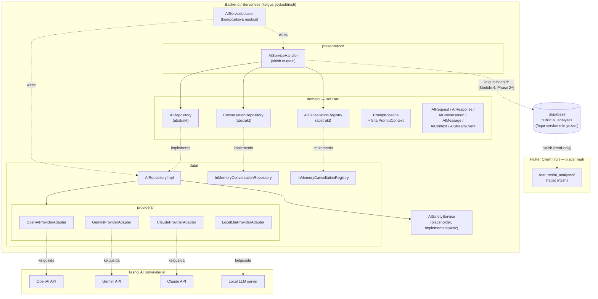

# AI_ARCHITECTURE.md — AI Service Foundation (Module 4, Phase 1–2A)

Bu hujjat `ai_service/` (repozitoriya ildizida, `lib/`dan tashqarida) qurilgan AI Service arxitekturasini tasvirlaydi. **Ko'lam: faqat poydevor va arxitektura — haqiqiy huquqiy fikrlash mantig'i yoki prompt mazmuni bu bosqichda yozilmagan.**

**Phase 2A yangilanishi:** Phase 1'dagi yagona `AISessionManager` klassi ikkita alohida, abstrakt shartnomaga ega qismga bo'lindi — `ConversationRepository` (suhbat tarixi/hayot davri) va `AICancellationRegistry` (bekor qilish kuzatuvi) — "Conversation Repository Contracts" bo'limiga qarang. `AIConversation`ga hayot davri holati (`AIConversationStatus`) va `close()` qo'shildi; `AIServiceHandler` endi oqim natijasini suhbat tarixiga avtomatik yozadi (quyidagi "Request Flow"ga qarang).

## Nega `lib/`dan tashqarida

`docs/ARCHITECTURE.md`ning "AI Service" bo'limi va `docs/DATABASE.md`dagi `ai_analyses` jadvali uchun RLS talabi ("faqat service role yozadi") allaqachon aniq belgilagan: **Flutter klient AI provayderni hech qachon to'g'ridan-to'g'ri chaqirmaydi.** Agar `AIRepository`ning implementatsiyasi mobil ilova ichida bo'lganida, provayder API kalitlari (OpenAI/Gemini/Claude) ilova binarida saqlanishi kerak bo'lardi — bu `docs/SECURITY.md`, "Secrets Management" talabini bevosita buzadi va foydalanuvchiga AI so'rovini soxtalashtirish/AI xulosasini chetlab o'tish imkonini beradi (`docs/DEVELOPMENT_RULES.md`, 15–16-bandlar — AI xolisligi shu orqali kafolatlanadi).

Shu sababli `ai_service/` **backend/serverless muhitda** (Supabase Edge Function yoki alohida Dart xizmati) joylashtirilishi mo'ljallangan kod — hozircha shu repozitoriyada, lekin `lib/`dan butunlay mustaqil, hech qachon Flutter ilovasi tomonidan import qilinmaydigan holda saqlanadi (`ai_service/README.md`ga qarang).

## Component Diagram

**Muhim:** `Handler → DB` bog'lanishi hozircha **kelgusi bosqich** sifatida belgilangan — Module 4, Phase 1 faqat `AIServiceHandler` gacha bo'lgan zanjirni quradi (so'rovni qabul qilish → xavfsizlik tekshiruvi joyi → provayderga uzatish shakli). `ai_analyses` jadvaliga haqiqiy yozish integratsiyasi keyingi bosqichda qo'shiladi.

## Request Flow

1. **Kirish nuqtasi** — `AIServiceHandler.handleRequest()` chaqiriladi (kelgusida: Edge Function HTTP so'rovi orqali).
2. **Foydalanuvchi xabari darhol tarixga yoziladi** — `ConversationRepository.appendMessage()` orqali, `role: user` bilan, so'rov muvaffaqiyatli bo'lishidan **qat'i nazar**. Suhbat topilmasa yoki allaqachon yopilgan bo'lsa (`AIConversation.isClosed`), shu yerda `AIStreamEvent.error` bilan to'xtaydi — provayderga umuman murojaat qilinmaydi.
3. **Bekor qilish tokeni** — shu so'rov uchun `AICancellationToken` yaratiladi va ro'yxatga olinadi (`AICancellationRegistry.register()`).
4. **Domain chaqiruvi** — `AIRepository.sendMessage()` chaqiriladi, `AIContext` (allaqachon `PromptPipeline.compose()` orqali tayyorlangan) va `providerId` bilan.
5. **Xavfsizlik tekshiruvi (joy ajratilgan)** — `AIRepositoryImpl` avval `AISafetyService.validateRequest()`ni chaqiradi. Hozircha implementatsiya yo'q — bu qadam **arxitektura darajasida** to'g'ri joyga qo'yilgan, shunda haqiqiy tekshiruv qo'shilganda boshqa hech narsa o'zgarmaydi.
6. **Provayderga uzatish** — `_providers[providerId]` xaritasidan mos `AIProviderAdapter` tanlanadi va `streamCompletion()` chaqiriladi.
7. **Oqim (stream)** — natija `Stream<AIStreamEvent>` sifatida qaytadi (`chunk`/`done`/`cancelled`/`error`). `chunk` bo'laklari suhbat tarixiga **yozilmaydi** (faqat oraliq holat); `done` kelganda to'liq javob `role: assistant` bilan tarixga yoziladi; `error`/`cancelled` holatida hech narsa yozilmaydi — muvaffaqiyatsiz javob tarixni "ifloslamaydi".
8. **Yakunlanish** — `done`/`error`/`cancelled` hodisasida `AICancellationRegistry.release()` (yoki `cancel()`) chaqirilib, bekor qilish tokeni tozalanadi.

Foundation bosqichida 5-qadam (xavfsizlik) har doim "xavfsiz" deb faraz qiluvchi test-double bilan, 6-qadam esa `UnimplementedError` bilan tugaydi (`ai_service/data/providers/*_adapter.dart`) — zanjirning **shakli** to'g'ri, **mazmuni** hali yo'q.

## Provider Abstraction

`AIProviderAdapter` — yagona nuqta, undan tashqarida hech qanday provayderga xos tur yoki import mavjud emas:

- `domain/` — `AIProviderId` enum'idan boshqa hech narsani bilmaydi (`openAI`, `gemini`, `claude`, `local`).
- `AIRepositoryImpl` — `Map<AIProviderId, AIProviderAdapter>` orqali ishlaydi, qaysi konkret klass turgani muhim emas.
- Yangi provayder qo'shish (masalan Mistral): (1) `AIProviderAdapter`ni amalga oshiruvchi bitta yangi klass, (2) `AIProviderId`ga bitta yangi qiymat, (3) `AIServiceLocator.build()`da bitta yangi xarita yozuvi. **Domain, repository interfeysi, prompt pipeline, safety interfeysi — hech biri o'zgarmaydi.**

Har bir adapter o'zining konfiguratsiya shaklini olib yuradi (`OpenAiProviderAdapter.apiKey` vs `LocalLlmProviderAdapter.endpointUrl`) — bu abstraktsiyaning turli xil provayder shakllariga (bulutli API kaliti vs. mahalliy server manzili) moslasha olishini isbotlaydi.

## AI Session / Conversation Repository Contracts

Phase 2A'da suhbat boshqaruvi ikkita mustaqil, bir-biridan bexabar shartnomaga bo'lingan (Single Responsibility — biri davomiy ma'lumot, ikkinchisi vaqtinchalik jarayon holati):

- **`ConversationRepository`** (`domain/repositories/conversation_repository.dart`) — suhbat hayot davri: `create()`, `getById()`, `appendMessage()`, `close()`. Foundation implementatsiyasi — `InMemoryConversationRepository` (`data/session/`).
- **`AICancellationRegistry`** (`domain/repositories/ai_cancellation_registry.dart`) — suhbat bo'yicha faol so'rovni bekor qilish: `register()`, `cancel()`, `release()`. Foundation implementatsiyasi — `InMemoryCancellationRegistry`.

Ikkalasi ham xotirada (in-memory) ishlaydi — ko'p nusxali (multi-instance) joylashtirishda alohida umumiy saqlash (masalan suhbat uchun Postgres, bekor qilish uchun Redis pub/sub) kerak bo'ladi; abstrakt shartnomalar shu almashtirishga tayyor.

Har bir talab qanday qondirilgani:

- **Conversation ID** — `InMemoryConversationRepository.create()` orqali generatsiya qilinadi (sozlanadigan `idGenerator`, test'larda deterministik qilib almashtirilishi mumkin).
- **Conversation lifecycle** — `AIConversationStatus` (`active`/`closed`). `close()` orqali yopiladi; yopilgan suhbatga `appendMessage()` chaqirilsa `StateError` tashlanadi — bu invariant `AIConversation`ning o'zida (entity darajasida) ta'minlangan, repository implementatsiyasidan mustaqil.
- **Message history** — `AIConversation.messages` (o'zgarmas ro'yxat), `appendMessage()` har safar yangi nusxa qaytaradi. `AIServiceHandler` foydalanuvchi va assistant xabarlarini avtomatik yozadi (yuqoridagi "Request Flow"ga qarang) — chaqiruvchi bu haqda alohida qayg'urmaydi.
- **Context injection** — `PromptPipeline.compose()` orqali, so'rov yuborilishidan oldin.
- **Cancellation** — `AICancellationToken` (`domain/entities/`), `AICancellationRegistry` orqali suhbat bo'yicha kuzatiladi.
- **Streaming-ready** — `AIRepository.sendMessage()`ning qaytish turi boshidanoq `Stream<AIStreamEvent>`, keyinroq "Future-dan Stream-ga" degan buzuvchi (breaking) o'zgarishni oldini oladi. Phase 2A'da bu oqim endi `ConversationRepository` bilan real bog'langan (`done` → tarixga yozish).

## Prompt Pipeline

Beshta mustaqil, kompozitsiyalanadigan context (`domain/prompt/`):

| Context | Vazifasi |
|---|---|
| `SystemContext` | Til, javob rejimi (konfiguratsiya, prompt matni emas) |
| `UserContext` | Faqat rol va til — sezgir shaxsiy ma'lumot **ataylab yo'q** (`docs/adr/ADR-006`) |
| `CaseContext` | Qaysi murojaat/nizo, kategoriya, ikkala tomon fakti bormi (nizo uchun) |
| `MemoryContext` | Kelgusi suhbat xotirasi uchun joy ajratilgan (hozircha bo'sh) |
| `SafetyContext` | Xolislik talabi (`requiresImpartiality`), uzunlik chegarasi kabi bayroqlar |

`PromptPipeline.withContext()` — o'zgarmas, zanjirlash (chaining) uslubidagi qurilmoqchi (builder). `compose()` — barcha context'larni bitta `AIContext`ga (kalit → strukturaviy ma'lumot xaritasi) birlashtiradi. **Hech qanday prompt matni/shabloni bu qatlamda yozilmagan** — bu ataylab, Module 4 Phase 1'ning aniq chegarasi.

## Safety Layer

`AISafetyService` — faqat interfeys (`validateRequest`, `validateResponse`), konkret implementatsiyasiz. `AIRepositoryImpl` uni chaqirish zanjiriga allaqachon joylashtirgan — kelgusida implementatsiya qo'shilganda faqat `AIServiceLocator.build()`ga real klass uzatiladi, boshqa hech narsa o'zgarmaydi.

## Future Voice AI Integration Point

Ovozli AI (masalan foydalanuvchi savolini ovoz orqali berishi/eshitishi) uchun ikkita tabiiy kirish nuqtasi mavjud, hech biri hozircha qurilmagan:

- **Kirish tomonida:** `AIServiceHandler.handleRequest()`dan OLDIN, nutqni matnga aylantiruvchi (speech-to-text) qadam — natija oddiy matn sifatida `UserContext`/suhbat xabariga kiradi, `AIRepository`/domain qatlami buni "ovozli so'rov" ekanligini bilishi shart emas.
- **Chiqish tomonida:** `AIStreamEvent.chunk`/`done`dan KEYIN, matnni ovozga aylantiruvchi (text-to-speech) qadam — `AIServiceHandler` darajasida, `AIStreamEvent`ning o'zi o'zgarmaydi.

Ikkala holatda ham `ai_service/domain/`ga hech qanday o'zgarish kerak emas — bu Clean Architecture ajratishining to'g'ridan-to'g'ri natijasi.

## Future Memory Integration Point

`MemoryContext.summarizedHistory` hozircha doim bo'sh ro'yxat. Kelgusida bu maydon quyidagilar bilan to'ldirilishi mo'ljallangan:

- Uzoq suhbatlar uchun avtomatik qisqartirish (summarization) xizmati — `ConversationRepository`ning `AIConversation.messages`ni kuzatib, chegaradan oshganda qisqartirib `MemoryContext`ga uzatishi.
- Kelajakda foydalanuvchi/ish (case) darajasidagi uzoq muddatli xotira (masalan vektor bazasi) — bu ham faqat `MemoryContext.toPromptData()`ni to'ldiradi, `PromptPipeline`ning qolgan qismiga tegmaydi.

## Bog'liq hujjatlar

- [`docs/ARCHITECTURE.md`](./ARCHITECTURE.md) — "AI Service" bo'limi (tizim darajasidagi joylashuv)
- [`docs/adr/ADR-004-ai-cost-governance.md`](./adr/ADR-004-ai-cost-governance.md) — xarajat nazorati (bu foundation'ga hali ulanmagan, kelgusi bosqich)
- [`docs/adr/ADR-005-ai-vendor-fallback.md`](./adr/ADR-005-ai-vendor-fallback.md) — vendor-agnostik interfeys qarori (shu Module 4ning asosi)
- [`docs/adr/ADR-006-hybrid-infrastructure-strategy.md`](./adr/ADR-006-hybrid-infrastructure-strategy.md) — sezgir ma'lumot chegarasi (`UserContext`ning nega minimal ekanligi)
- [`ai_service/README.md`](../ai_service/README.md) — nima uchun bu kod `lib/`dan tashqarida
