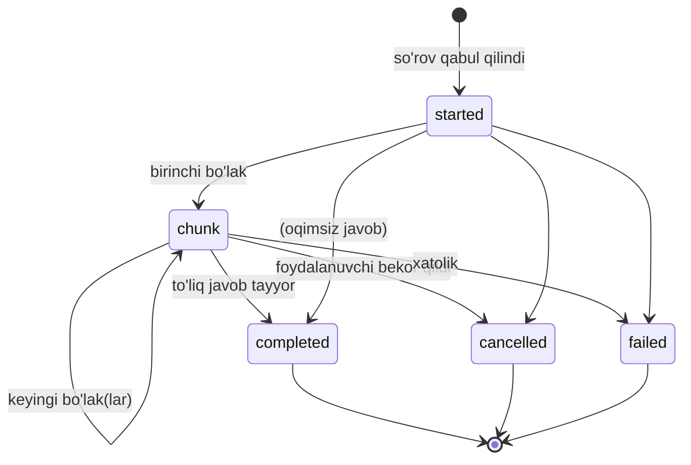
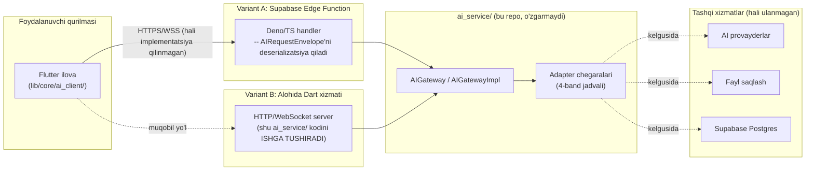
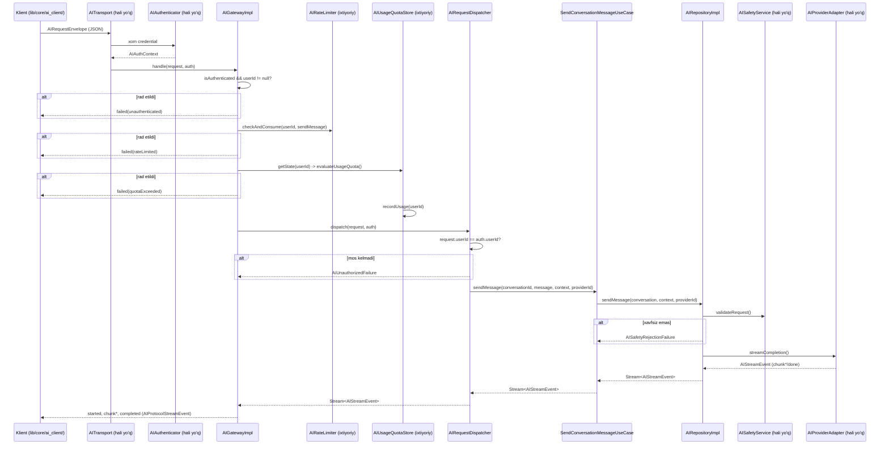
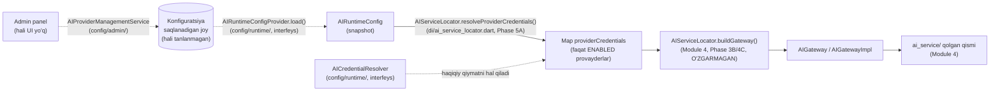
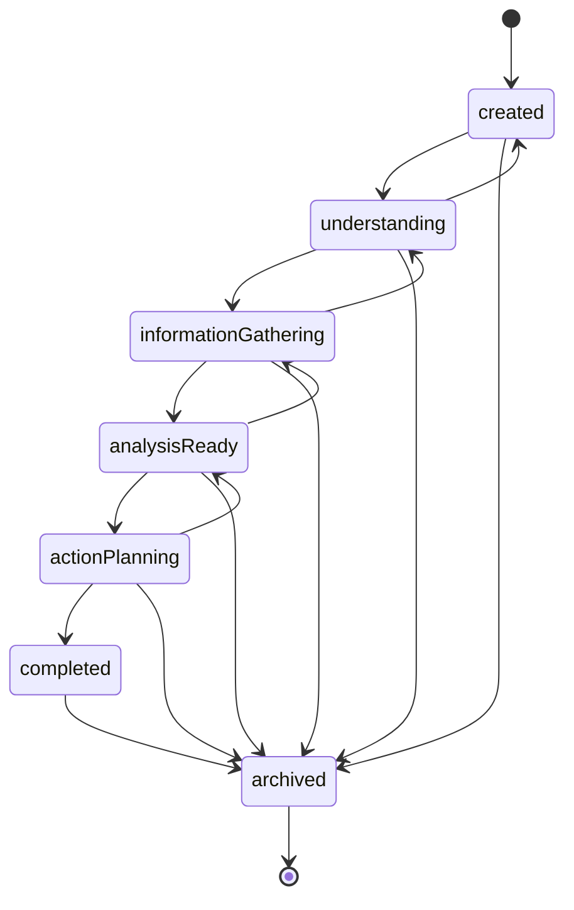
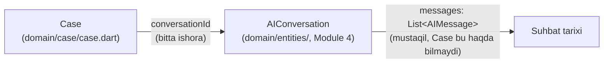

# AI_ARCHITECTURE.md — AI Service Foundation (Module 4, Phase 1–4C; Module 5, Phase 5A–5B)

Bu hujjat `ai_service/` (repozitoriya ildizida, `lib/`dan tashqarida) qurilgan AI Service arxitekturasini tasvirlaydi. **Ko'lam: faqat poydevor va arxitektura — haqiqiy huquqiy fikrlash mantig'i yoki prompt mazmuni bu bosqichda yozilmagan.** Phase 4A'dan boshlab bu hujjat `lib/core/ai_client/`ni ham qamrab oladi — `ai_service/`ning Flutter klient tomonidagi ko'zgusi (mirror) hamkasbi, quyidagi "Klient Integratsiya Poydevori" bo'limiga qarang. Phase 4B — **backend KONTRAKTINING** (endpoint/validatsiya/autentifikatsiya/rate-limit/token-hisob/kvota/persistensiya/fayl-yuklash/versiya-kelishuvi) to'liq shakli, quyidagi "Backend Contract (Module 4, Phase 4B)" bo'limiga qarang. Phase 4C — o'sha kontraktni HAQIQIY ijro zanjiriga ulaydigan **READINESS** bosqichi (rate-limit/kvota gateway darajasida yoqiladigan, kompozitsiya ildizi pluggable qilinadigan, yangi adapter chegaralari qo'shiladigan), quyidagi "Backend Implementation Readiness (Module 4, Phase 4C)" bo'limiga qarang -- hech qanday HTTP/Edge Function/haqiqiy provayder implementatsiyasi hamon YO'Q.

**Module 5, Phase 5A (AI Configuration and Control Foundation):** Module 4 butunlay "bitta so'rov qanday ishlaydi" (request pipeline) haqida edi. Module 5 boshqa savolga javob beradi: **AI provayderlarning O'ZI (qaysi yoqilgan, qaysi model, qaysi limitlar, qancha xarajat) qanday BOSHQARILADI** -- admin panel/backend konfiguratsiya qatlami orqali, Flutter ilovasi ichida HECH QACHON emas. Yangi `ai_service/config/` papkasi (`domain/`, `runtime/`, `admin/` -- pastdagi "AI Configuration and Control Foundation (Module 5, Phase 5A)" bo'limiga qarang) shu savolga javob beradi. Hech qanday OpenAI/Gemini/Claude SDK, API kalit yoki haqiqiy AI chaqiruvi qo'shilmagan -- faqat BOSHQARUV arxitekturasi.

**Module 5, Phase 5B (AI Case and Conversation Foundation):** Phase 5A "provayderlar qanday boshqariladi" savoliga javob berdi. Phase 5B esa foydalanuvchi TOMONIGA qaytadi: **foydalanuvchi muammosini qanday YARATADI, AI bilan qanday MULOQOT qiladi, va bu jarayon qanday KUZATILADI (lifecycle)**. Yangi `ai_service/domain/case/` -- `AIConversation` (Module 4)dan YUQORI darajadagi `Case` mavhumligi: toifa (`CaseCategory`), muhimlik (`CasePriority`), hayot-davri holati (`CaseStatus`, yettita bosqich) va voqealar tarixi (`CaseTimeline`). Har bir `Case` bitta `AIConversation`ga ishora qiladi (`conversationId`), lekin suhbat tarixining o'zi mustaqil qoladi. Foydalanuvchi muammoni tushuntirganda ishga tushadigan intake oqimi FAQAT soxta (mock) savol generatoriga tayanadi (`MockCaseIntakeAssistant`) -- hech qanday huquqiy xulosa, hech qanday haqiqiy AI. Pastdagi "AI Case and Conversation Foundation (Module 5, Phase 5B)" bo'limiga qarang.

**Phase 2A yangilanishi:** Phase 1'dagi yagona `AISessionManager` klassi ikkita alohida, abstrakt shartnomaga ega qismga bo'lindi — `ConversationRepository` (suhbat tarixi/hayot davri) va `AICancellationRegistry` (bekor qilish kuzatuvi) — "Conversation Repository Contracts" bo'limiga qarang. `AIConversation`ga hayot davri holati (`AIConversationStatus`) va `close()` qo'shildi; `AIServiceHandler` endi oqim natijasini suhbat tarixiga avtomatik yozadi (quyidagi "Request Flow"ga qarang).

**Phase 2B yangilanishi:** `UserContext.role` va `CaseContext.caseType` xom `String`dan tur-xavfsiz enum'ga (`AIUserRole`, `AICaseType`) o'tkazildi; `CaseContext`ning invarianti kuchaytirildi (`caseType` endi mos ID bilan mos kelishi tekshiriladi). Yangi `ContextAssembler` — beshta kanonik context'ni (majburiy: System/User/Safety, ixtiyoriy: Case/Memory) tur-xavfsiz, kompilyatsiya vaqtida tekshiriladigan tarzda yig'uvchi yuqori daraja — "Prompt Pipeline / Context Assembler" bo'limiga qarang.

**Phase 2C yangilanishi:** Orkestratsiya mantig'i (suhbat tarixi bilan bog'lanish, qayta urinish) `AIServiceHandler`dan (kirish nuqtasi) `domain/usecases/`ga ko'chirildi — `AIServiceHandler` endi faqat delegatsiya qiluvchi "yupqa" (thin) qatlam. Xom `String message` o'rniga tur-xavfsiz `AIFailure` xatolik ierarxiyasi kiritildi (`isRetryable` xususiyati bilan); `ConversationRepository`/`AIConversation` endi umumiy `StateError` o'rniga aniq ajraladigan `ConversationNotFoundException`/`ConversationClosedException` tashlaydi. Yangi `AIRetryPolicy`/`AIRetryExecutor` — streaming-xavfsiz (allaqachon chiqarilgan `chunk`lardan keyin qayta urinilmaydi) qayta urinish mexanizmi. Quyidagi "AI UseCases & Orkestratsiya", "Xatolik Abstraksiyasi" va "Qayta Urinish Abstraksiyasi" bo'limlariga qarang.

**Phase 3A yangilanishi:** Yangi `protocol/` papkasi — Flutter klient ↔ backend orasidagi SIMLI (wire) shartnoma, `domain/`dagi ICHKI kontraktlardan (`AIRequest`/`AIResponse`/`AIStreamEvent`) ATAYLAB mustaqil. `AIRequestEnvelope`/`AIResponseEnvelope` (JSON serializatsiya bilan), `AIProtocolStreamEvent` (5 holat: `started`/`chunk`/`completed`/`cancelled`/`failed`), `AIProtocolError` (provayderdan mustaqil, barqaror xatolik kodlari) va `AIProtocolVersion` (kelgusi sxema yangilanishlari uchun). Quyidagi "Klient ↔ Backend Protokoli" bo'limiga qarang.

**Phase 3B yangilanishi:** Yangi `gateway/` papkasi — Phase 3A'da faqat SHAKL sifatida belgilangan simli protokolni haqiqiy, ijro etiladigan zanjirga ulaydi: `AIGateway`/`AIGatewayImpl` (yagona kirish nuqtasi: autentifikatsiya tekshiruvi → `AIRequestDispatcher` → `AITimeoutGuard` → `AIResponseDispatcher`), `AIRequestDispatcher` (soxtalashtirishga qarshi `userId` tekshiruvi + `context` tarjimasi), `AIResponseDispatcher` (ichki `AIStreamEvent`/`AIFailure` → simli `AIProtocolStreamEvent`/`AIProtocolError` to'liq tarjimasi), `AITimeoutGuard`/`AITimeoutPolicy` (muddat nazorati). `AIAuthenticator`, `AIConnectivityMonitor`, `AITransport` — talab bo'yicha **faqat interfeys, implementatsiyasiz** qo'shilgan (`AISafetyService` konventsiyasi). Yangi `AIUnauthorizedFailure`/`AIInvalidRequestFailure` (`domain/entities/ai_failure.dart`) va mos `unauthenticated`/`unauthorized` kodlari (`protocol/ai_protocol_error.dart`). Quyidagi "Backend Gateway" bo'limiga qarang.

**Architecture Review yangilanishi (texnik qarz yopildi):** Module 4, Phase 1–3B bo'yicha to'liq arxitektura ko'rib chiqish (enterprise architecture review) o'tkazildi — hech qanday Clean Architecture/bog'liqlik yo'nalishi buzilishi topilmadi. Ikkita ANIQLANGAN (lekin hujjatlashtirilmagan) texnik qarz moddasi yopildi: (1) `ai_service/`ning Flutter/`lib/`dan mustaqilligi endi faqat kod ko'rib chiqish intizomi bilan emas, avtomatik test bilan ta'minlanadi (`test/ai_service/architecture_boundary_test.dart`, quyidagi "Nega `lib/`dan tashqarida"ga qarang); (2) `AICancellationRegistry.register()`dagi concurrency chegara holati (bir xil suhbat uchun ikkinchi so'rov birinchisining tokenini jimgina "orphan" qilib qo'yishi) tuzatildi — endi eskisi aniq bekor qilinadi (quyidagi "AI Session / Conversation Repository Contracts"dagi "Cancellation"ga qarang).

**Phase 4A yangilanishi (AI Integration Foundation):** Yangi `lib/core/ai_client/` -- Flutter ilovasi bilan kelgusi haqiqiy backend orasidagi INTEGRATSIYA POYDEVORI, hozircha faqat soxta (mock) javoblar bilan. `AiGatewayClient` (provayderdan mustaqil klient interfeysi), `protocol/` (backend `protocol/`ning klient tomonidagi mustaqil ko'chirmasi), `AiClientContextAssembler` (backend `ContextAssembler`ning klient hamkasbi), `AiResponseMapper` (simli modellarni domen modellariga, xatoliklarni esa ilovaning mavjud `Failure` turiga tarjima qiladi), `AiRequestPipeline` (to'liq quvur: Conversation -> Context Assembler -> AI Gateway -> Backend Protocol -> Response Mapper), `MockAiGatewayClient` (soxta oqim generatori), `AiConnectivityMonitor`/`AiDiagnosticsLogger` (interfeys, implementatsiyasiz/analitikasiz). Quyidagi "Klient Integratsiya Poydevori" bo'limiga qarang.

**Phase 4B yangilanishi (Backend Contract):** Flutter klient bilan kelgusi haqiqiy AI Service orasidagi BACKEND KONTRAKTI to'liq shaklda belgilandi -- o'nta mustaqil bo'lak: endpoint ta'riflari (`gateway/endpoint/`), so'rov/javob validatsiya shartnomalari (`gateway/validation/`), autentifikatsiya kontrakti (`protocol/ai_backend_credential.dart`), rate-limit kontrakti (`gateway/ratelimit/` + `protocol/ai_rate_limit_contract.dart`), token-hisob modeli (`domain/accounting/`), foydalanish kvotasi modeli (`domain/quota/` + `protocol/ai_usage_quota_contract.dart`), suhbat persistensiya kontrakti (`data/session/ai_conversation_persistence_contract.dart`), fayl yuklash kontrakti (`protocol/ai_attachment_upload_contract.dart`) va versiya kelishuvi kontrakti (`protocol/ai_version_negotiation_contract.dart`). Bu -- **haqiqiy backend qurilishidan OLDINGI SO'NGGI arxitektura bosqichi**; quyidagi "Backend Contract (Module 4, Phase 4B)" bo'limiga qarang.

**Phase 4C yangilanishi (Backend Implementation Readiness):** Phase 4B'da faqat SHAKL sifatida belgilangan `AIRateLimiter`/`AIUsageQuotaStore` kontraktlari endi `AIGatewayImpl`ning haqiqiy ijro zanjiriga ulandi (ikkalasi ham ixtiyoriy, standart holatda o'chirilgan -- mavjud xatti-harakat o'zgarmaydi). `AIServiceLocator.build()`/`buildGateway()` endi `conversationRepository`/`cancellationRegistry` uchun PLUGGABLE -- haqiqiy backend qurilganda kompozitsiya ildizining o'zi o'zgarmasdan, faqat shu parametrlar orqali real implementatsiya in'ektsiya qilinadi. Ikkita yangi adapter chegarasi qo'shildi: `AIAttachmentStorageAdapter` (`gateway/attachment/`) va `AITokenAccountingSink` (`domain/accounting/`) -- ikkalasi ham interfeys, implementatsiyasiz. Auditda topilgan bitta mudofaa (defensive) qattiqlashtirish: `AIGatewayImpl` endi `isAuthenticated == true` lekin `userId == null` holatini ham `unauthenticated` sifatida rad etadi (ilgari bu holat `AIRequestDispatcher`gacha yetib borar, keyin `unauthorized` sifatida rad etilar edi). Quyidagi "Backend Implementation Readiness (Module 4, Phase 4C)" bo'limiga qarang.

## Nega `lib/`dan tashqarida

`docs/ARCHITECTURE.md`ning "AI Service" bo'limi va `docs/DATABASE.md`dagi `ai_analyses` jadvali uchun RLS talabi ("faqat service role yozadi") allaqachon aniq belgilagan: **Flutter klient AI provayderni hech qachon to'g'ridan-to'g'ri chaqirmaydi.** Agar `AIRepository`ning implementatsiyasi mobil ilova ichida bo'lganida, provayder API kalitlari (OpenAI/Gemini/Claude) ilova binarida saqlanishi kerak bo'lardi — bu `docs/SECURITY.md`, "Secrets Management" talabini bevosita buzadi va foydalanuvchiga AI so'rovini soxtalashtirish/AI xulosasini chetlab o'tish imkonini beradi (`docs/DEVELOPMENT_RULES.md`, 15–16-bandlar — AI xolisligi shu orqali kafolatlanadi).

Shu sababli `ai_service/` **backend/serverless muhitda** (Supabase Edge Function yoki alohida Dart xizmati) joylashtirilishi mo'ljallangan kod — hozircha shu repozitoriyada, lekin `lib/`dan butunlay mustaqil, hech qachon Flutter ilovasi tomonidan import qilinmaydigan holda saqlanadi (`ai_service/README.md`ga qarang).

**Avtomatik ta'minlangan (Architecture Review'dan keyin):** bitta umumiy `pubspec.yaml` ostida yotgani uchun bu chegara ilgari FAQAT kod ko'rib chiqish intizomi bilan ushlab turilardi — hech narsa `ai_service/` ichida tasodifiy `import 'package:flutter/...'` paydo bo'lishini avtomatik ushlay olmasdi. `test/ai_service/architecture_boundary_test.dart` endi shu bo'shliqni yopadi: `ai_service/`ning har bir faylini skanerlab, `package:flutter`, `dart:ui`, `lib/` yoki `package:adolat_ai` importlaridan birortasi topilsa, loyihaning yagona sifat darvozasi (`flutter test`) qizil bo'ladi.

## Component Diagram

```mermaid
flowchart TB
    subgraph Client["Flutter Client (lib/)"]
        AIAnalysesFeature["features/ai_analyses/\n(faqat o'qish, o'zgarmadi)"]
        subgraph AiClientCore["core/ai_client/ — Phase 4A"]
            ClientPipeline["AiRequestPipeline"]
            ClientAssembler["AiClientContextAssembler\n+ 5 ta AiClientPromptContext"]
            ClientGatewayIface["AiGatewayClient\n(abstrakt)"]
            ClientMock["MockAiGatewayClient"]
            ClientMapper["AiResponseMapper"]
            ClientDomainEvent["AiClientStreamEvent\n(Failure bilan)"]
            ClientProtocol["protocol/ (mirror)\nAiRequestEnvelope /\nAiProtocolStreamEvent"]
            ClientConnMonitor["AiConnectivityMonitor\n(interfeys, implementatsiyasiz)"]
            ClientLogger["AiDiagnosticsLogger"]
        end
        AppFailure["core/error/Failure\n(ilovaning yagona xatolik turi)"]
    end

    subgraph Backend["Backend / Serverless (kelgusi joylashtirish)"]
        subgraph Protocol["protocol/ — sof Dart, JSON serializatsiya"]
            ReqEnv["AIRequestEnvelope"]
            RespEnv["AIResponseEnvelope"]
            StreamEv["AIProtocolStreamEvent\n(started/chunk/completed/\ncancelled/failed)"]
            ProtoErr["AIProtocolError"]
        end
        subgraph Gateway["gateway/ — Phase 3B"]
            GatewayIface["AIGateway\n(abstrakt)"]
            GatewayImpl["AIGatewayImpl"]
            ReqDispatch["AIRequestDispatcher\n(auth tekshiruvi +\ncontext tarjimasi)"]
            RespDispatch["AIResponseDispatcher"]
            TimeoutGuard["AITimeoutGuard /\nAITimeoutPolicy"]
            AuthCtx["AIAuthContext"]
            Authenticator["AIAuthenticator\n(interfeys, implementatsiyasiz)"]
            ConnMonitor["AIConnectivityMonitor\n(interfeys, implementatsiyasiz)"]
            Transport["AITransport\n(interfeys, implementatsiyasiz)"]
        end
        subgraph Presentation["presentation/"]
            Handler["AIServiceHandler\n(yupqa kirish nuqtasi,\nbuild() yo'li)"]
        end
        subgraph UseCases["domain/usecases/"]
            StartUC["StartConversationUseCase"]
            SendUC["SendConversationMessageUseCase\n(orkestratsiya + retry)"]
            CancelUC["CancelConversationUseCase"]
            CloseUC["CloseConversationUseCase"]
        end
        subgraph Domain["domain/ — sof Dart"]
            Repo["AIRepository\n(abstrakt)"]
            ConvRepo["ConversationRepository\n(abstrakt)"]
            CancelReg["AICancellationRegistry\n(abstrakt)"]
            Retry["AIRetryPolicy /\nAIRetryExecutor"]
            Failure["AIFailure\n(tur-xavfsiz xatolik ierarxiyasi)"]
            Prompt["PromptPipeline\n+ 5 ta PromptContext"]
            Entities["AIRequest / AIResponse /\nAIConversation / AIMessage /\nAIContext / AIStreamEvent"]
        end
        subgraph Data["data/"]
            RepoImpl["AIRepositoryImpl"]
            ConvRepoImpl["InMemoryConversationRepository"]
            CancelRegImpl["InMemoryCancellationRegistry"]
            subgraph Providers["providers/"]
                OpenAI["OpenAiProviderAdapter"]
                Gemini["GeminiProviderAdapter"]
                Claude["ClaudeProviderAdapter"]
                Local["LocalLlmProviderAdapter"]
            end
        end
        Safety["AISafetyService\n(placeholder, implementatsiyasiz)"]
        DI["AIServiceLocator\n(kompozitsiya nuqtasi)"]
    end

    subgraph External["Tashqi AI provayderlar"]
        OpenAIAPI["OpenAI API"]
        GeminiAPI["Gemini API"]
        ClaudeAPI["Claude API"]
        LocalAPI["Local LLM server"]
    end

    DB[("Supabase\npublic.ai_analyses\n(faqat service role yozadi)")]

    AIAnalysesFeature -."so'raydi (kelgusi integratsiya)".-> ReqEnv
    ClientPipeline --> ClientAssembler
    ClientAssembler --> ClientProtocol
    ClientPipeline --> ClientGatewayIface
    ClientGatewayIface -.implements.-> ClientMock
    ClientGatewayIface --> ClientProtocol
    ClientPipeline --> ClientMapper
    ClientMapper --> ClientDomainEvent
    ClientMapper -."tarjima qiladi".-> AppFailure
    ClientPipeline -."ixtiyoriy, hozircha null".-> ClientConnMonitor
    ClientPipeline --> ClientLogger
    ClientGatewayIface -."kelgusida\n(HTTP/WebSocket -- haqiqiy backend)".-> GatewayIface
    Transport -."kelgusida\n(HTTP/WebSocket/gRPC)".-> ReqEnv
    Authenticator -."kelgusida\n(HTTP handler)".-> AuthCtx
    ReqEnv --> GatewayIface
    AuthCtx --> GatewayIface
    GatewayIface -.implements.-> GatewayImpl
    GatewayImpl --> ReqDispatch
    GatewayImpl --> TimeoutGuard
    TimeoutGuard --> RespDispatch
    RespDispatch --> StreamEv
    RespDispatch --> ProtoErr
    ReqDispatch --> SendUC
    ConnMonitor -."kelgusida\n(klient tomonida, ai_service/\ntashqarisida)".-> ReqEnv
    Handler --> StartUC
    Handler --> SendUC
    Handler --> CancelUC
    Handler --> CloseUC
    SendUC --> Repo
    SendUC --> ConvRepo
    SendUC --> CancelReg
    SendUC --> Retry
    Retry --> Failure
    StartUC --> ConvRepo
    CancelUC --> CancelReg
    CloseUC --> ConvRepo
    Repo -.implements.-> RepoImpl
    ConvRepo -.implements.-> ConvRepoImpl
    CancelReg -.implements.-> CancelRegImpl
    RepoImpl --> Safety
    RepoImpl --> Providers
    RepoImpl -."yaratadi (AIFailure)".-> Failure
    OpenAI -.kelgusida.-> OpenAIAPI
    Gemini -.kelgusida.-> GeminiAPI
    Claude -.kelgusida.-> ClaudeAPI
    Local -.kelgusida.-> LocalAPI
    DI -.wires.-> Handler
    DI -.wires.-> GatewayImpl
    DI -.wires.-> SendUC
    DI -.wires.-> RepoImpl

    Handler -."kelgusi bosqich\n(Module 4, Phase 2+)".-> DB
    DB -."o'qish (read-only)".-> AIAnalysesFeature
```



**Muhim:** `Handler → DB` bog'lanishi hozircha **kelgusi bosqich** sifatida belgilangan — Module 4, Phase 1 faqat `AIServiceHandler` gacha bo'lgan zanjirni quradi (so'rovni qabul qilish → xavfsizlik tekshiruvi joyi → provayderga uzatish shakli). `ai_analyses` jadvaliga haqiqiy yozish integratsiyasi keyingi bosqichda qo'shiladi.

**Muhim (Phase 3B):** `GatewayImpl → ReqDispatch → SendUC` — `Handler → StartUC/SendUC/CancelUC/CloseUC` zanjiridan **butunlay mustaqil** ikkinchi yo'l. `AIServiceLocator.buildGateway()` `AIServiceHandler`ni umuman qurmaydi/ishlatmaydi — `AIRequestDispatcher`ni to'g'ridan-to'g'ri `SendConversationMessageUseCase`ga ulaydi (hozircha faqat xabar yuborish amali simli protokol orqali ochilgan, `StartUC`/`CancelUC`/`CloseUC` uchun mos konvert turi yo'q — yuqoridagi "Backend Gateway" bo'limiga qarang). `build()` va `buildGateway()` bir vaqtda chaqirilsa, ikkalasi MUSTAQIL `ConversationRepository` nusxasiga ega bo'ladi (suhbat holati ulashilmaydi) — amalda faqat bittasi ishlatilishi kutiladi.

**Muhim (Phase 4A):** `ClientGatewayIface -.kelgusida.-> GatewayIface` chizig'i -- diagrammadagi YAGONA `Client` ↔ `Backend` bog'lanishi -- ATAYLAB nuqtali (hali yo'q): `ClientGatewayIface`ning hozirgi yagona implementatsiyasi `ClientMock` (`MockAiGatewayClient`) hech qanday tarmoqqa chiqmaydi, butun javobni xotirada generatsiya qiladi. `core/ai_client/` `ai_service/`dagi HECH BIR turni import qilmaydi (`ClientProtocol` — `protocol/`ning MUSTAQIL ko'chirmasi, o'zining `AiRequestEnvelope`/`AiProtocolStreamEvent`i bilan) — bu chegara `test/core/ai_client/architecture_boundary_test.dart` orqali avtomatik tekshiriladi (`test/ai_service/architecture_boundary_test.dart`ning qarama-qarshi yo'nalishi). Batafsil: quyidagi "Klient Integratsiya Poydevori" bo'limi.

## Request Flow

1. **Kirish nuqtasi** — `AIServiceHandler.handleRequest()` chaqiriladi (kelgusida: Edge Function HTTP so'rovi orqali). Handler hech qanday qaror qabul qilmaydi — darhol `SendConversationMessageUseCase`ga uzatadi (quyidagi "AI UseCases & Orkestratsiya"ga qarang).
2. **Foydalanuvchi xabari darhol tarixga yoziladi** — `ConversationRepository.appendMessage()` orqali, `role: user` bilan, so'rov muvaffaqiyatli bo'lishidan **qat'i nazar**. Suhbat topilmasa (`ConversationNotFoundException`) yoki allaqachon yopilgan bo'lsa (`ConversationClosedException`), usecase buni aniq `catch` qilib, mos `AIFailure` (`AIConversationNotFoundFailure`/`AIConversationClosedFailure`) bilan `AIStreamEvent.error` qaytaradi — provayderga umuman murojaat qilinmaydi.
3. **Bekor qilish tokeni** — shu so'rov uchun `AICancellationToken` yaratiladi va ro'yxatga olinadi (`AICancellationRegistry.register()`).
4. **Qayta urinish bilan o'ralgan domain chaqiruvi** — `AIRepository.sendMessage()` to'g'ridan-to'g'ri emas, `AIRetryExecutor.run()` orqali chaqiriladi (`AIContext` va `providerId` bilan). Xatolik `AIFailure.isRetryable` bo'lsa va hali hech qanday `chunk` chiqarilmagan bo'lsa, `AIRetryPolicy` bo'yicha avtomatik qayta uriniladi — quyidagi "Qayta Urinish Abstraksiyasi"ga qarang.
5. **Xavfsizlik tekshiruvi (joy ajratilgan)** — `AIRepositoryImpl` avval `AISafetyService.validateRequest()`ni chaqiradi. Hozircha implementatsiya yo'q — bu qadam **arxitektura darajasida** to'g'ri joyga qo'yilgan, shunda haqiqiy tekshiruv qo'shilganda boshqa hech narsa o'zgarmaydi. Rad etilsa, `AISafetyRejectionFailure` (hech qachon qayta urinilmaydi) bilan yakunlanadi.
6. **Provayderga uzatish** — `_providers[providerId]` xaritasidan mos `AIProviderAdapter` tanlanadi va `streamCompletion()` chaqiriladi. Ro'yxatdan o'tmagan provayder — `AIProviderNotConfiguredFailure` (qayta urinilmaydi).
7. **Oqim (stream)** — natija `Stream<AIStreamEvent>` sifatida qaytadi (`chunk`/`done`/`cancelled`/`error`, `error` endi tur-xavfsiz `AIFailure` olib yuradi). `chunk` bo'laklari suhbat tarixiga **yozilmaydi** (faqat oraliq holat); `done` kelganda to'liq javob `role: assistant` bilan tarixga yoziladi; `error`/`cancelled` holatida hech narsa yozilmaydi — muvaffaqiyatsiz javob tarixni "ifloslamaydi".
8. **Yakunlanish** — `done`/`error`/`cancelled` hodisasida `AICancellationRegistry.release()` (yoki `cancel()`) chaqirilib, bekor qilish tokeni tozalanadi.

Foundation bosqichida 5-qadam (xavfsizlik) har doim "xavfsiz" deb faraz qiluvchi test-double bilan, 6-qadam esa `UnimplementedError` bilan tugaydi (`ai_service/data/providers/*_adapter.dart`) — zanjirning **shakli** to'g'ri, **mazmuni** hali yo'q.

## Klient ↔ Backend Protokoli (Module 4, Phase 3A)

Yuqoridagi "Request Flow" — backend ICHIDAGI zanjir (`AIServiceHandler` dan boshlab). Bu bo'lim esa undan OLDINGI chegarani tasvirlaydi: Flutter klient bilan backend orasida SIMDAN (HTTP/WebSocket) qanday ma'lumot o'tishi kerakligi. Bu qatlam `ai_service/protocol/`da, **sof Dart, hech qanday Flutter/Riverpod bog'liqligisiz** — kelgusida backend haqiqiy Dart bo'lmagan muhitda (masalan boshqa til bilan yozilgan Edge Function) ishlasa ham, JSON shakli shu klasslarning `toJson()`/`fromJson()` natijasi orqali til-mustaqil hujjatlashtirilgan bo'ladi.

**Nega `domain/entities/`dagi `AIRequest`/`AIResponse`/`AIStreamEvent`dan ALOHIDA:** ular backend ICHIDAGI, `AIRepository` ↔ `AIProviderAdapter` orasidagi jarayon-ichi (in-process) shartnoma — serializatsiya kerak emas va `providerId`ni o'z ichiga oladi. `protocol/`dagi konvertlar esa klient ↔ backend chegarasi — ATAYLAB `providerId`siz (qaysi provayder ishlatilishi klientning emas, backendning qarori, `docs/adr/ADR-005`) va ichki domain modelidan mustaqil (`context` maydoni xom `Map<String, dynamic>`, `AIContext`ga bog'lanmagan — ikkalasi mustaqil evolyutsiya qila oladi).

**Bu bosqich (Phase 3A) faqat SHAKLNI belgilagan edi — hech qanday integratsiya kodi yo'q edi:** `protocol/` klasslari `presentation/ai_service_handler.dart`ga ulanmagan, HTTP/WebSocket handler yo'q, `AIStreamEvent` ↔ `AIProtocolStreamEvent` tarjimasi yo'q edi. **Yangilanish (Phase 3B):** `AIStreamEvent` ↔ `AIProtocolStreamEvent` tarjimasi endi `gateway/dispatch/ai_response_dispatcher.dart`da mavjud va testlangan (quyidagi "Backend Gateway" bo'limiga qarang) — lekin HTTP/WebSocket handlerning o'zi (haqiqiy transport) hamon yo'q, `AIGateway.handle()` faqat to'g'ridan-to'g'ri Dart chaqiruvi orqali ishga tushiriladi.

### So'rov (Request) Lifecycle

`AIRequestEnvelope` (`protocol/ai_request_envelope.dart`):

| Maydon | Vazifasi |
|---|---|
| `requestId` | Har bir so'rovning o'ziga xos identifikatori — javobni (`AIResponseEnvelope.requestId`) va oqim hodisalarini (`AIProtocolStreamEvent.requestId`) so'rov bilan bog'lash uchun |
| `conversationId` | Qaysi suhbatga tegishli |
| `userId` | Kim so'ramoqda (audit/RLS uchun — `docs/DATABASE.md`) |
| `message` | Foydalanuvchi xabari, xom matn |
| `context` | Xom `Map<String, dynamic>` — ichki `AIContext`dan mustaqil (yuqoridagi izohga qarang) |
| `attachments` | `List<AIAttachmentMetadata>` — fayl METADATASI (id/fileName/mimeType/sizeBytes/storageRef), fayl bayt(lar)i emas — alohida yuklash kanali orqali oldindan yuklanadi |
| `requestedAt` | Klient tomonidagi so'rov vaqti |
| `protocolVersion` | Standart holatda `AIProtocolVersion.current` |

**Muhim dizayn qarori:** `AIRequestEnvelope`da `providerId` maydoni YO'Q. Provayder tanlovi butunlay backend qarori — aks holda klient provayder tanlab, `docs/adr/ADR-005`dagi vendor-fallback strategiyasini chetlab o'tishi mumkin bo'lardi.

### Javob (Response) Lifecycle

`AIResponseEnvelope` (`protocol/ai_response_envelope.dart`):

| Maydon | Vazifasi |
|---|---|
| `responseId` | Javobning o'ziga xos identifikatori |
| `requestId` | Qaysi so'rovga javob (talab ro'yxatida aniq sanalmagan, lekin qo'shilgan — bir nechta parallel so'rovni ajratish uchun zarur) |
| `conversationId` | Qaysi suhbatga tegishli |
| `assistantMessage` | To'liq javob matni — **faqat `status == completed` bo'lganda** nolldan farqli bo'lishi mumkin (`assert` bilan majburlangan) |
| `status` | `AIProtocolStatus`: `completed`/`failed`/`cancelled` |
| `tokenUsage` | `AITokenUsage` — joy ajratilgan (barcha maydonlar hozircha `null`) |
| `latencyMs` | Joy ajratilgan (hozircha `null`) |
| `receivedAt` / `respondedAt` | Backend so'rovni qabul qilgan/javobni yakunlagan vaqt |
| `protocolVersion` | Javob qaysi sxema versiyasi bo'yicha shakllantirilgani |
| `error` | **faqat `status == failed` bo'lganda** majburiy (`assert` bilan majburlangan) |

Ikkala `assert` ham ichki `SendConversationMessageUseCase` konventsiyasi bilan bir xil qoidani simli protokol darajasida takrorlaydi: muvaffaqiyatsiz/bekor qilingan javob mazmun olib yurmaydi, faqat muvaffaqiyatli javob xatolik olib yurmaydi.

### Protokol Versiyalash

`AIProtocolVersion` (`protocol/ai_protocol_version.dart`) — butun `AIRequestEnvelope`/`AIResponseEnvelope`/`AIProtocolStreamEvent` sxemasi BITTA BIRLIK sifatida versiyalanadi (semver emas — oddiy butun son, `v1`, `v2`, ...). Har bir konvert o'zining `protocolVersion` maydonini olib yuradi, shuning uchun:

- Backend migratsiya davrida bir nechta versiyani BIR VAQTNING O'ZIDA qo'llab-quvvatlashi mumkin (masalan eski klient ilovalari yangilanmagan bo'lsa).
- Kelishmovchilik (breaking) o'zgarish — versiya oshiriladi, eski versiya bilan ishlash mantig'i alohida saqlanishi mumkin (kelgusi integratsiya bosqichi).
- Standart holat har doim `AIProtocolVersion.current` (hozircha `v1`) — mavjud klient/testlar ushbu qiymatni aniq ko'rsatmasa ham to'g'ri ishlaydi.

### Oqim (Streaming) Lifecycle

`AIProtocolStreamEvent` (`protocol/ai_protocol_stream_event.dart`) — sealed klass, 5 holat:



- **`started`** — ichki `AIStreamEvent`da YO'Q, faqat simli protokolga xos: backend so'rovni qabul qilganini bildiradi, klient "jim qolish = tarmoq kechikishi" bilan "jim qolish = so'rov umuman yetib bormadi"ni ajrata olsin.
- **`chunk`** — qisman matn (`sequence` + `deltaContent`), `AIStreamEventChunk`ga mos.
- **`completed`** — to'liq `AIResponseEnvelope` (`status == completed`) olib yuradi.
- **`cancelled`** / **`failed`** — mos ravishda `AIStreamEventCancelled`/`AIStreamEventError`ga parallel, `failed` `AIProtocolError` olib yuradi.

Har bir variant `toJson()`da `'type'` ajratuvchi (discriminator) maydonini yozadi; `AIProtocolStreamEvent.fromJson()` shu maydon bo'yicha to'g'ri variantni tanlaydi — JSON'ning o'zida Dart'ning sealed tur tizimi yo'qligi uchun zarur.

### Xatolik Oqimi (Error Flow)

`AIProtocolError`/`AIProtocolErrorCode` (`protocol/ai_protocol_error.dart`) — provayderdan mustaqil, BARQAROR (stable) xatolik kodlari: `network`, `timeout`, `rateLimited`, `providerError`, `safetyRejected`, `providerNotConfigured`, `conversationNotFound`, `conversationClosed`, `invalidRequest` (klient noto'g'ri so'rov yuborsa — ichki `AIFailure`da yo'q, chunki bu backend emas, KLIENT xatosi), `unknown`. Phase 3B'da qo'shilgan: `unauthenticated`, `unauthorized` (quyidagi "Backend Gateway" bo'limiga qarang).

**`AIFailure` (Phase 2C) bilan ADASHTIRILMASIN:** `AIFailure` — Dart sealed klass, faqat backend ichida. `AIProtocolError.code` — Dart turi emas, string-asosli ENUM QIYMATI, chunki JSON orqali istalgan til/platformaga yetib borishi kerak va versiyalar osha nomi barqaror qolishi shart. Phase 3A'da `AIFailure` → `AIProtocolError` tarjimasi (masalan `AINetworkFailure` → `AIProtocolErrorCode.network`) hali "kelgusi integratsiya bosqichi" edi — bu bosqich (3A) faqat ikkala tomonning MUSTAQIL SHAKLINI belgilagan. **Yangilanish (Phase 3B):** tarjimaning o'zi endi `gateway/dispatch/ai_response_dispatcher.dart`da mavjud — quyidagi "Backend Gateway" bo'limidagi to'liq xaritalash jadvaliga qarang.

`retryable: bool` maydoni `AIFailure.isRetryable`ning simli ko'rinishi — klient shu bayroqqa qarab "qayta urinish" tugmasini ko'rsatish/ko'rsatmaslikni hal qila oladi, Dart tur ierarxiyasini bilishga muhtoj bo'lmasdan.

## Backend Gateway (Module 4, Phase 3B)

Phase 3A yuqorida faqat klient ↔ backend chegarasining SHAKLINI belgiladi va aniq ta'kidladi: "hech qanday integratsiya kodi yo'q — `protocol/` klasslari `presentation/ai_service_handler.dart`ga ulanmagan, `AIStreamEvent` ↔ `AIProtocolStreamEvent` tarjimasi yo'q". `gateway/` papkasi aynan shu bo'shliqni to'ldiradi — protokolni haqiqiy, ijro etiladigan (va testlangan) zanjirga aylantiradi.

### `AIGateway` — yagona kirish nuqtasi

`AIGateway` (`gateway/ai_gateway.dart`) — mantiqiy (logical) kontrakt: bitta metod, `handle({required AIRequestEnvelope request, required AIAuthContext auth})`, `Stream<AIProtocolStreamEvent>` qaytaradi. `AITransport` bilan bir xil sabab bilan HTTP/WebSocket/gRPC haqida hech narsa bilmaydi — transportga xos kirish nuqtasi (hali yozilmagan) `AIRequestEnvelope`ni deserializatsiya qilib, `AIAuthenticator` orqali `AIAuthContext` olib, shu metodni chaqiradi deb faraz qilinadi.

`AIGatewayImpl` (`gateway/ai_gateway_impl.dart`) — yagona implementatsiya, to'rt bosqichli zanjir:

1. **Tezkor autentifikatsiya rad etishi** — `auth.isAuthenticated == false` bo'lsa, `AIRequestDispatcher`ga ham, usecase qatlamiga ham murojaat qilinmasdan, darhol `AIProtocolStreamEventFailed` (`unauthenticated`) qaytariladi. Bu FAQAT "umuman autentifikatsiya qilinganmi" darajasidagi eng arzon tekshiruv.
2. **`AIRequestDispatcher.dispatch()`** — quyidagi "Request Dispatch"ga qarang.
3. **`AITimeoutGuard.guard()`** — ichki `Stream<AIStreamEvent>` ustiga muddat nazoratini o'raydi.
4. **`AIResponseDispatcher.dispatch()`** — natijani simli `Stream<AIProtocolStreamEvent>`ga tarjima qiladi.

### Authentication Boundary

`AIAuthContext` (`gateway/auth/ai_auth_context.dart`) — bitta so'rov uchun autentifikatsiya natijasi: `isAuthenticated`, `userId` (autentifikatsiyadan o'tgan bo'lsa to'ldiriladi), `claims` (kelgusi rol/ruxsat kengaytmasi uchun joy, hozircha hech kim to'ldirmaydi/o'qimaydi).

`AIAuthenticator` (`gateway/auth/ai_authenticator.dart`) — **faqat interfeys, implementatsiyasiz** (`AISafetyService`, Phase 1 bilan bir xil konventsiya): `Future<AIAuthContext> authenticate(Object? credential)`. `credential` ataylab `Object?` — transport-ga xos xom ma'lumot (HTTP `Authorization` sarlavhasi, WebSocket handshake tokeni, ...) shaklidan mustaqil. Bu chegara `AIGateway`dan OLDIN, transportga xos kirish nuqtasida ishlaydi deb mo'ljallangan — shu ajratish tufayli `AIGateway`/`AIRequestDispatcher` "qanday token tekshiriladi"ni umuman bilmaydi.

### Request Dispatch

`AIRequestDispatcher` (`gateway/dispatch/ai_request_dispatcher.dart`) simli `AIRequestEnvelope`ni ichki `SendConversationMessageUseCase` chaqiruviga aylantiradi:

- **Soxtalashtirishga qarshi tekshiruv:** `request.userId` — klient da'vosi; `auth.userId` — autentifikatsiya qatlami tasdiqlagan shaxs. `AIGatewayImpl`dagi tekshiruvdan farqli, bu yerda ikkalasi **bir-biriga mos kelishi** ham tekshiriladi — mos kelmasa (`auth.userId != request.userId`), `AIUnauthorizedFailure` bilan rad etiladi, provayderga umuman murojaat qilinmaydi.
- **`context` tarjimasi:** `AIRequestEnvelope.context` (xom `Map<String, dynamic>`, Phase 3A'da ichki `AIContext`dan ATAYLAB mustaqil) `AIContext.sections`ning kutilgan shakliga (`Map<String, Map<String, dynamic>>`) aylantiriladi. Shakl mos kelmasa (masalan ichki qiymat `Map` emas), `AIInvalidRequestFailure` bilan yakunlanadi — bu KLIENT xatosi, backend ICHKI xatosi emas (`AIFailure`da yo'q, faqat `protocol/`da `invalidRequest` kodi bilan simli ko'rinishga ega).
- **Provayder tanlovi:** `selectProvider` — chaqiruvchi tomonidan in'ektsiya qilinadigan, **majburiy** funksiya (`AIProviderId Function(AIRequestEnvelope request)`). Haqiqiy tanlov strategiyasi (`docs/adr/ADR-005` — fallback zanjiri, yuklama balansi) kelgusi bosqich; bu yerda faqat joy ajratilgan, yashirin standart YO'Q.
- **Ko'lam:** `AIRequestEnvelope` (Phase 3A) faqat "xabar yuborish" amalini ifodalaydi — suhbat boshlash/bekor qilish/yopish uchun mos konvert turi hali yo'q, shuning uchun bu dispatcher faqat `SendConversationMessageUseCase`ga yo'naltiradi; `StartUC`/`CancelUC`/`CloseUC` gateway orqali hali ochilmagan.

### Timeout Strategy

`AITimeoutPolicy` (`gateway/timeout/ai_timeout_policy.dart`) — sof konfiguratsiya (`AIRetryPolicy`, Phase 2C bilan bir xil ruhda): bitta `eventTimeout` (standart 30 soniya) — oqimdagi ikkita ketma-ket hodisa orasidagi (yoki boshlanishidan birinchi hodisagacha) maksimal kutish vaqti. Ikkita alohida "birinchi hodisa"/"keyingi hodisalar" chegarasi ATAYLAB YO'Q — bu aynan Dart'ning o'z `Stream.timeout()` semantikasi, ijro ustiga qo'shimcha, xato qilish ehtimoli yuqori mantiq qurilmagan.

`AITimeoutGuard` (`gateway/timeout/ai_timeout_guard.dart`) — haqiqiy ijro: `events.timeout(policy.eventTimeout, onTimeout: ...)`. Muddat tugasa, alohida "timeout hodisasi" turi ixtiro qilinmaydi — allaqachon mavjud `AITimeoutFailure` (Phase 2C) `AIStreamEventError` sifatida chiqariladi va oqim yopiladi; keyinroq `AIResponseDispatcher` buni boshqa har qanday ichki xatolik kabi, bir xil yo'l bilan `AIProtocolError`ga tarjima qiladi.

### Response Dispatch — `AIStreamEvent` → `AIProtocolStreamEvent` tarjimasi

`AIResponseDispatcher` (`gateway/dispatch/ai_response_dispatcher.dart`) — aynan Phase 3A bo'limida ochiq qoldirilgan tarjimani amalga oshiradi. Ichki `Stream<AIStreamEvent>`ni qabul qiladi, avval darhol `AIProtocolStreamEventStarted` chiqaradi (`AIStreamEvent`da yo'q, faqat simli protokolga xos), so'ng har bir ichki hodisani mos simli hodisaga aylantiradi: `AIStreamEventChunk` → `AIProtocolStreamEventChunk` (ortib boruvchi `sequence` bilan), `AIStreamEventDone` → `AIProtocolStreamEventCompleted` (to'liq `AIResponseEnvelope` bilan), `AIStreamEventCancelled` → `AIProtocolStreamEventCancelled`, `AIStreamEventError` → `AIProtocolStreamEventFailed`.

`AIFailure` → `AIProtocolError` tarjimasi (`_toProtocolError()`) — sealed klass ustidan TO'LIQ (exhaustive) `switch`, kompilyator kelgusida `AIFailure`ga yangi variant qo'shilganda shu joyni yangilashni majbur qiladi:

| `AIFailure` | `AIProtocolErrorCode` | `retryable` |
|---|---|---|
| `AINetworkFailure` | `network` | `true` |
| `AITimeoutFailure` | `timeout` | `true` |
| `AIRateLimitFailure` | `rateLimited` | `true` |
| `AIProviderFailure` | `providerError` | `false` |
| `AISafetyRejectionFailure` | `safetyRejected` | `false` |
| `AIProviderNotConfiguredFailure` | `providerNotConfigured` | `false` |
| `AIConversationNotFoundFailure` | `conversationNotFound` | `false` |
| `AIConversationClosedFailure` | `conversationClosed` | `false` |
| `AIUnauthorizedFailure` | `unauthorized` | `false` |
| `AIInvalidRequestFailure` | `invalidRequest` | `false` |
| `AIUnknownFailure` | `unknown` | `false` |

**Muhim:** `message` maydoni ichki xatolikning xom matnini EMAS, har bir kod uchun oldindan tayyorlangan, foydalanuvchiga xavfsiz umumiy matnni oladi (`AIInvalidRequestFailure.reason` bundan yagona istisno — u allaqachon KLIENT so'rovining o'zi haqida, provayder ichki tafsiloti emas). Provayder ichki xabari (masalan `AIProviderFailure.message`) simdan tashqariga hech qachon chiqmaydi.

### Yangi xatolik turlari (`domain`/`protocol`)

Gateway ikkita yangi, Phase 2C'dagi `AIFailure` konventsiyasiga mos xatolik qo'shdi (`domain/entities/ai_failure.dart`), ikkalasi ham `isRetryable => false` — dasturlash xatosi emas, mos ravishda soxtalashtirish urinishi/eskirgan klient holati va bir xil noto'g'ri so'rovni qayta yuborish bir xil natija berishi tabiiy bo'lgani uchun:

- **`AIUnauthorizedFailure`** — klient `request.userId` autentifikatsiya qatlami tasdiqlagan shaxsdan farqli deb da'vo qildi.
- **`AIInvalidRequestFailure({required reason})`** — so'rov shakli yaroqsiz (masalan `context`ning ichki tuzilishi).

Mos ravishda `protocol/ai_protocol_error.dart`ga ikkita yangi barqaror kod qo'shildi: `unauthenticated` (hech qanday hisob ma'lumoti yo'q) va `unauthorized` (autentifikatsiyadan o'tgan, lekin huquqsiz).

### Connectivity Abstraction

`AIConnectivityMonitor` (`gateway/connectivity/ai_connectivity_monitor.dart`) — **faqat interfeys, implementatsiyasiz**: `currentStatus` (`AIConnectivityStatus`: `online`/`offline`/`unknown`) va `statusChanges` oqimi. Hech qanday haqiqiy tarmoq holatini TEKSHIRMAYDI (masalan `connectivity_plus` paketi) — bu Flutter/platforma-ga xos tafsilot, `ai_service/` esa Flutter'dan mustaqil bo'lishi shart (yuqoridagi "Nega `lib/`dan tashqarida"). Kelgusida bu interfeysni klient tomonidagi konkret implementatsiya (`ai_service/` tashqarisida, `lib/`da) amalga oshiradi — chaqiruvchi so'rov yuborishdan OLDIN `offline` holatini bilib, foydasiz tarmoq urinishi o'rniga darhol mos UI holatini ko'rsatishi uchun. **Hozircha `AIGateway`/`AIGatewayImpl`ning hech qaysi qismiga ulanmagan.**

### Transport Abstraction

`AITransport` (`gateway/transport/ai_transport.dart`) — **faqat interfeys, implementatsiyasiz**: `kind` (`AITransportKind`: `http`/`streamingHttp`/`webSocket`/`grpc`) va `send(AIRequestEnvelope request)` (`Stream<AIProtocolStreamEvent>` qaytaradi — `AIGateway.handle()` bilan bir xil imzo, chunki bitta mantiqiy `AIGateway` turli xil simli transportlar orqali chaqirilishi mumkin bo'lishi kerak). Farqi: `AIGateway` — backendning MANTIQIY kontrakti (jarayon ichi, serializatsiya yo'q); `AITransport` — klient tomonidagi (yoki gateway oldidagi) SIMLI adapter. Kelgusi implementatsiyalar (`HttpAITransport`, `WebSocketAITransport`, `GrpcAITransport`, ...) bu bosqichda YO'Q.

### DI: `AIServiceLocator.buildGateway()`

`ai_service_locator.dart`dagi ichki qurish mantig'i (provayder xaritasi, repository, usecase'lar) `build()` (Phase 1–2C, `AIServiceHandler` qaytaradi) va `buildGateway()` (Phase 3B, `AIGateway` qaytaradi) orasida takrorlanmasin deb, xususiy `_UseCaseBundle` orqali umumiylashtirilgan. `buildGateway()` `providerCredentials`/`safetyService`/`retryPolicy`ga qo'shimcha ravishda `selectProvider` (majburiy) va `timeoutPolicy` (standart `AITimeoutPolicy()`) qabul qiladi.

**Muhim cheklov (yuqoridagi Component Diagram'dagi "Muhim (Phase 3B)"ga qarang):** `build()` va `buildGateway()` — ikkita MUSTAQIL kompozitsiya ildizi. Ikkalasi bir vaqtda chaqirilsa, har biri o'zining `InMemoryConversationRepository` nusxasini yaratadi — suhbat holati ular orasida ULASHILMAYDI. Amalda faqat BITTASI ishlatilishi kutiladi: to'g'ridan-to'g'ri Dart chaqiruvi kerak bo'lsa `build()`, HTTP/WebSocket kirish nuqtasi kerak bo'lsa `buildGateway()`.

### Bu bosqichda YO'Q

Phase 3A'dagi kabi aniq chegara: Gateway qatlami FAQAT `ai_service/` ICHIDAGI, sof Dart zanjirni yakunlaydi (va testlaydi). Quyidagilarning HECH BIRI bu bosqichda yo'q:

- Haqiqiy HTTP/WebSocket/gRPC kirish nuqtasi — `AIGateway.handle()` hozircha faqat to'g'ridan-to'g'ri Dart chaqiruvi orqali (masalan integratsion testlarda) ishga tushiriladi.
- `AIAuthenticator`/`AIConnectivityMonitor`/`AITransport`ning istalgan konkret implementatsiyasi.
- Provayder tanlash strategiyasi (`selectProvider` — chaqiruvchi tomonidan qo'lda in'ektsiya qilinadi, standart fallback zanjiri yo'q).
- `AIServiceHandler` (`build()` yo'li) va `AIGateway` (`buildGateway()` yo'li) orasidagi birlashtirish — ikkalasi mustaqil qolmoqda.

## Klient Integratsiya Poydevori (Module 4, Phase 4A)

Yuqoridagi barcha bo'limlar `ai_service/` (backend) haqida edi. Bu bo'lim -- **haqiqiy backend qurilishidan OLDINGI SO'NGGI arxitektura bosqichi** -- Flutter klient (`lib/core/ai_client/`) tomonini tasvirlaydi: ilova AI Gateway bilan qanday gaplashadi, hozircha esa faqat soxta (mock) javoblar bilan.

**Nega `ai_service/`ni import qilmaydi:** `lib/` `ai_service/`ga hech qachon bog'liq bo'la olmaydi (yuqoridagi "Nega `lib/`dan tashqarida"). Shuning uchun `core/ai_client/protocol/` -- `ai_service/protocol/`ning har bir klassini (`AiRequestEnvelope`, `AiProtocolStreamEvent`, `AiProtocolError`, ...) bir xil JSON shaklga, lekin MUSTAQIL Dart klassiga ega qilib ko'chiradi -- xuddi loyihaning `AIUserRole`/`UserRole` juftligi (`ai_service/domain/prompt/ai_user_role.dart`) bilan bir xil, allaqachon o'rnatilgan konventsiya. `test/core/ai_client/architecture_boundary_test.dart` bu chegarani (`lib/` -> `ai_service/` yo'nalishida) avtomatik tekshiradi -- `test/ai_service/architecture_boundary_test.dart`ning qarama-qarshi tomoni.

### End-to-End So'rov Oqimi

```
Foydalanuvchi amali -> Conversation -> Context Assembler -> AI Gateway -> Backend Protocol -> Response Mapper
```

`AiRequestPipeline` (`ai_request_pipeline.dart`) shu zanjirning yagona bog'lovchisi:

1. **Foydalanuvchi amali / Conversation** -- chaqiruvchi (kelgusi chat controller) joriy `AiClientConversation`ni (mahalliy, optimistic nusxa -- `domain/ai_client_conversation.dart`) va xabar matnini beradi. `AiRequestPipeline` bu obyektni O'ZI o'zgartirmaydi -- chaqiruvchi qaytgan hodisalarga qarab yangi nusxa yaratadi (`AIConversation`ning backend'dagi o'zgarmas naqshi bilan bir xil ruh, `AI Session / Conversation Repository Contracts`ga qarang).
2. **Context Assembler** -- `AiClientContextAssembler.assemble()` beshta context'ni (majburiy: System/User/Safety, ixtiyoriy: Case/Memory -- backend `ContextAssembler` bilan bir xil qat'iy shartnoma) bitta `Map<String, dynamic>`ga yig'adi.
3. **AI Gateway** -- `AiGatewayClient.sendMessage()` chaqiriladi (hozircha `MockAiGatewayClient`).
4. **Backend Protocol** -- natija `Stream<AiProtocolStreamEvent>` (simli, klient-tomon mirror).
5. **Response Mapper** -- `AiResponseMapper.mapStreamEvent()` har bir hodisani `AiClientStreamEvent`ga (domen, presentation qatlami ko'radigan yagona tur) tarjima qiladi.

**Offline Handling (talab qilingan tayyorgarlik, haqiqiy implementatsiya YO'Q):** `AiConnectivityMonitor` (`connectivity/`) -- faqat interfeys, backend hamkasbi bilan bir xil ataylab qilingan tanlov. `AiRequestPipeline` uni IXTIYORIY bog'liqlik sifatida qabul qiladi; `null` bo'lsa (hozirgi standart holat) hech qanday tekshiruv qilinmaydi. Berilsa va `currentStatus == offline` bo'lsa, so'rov gateway'ga UMUMAN yuborilmasdan darhol `Failure.network()` bilan yakunlanadi. Haqiqiy monitor (masalan `connectivity_plus` ustiga qurilgan) qo'shilganda faqat shu joyga in'ektsiya qilinadi -- pipeline o'zgarmaydi.

### Response Mapping Oqimi

`AiResponseMapper` (`mapping/ai_response_mapper.dart`) ikkita mustaqil tarjimani bajaradi:

1. **`AiProtocolStreamEvent` -> `AiClientStreamEvent`** -- 5 holatning har biri (`started`/`chunk`/`completed`/`cancelled`/`failed`) mos domen hodisasiga o'tadi; `completed` uchun `AiResponseEnvelope.assistantMessage` `AiClientMessage`ga o'raladi.
2. **`AiProtocolError` -> `Failure`** -- **AI-ga xos ikkinchi xatolik ierarxiyasi ATAYLAB yaratilmagan.** `core/error/failure.dart`dagi ilovaning YAGONA, mavjud `Failure` turi ishlatiladi, shunda `Result<T>`, `FailureUserMessage.userMessage`, `describeErrorForUser()` kabi butun ilova bo'ylab ishlaydigan mexanizmlar AI oqimi uchun ham o'zgarishsiz ishlaydi:

   | `AiProtocolErrorCode` | `Failure` varianti |
   |---|---|
   | `network`, `timeout` | `Failure.network()` |
   | `rateLimited`, `providerError`, `providerNotConfigured` | `Failure.server(message, code: ...)` |
   | `safetyRejected`, `conversationNotFound`, `conversationClosed`, `invalidRequest` | `Failure.validation(message: ...)` |
   | `unauthenticated`, `unauthorized` | `Failure.permissionDenied(message: ...)` |
   | `unknown` | `Failure.unknown(message: ...)` |

   Bu jadval `test/core/ai_client/mapping/ai_response_mapper_test.dart`da `AiProtocolErrorCode.values`ning barchasi bo'yicha to'liq (exhaustive) testlangan. Backend'dan kelgan xom xatolik matni (`AiProtocolError.message`) `Failure`ning o'zida saqlanishi mumkin, lekin UI'ga hech qachon to'g'ridan-to'g'ri chiqarilmaydi -- `FailureUserMessage.userMessage` xavfsiz muqobilni beradi (`docs/SECURITY.md`, "API Security").

### Mock Integratsiya Oqimi

`MockAiGatewayClient` (`mock/mock_ai_gateway_client.dart`) -- `AiGatewayClient`ning yagona, hozirgi implementatsiyasi:

- Hech qanday tarmoq chaqiruvi, hech qanday provayder SDK'si YO'Q -- butun javob (`responseText`) xotirada, so'zma-so'z bo'laklarga (`wordsPerChunk`) bo'lib, `chunk` ketma-ketligi sifatida generatsiya qilinadi, so'ng `completed` bilan yakunlanadi.
- Standart `chunkDelay = Duration.zero` -- testlarda haqiqiy kutish yo'q (CI sekinlashmaydi); rivojlantirishda oshirib, "jonli" oqimni simulyatsiya qilish mumkin.
- `failWith` parametri berilsa, `chunk` chiqarmasdan darhol `failed` bilan yakunlanadi -- xatolik yo'lini (`AiResponseMapper`, `AiRequestPipeline`) sinash uchun.
- `AiRequestPipeline` bilan integratsiyasi `test/core/ai_client/ai_request_pipeline_test.dart`da uchtan-uchga (end-to-end) testlangan: `started` -> `chunk`* -> `completed`, assemblangan context/xabar gateway so'roviga to'g'ri yetib borishi, va oflayn qisqa tutashuv (short-circuit).

### Kelgusi Backend Almashtirish Strategiyasi

`AiGatewayClient` interfeysi -- yagona almashtirish nuqtasi. Haqiqiy backend (Supabase Edge Function yoki alohida Dart xizmati, `ai_service/gateway/`ni ishga tushiruvchi) qurilganda:

1. Yangi implementatsiya (`HttpAiGatewayClient`/`WebSocketAiGatewayClient`) `AiGatewayClient`ni amalga oshiradi -- `sendMessage()` haqiqiy HTTP/WebSocket so'rovi yuboradi, javobni `AiProtocolStreamEvent.fromJson()` orqali deserializatsiya qiladi.
2. `core/ai_client/di/ai_client_providers.dart`dagi `aiGatewayClientProvider` FAQAT shu bitta joyda `MockAiGatewayClient()`dan yangi implementatsiyaga almashtiriladi.
3. `AiRequestPipeline`, `AiResponseMapper`, `AiClientContextAssembler`, presentation qatlami (kelgusi chat controller/UI) -- BIRI HAM o'zgarmaydi, chunki ularning barchasi `AiGatewayClient` INTERFEYSI bilan ishlaydi, konkret implementatsiya bilan emas.
4. `credential` parametri (`AiGatewayClient.sendMessage()`) shu bosqichda haqiqiy mazmun bilan to'ldiriladi (masalan joriy Supabase sessiyasining access token'i) -- hozircha `null`/ishlatilmagan.

Bu -- `ai_service/`dagi `AIProviderAdapter` abstraktsiyasi (yangi AI provayder qo'shish = bitta yangi klass) bilan bir xil naqsh, endi klient ↔ backend transporti uchun.

### Bu bosqichda YO'Q

- Haqiqiy HTTP/WebSocket transporti -- `MockAiGatewayClient` hech qanday tarmoqqa chiqmaydi.
- `AiConnectivityMonitor`ning konkret implementatsiyasi.
- Haqiqiy autentifikatsiya ma'lumoti (`credential` doim `null`/ishlatilmagan).
- Presentation qatlami (chat ekrani/UI) -- bu bosqich faqat PIPELINE'ni quradi, ekranni emas.
- `AiDiagnosticsLogger`ning analitika provayderiga ulanishi (`DebugConsoleAiDiagnosticsLogger` -- faqat debug konsol, hech qachon o'zgarmasligi shart emas, lekin tashqi xizmatga ulanmaydi).

## Provider Abstraction

`AIProviderAdapter` — yagona nuqta, undan tashqarida hech qanday provayderga xos tur yoki import mavjud emas:

- `domain/` — `AIProviderId` enum'idan boshqa hech narsani bilmaydi (`openAI`, `gemini`, `claude`, `local`).
- `AIRepositoryImpl` — `Map<AIProviderId, AIProviderAdapter>` orqali ishlaydi, qaysi konkret klass turgani muhim emas.
- Yangi provayder qo'shish (masalan Mistral): (1) `AIProviderAdapter`ni amalga oshiruvchi bitta yangi klass, (2) `AIProviderId`ga bitta yangi qiymat, (3) `AIServiceLocator.build()`da bitta yangi xarita yozuvi. **Domain, repository interfeysi, prompt pipeline, safety interfeysi — hech biri o'zgarmaydi.**

Har bir adapter o'zining konfiguratsiya shaklini olib yuradi (`OpenAiProviderAdapter.apiKey` vs `LocalLlmProviderAdapter.endpointUrl`) — bu abstraktsiyaning turli xil provayder shakllariga (bulutli API kaliti vs. mahalliy server manzili) moslasha olishini isbotlaydi.

## AI Session / Conversation Repository Contracts

Phase 2A'da suhbat boshqaruvi ikkita mustaqil, bir-biridan bexabar shartnomaga bo'lingan (Single Responsibility — biri davomiy ma'lumot, ikkinchisi vaqtinchalik jarayon holati):

- **`ConversationRepository`** (`domain/repositories/conversation_repository.dart`) — suhbat hayot davri: `create()`, `getById()`, `appendMessage()`, `close()`. Foundation implementatsiyasi — `InMemoryConversationRepository` (`data/session/`).
- **`AICancellationRegistry`** (`domain/repositories/ai_cancellation_registry.dart`) — suhbat bo'yicha faol so'rovni bekor qilish: `register()`, `cancel()`, `release()`. Foundation implementatsiyasi — `InMemoryCancellationRegistry`.

Ikkalasi ham xotirada (in-memory) ishlaydi — ko'p nusxali (multi-instance) joylashtirishda alohida umumiy saqlash (masalan suhbat uchun Postgres, bekor qilish uchun Redis pub/sub) kerak bo'ladi; abstrakt shartnomalar shu almashtirishga tayyor.

Har bir talab qanday qondirilgani:

- **Conversation ID** — `InMemoryConversationRepository.create()` orqali generatsiya qilinadi (sozlanadigan `idGenerator`, test'larda deterministik qilib almashtirilishi mumkin).
- **Conversation lifecycle** — `AIConversationStatus` (`active`/`closed`). `close()` orqali yopiladi; yopilgan suhbatga `appendMessage()` chaqirilsa `ConversationClosedException` tashlanadi — bu invariant `AIConversation`ning o'zida (entity darajasida) ta'minlangan, repository implementatsiyasidan mustaqil.
- **Message history** — `AIConversation.messages` (o'zgarmas ro'yxat), `appendMessage()` har safar yangi nusxa qaytaradi. `SendConversationMessageUseCase` foydalanuvchi va assistant xabarlarini avtomatik yozadi (yuqoridagi "Request Flow"ga qarang) — chaqiruvchi bu haqda alohida qayg'urmaydi.
- **Context injection** — `ContextAssembler.assemble()` (Phase 2B) orqali, so'rov yuborilishidan oldin — quyidagi "Prompt Pipeline / Context Assembler" bo'limiga qarang.
- **Cancellation** — `AICancellationToken` (`domain/entities/`), `AICancellationRegistry` orqali suhbat bo'yicha kuzatiladi. **Concurrency chegara holati (Architecture Review'da tuzatilgan):** bir xil suhbat uchun ikkinchi so'rov ro'yxatga olinganda (masalan bir xil suhbat ikkita qurilma/oynada ochilgan bo'lsa), `register()` endi birinchi tokenni ALMASHTIRISHDAN OLDIN uni ANIQ bekor qiladi (`InMemoryCancellationRegistry.register()`) — ilgari eskisi jimgina "orphan" (hech qanday `cancel()` chaqiruvi orqali endi erishib bo'lmaydigan, lekin baribir ishlab turadigan) holatga tashlab qo'yilar edi. Endi "bitta suhbatda bir vaqtning o'zida faqat bitta faol so'rov" invarianti haqiqatda ham ta'minlanadi.
- **Streaming-ready** — `AIRepository.sendMessage()`ning qaytish turi boshidanoq `Stream<AIStreamEvent>`, keyinroq "Future-dan Stream-ga" degan buzuvchi (breaking) o'zgarishni oldini oladi. Phase 2A'da bu oqim endi `ConversationRepository` bilan real bog'langan (`done` → tarixga yozish).

## AI UseCases & Orkestratsiya

Phase 2C'gacha butun orkestratsiya mantig'i (suhbat tarixi bilan bog'lanish, xatolikni tarjima qilish) `AIServiceHandler`ning o'zida edi — bu "kirish nuqtasi" mas'uliyatidan tashqari, biznes qoidasini ham o'z ichiga olar edi (flutter klientdagi ekranning o'zi domain mantig'ini bajarishiga o'xshash muammo). Endi bu qoida `domain/usecases/`ga ko'chirilgan — `lib/features/*/domain/usecases/`dagi bir-usecase-bir-operatsiya konventsiyasining `ai_service/`dagi ko'rinishi:

| UseCase | Vazifasi |
|---|---|
| `StartConversationUseCase` | Yangi suhbat yaratadi (`ConversationRepository.create()`ni chaqiradi) |
| `SendConversationMessageUseCase` | Asosiy orkestratsiya: xabarni tarixga yozish → qayta urinish bilan AI so'rovi → natijaga qarab tarixni yangilash (to'liq zanjir — yuqoridagi "Request Flow"ga qarang) |
| `CancelConversationUseCase` | Joriy faol so'rovni bekor qiladi (`AICancellationRegistry.cancel()`) |
| `CloseConversationUseCase` | Suhbatni yopadi (`ConversationRepository.close()`) — Phase 2A'dan beri mavjud edi, lekin unga usecase qatlami orqali murojaat qilish yo'li yo'q edi |

`AIServiceHandler` (`presentation/`) endi qasddan "yupqa" (thin) — har bir ochiq metodi bevosita mos usecase'ni chaqiradi, hech qanday shart/qaror mantig'i yo'q. Bu Clean Architecture'ning "presentation hech qachon biznes qoidasini bilmaydi" tamoyilini `ai_service/`ga ham to'liq qo'llaydi.

## Xatolik Abstraksiyasi

Ilgari (Phase 1–2B) `AIStreamEvent.error` xom `String message` olib yurar edi — bu chaqiruvchi tomonga xatolik TURI haqida hech narsa aytmasdi. Endi ikkita aniq ajratilgan qatlam bor:

- **`AIFailure`** (`domain/entities/ai_failure.dart`) — sealed ierarxiya, flutter klientdagi `core/error/failure.dart` konventsiyasi bilan bir xil ruhda, lekin AI'ga xos: `AINetworkFailure`, `AITimeoutFailure`, `AIRateLimitFailure`, `AIProviderFailure`, `AISafetyRejectionFailure`, `AIProviderNotConfiguredFailure`, `AIConversationNotFoundFailure`, `AIConversationClosedFailure`, `AIUnauthorizedFailure`, `AIInvalidRequestFailure` (ikkalasi Phase 3B, "Backend Gateway"ga qarang), `AIUnknownFailure`. Har biri `isRetryable` xususiyatiga ega — bu `AIRetryPolicy`ning yagona haqiqat manbai (Single Source of Truth).
- **`ConversationNotFoundException`/`ConversationClosedException`** (`domain/repositories/conversation_exceptions.dart`) — `ConversationRepository`/`AIConversation` tashlaydigan, aniq ajraladigan xatoliklar (ilgari umumiy `StateError`). `Exception`ni amalga oshiradi, `Error`ni emas — bular dasturlash xatosi emas, kutilgan ish vaqti holatlari. `SendConversationMessageUseCase` shu turlarni `catch` qilib, mos `AIFailure`ga tarjima qiladi.

**Muhim:** `AIFailure` foydalanuvchiga ko'rsatiladigan matnni o'zi belgilamaydi (`describeErrorForUser()` singari funksiya yo'q) — bu keyingi bosqichda, haqiqiy backend integratsiyasida hal qilinadi. Hozircha faqat TUZILISH (structure) beriladi.

## Qayta Urinish Abstraksiyasi

`ADR-005`da qayd etilgan "cheklangan sonli avtomatik qayta urinishdan keyin aniq xatolik holati belgilanadi" talabining arxitektura darajasidagi ifodasi — ikkita ajratilgan qism (`domain/retry/`):

- **`AIRetryPolicy`** — sof konfiguratsiya: `maxAttempts`, `initialDelay`, `backoffMultiplier` (eksponensial backoff). `shouldRetry({failure, attemptNumber})` — ikkala shart ham bajarilishi kerak: xatolik turi `isRetryable` VA limit tugamagan.
- **`AIRetryExecutor`** — haqiqiy ijro: istalgan `Stream<AIStreamEvent> Function()` operatsiyasini o'raydi, policy bo'yicha qayta uriniladi.

**Streaming-xavfsiz qayta urinish qoidasi (muhim dizayn qarori):** agar operatsiya hech bo'lmasa bitta `AIStreamEventChunk` chiqarib ulgurgan bo'lsa, keyingi xatolik QAYTA URINILMAYDI — chunki tinglovchi allaqachon qisman javobni ko'rgan; boshidan takrorlash oldingi bo'laklarni qayta yuborib, javobni ikki marta ko'paytiradi/aralashtiradi. Qayta urinish faqat "butun urinish HECH NARSA chiqarmasdan muvaffaqiyatsiz bo'ldi" holatida mantiqan xavfsiz (masalan ulanish o'rnatilmadi).

`SendConversationMessageUseCase` `AIRepository.sendMessage()`ni to'g'ridan-to'g'ri emas, `AIRetryExecutor.run()` orqali chaqiradi — shuning uchun qayta urinish butun `ai_service/`ning istalgan joyida (kelgusida boshqa usecase qo'shilsa ham) bir xil, markazlashtirilgan qoida bilan ishlaydi.

## Prompt Pipeline / Context Assembler

Beshta mustaqil, kompozitsiyalanadigan context (`domain/prompt/`):

| Context | Majburiymi (`ContextAssembler`da) | Vazifasi |
|---|---|---|
| `SystemContext` | Ha | Til, javob rejimi (konfiguratsiya, prompt matni emas) |
| `UserContext` | Ha | Faqat rol (`AIUserRole`, tur-xavfsiz) va til — sezgir shaxsiy ma'lumot **ataylab yo'q** (`docs/adr/ADR-006`) |
| `SafetyContext` | Ha | Xolislik talabi (`requiresImpartiality`), uzunlik chegarasi kabi bayroqlar — `DEVELOPMENT_RULES.md`, 15–16-bandlar hech qachon "unutilib qolmasligi" uchun majburiy qilingan |
| `CaseContext` | Yo'q | Qaysi murojaat/nizo (`AICaseType`, tur-xavfsiz), kategoriya, ikkala tomon fakti bormi (nizo uchun) — ishga bog'lanmagan umumiy so'rovlarda bo'lmasligi mumkin |
| `MemoryContext` | Yo'q | Kelgusi suhbat xotirasi uchun joy ajratilgan (hozircha bo'sh) — bitta martalik so'rovda kerak emas |

**Ikki daraja:**

- **`PromptPipeline`** (`prompt_pipeline.dart`) — umumiy maqsadli, past darajadagi mexanizm: istalgan sonli/turdagi `PromptContext`ni qabul qiladi, `withContext()` bilan zanjirlanadi, `compose()` bilan `AIContext`ga yig'iladi. Bo'sh yoki noto'liq kombinatsiyani ham qabul qiladi — hech qanday majburiylik tekshiruvi yo'q.
- **`ContextAssembler`** (`context_assembler.dart`, Module 4 Phase 2B) — shu loyihaga xos, tur-xavfsiz yuqori daraja: konstruktorida `systemContext`/`userContext`/`safetyContext` **majburiy** (kompilyatsiya vaqtida tekshiriladi — `required`), `caseContext`/`memoryContext` esa ixtiyoriy (`null` bo'lishi mumkin). Ichki tomondan `PromptPipeline`ni ishlatadi — ikkinchisini almashtirmaydi, ustiga quriladi.

**Tur xavfsizligi:** `UserContext.role` (`AIUserRole`: `citizen`/`organization`/`admin`) va `CaseContext.caseType` (`AICaseType`: `appeal`/`dispute`) — ikkalasi ham Phase 2B'da xom `String`dan tur-xavfsiz enum'ga o'tkazildi (loyihaning boshqa joylaridagi — `AppealStatus`, `DisputeStatus`, `AIProviderId` — bir xil konventsiyasiga muvofiq). `CaseContext`ning `assert`i ham kuchaytirildi: endi shunchaki "appealId yoki disputeId'dan bittasi" emas, balki **`caseType` aynan mos ID bilan kelishi** tekshiriladi (masalan `caseType: dispute` bilan `appealId` berilsa xato).

**Hech qanday prompt matni/shabloni bu qatlamda yozilmagan** — bu ataylab, Module 4'ning aniq chegarasi (Phase 1 va 2B, ikkalasida ham).

## Safety Layer

`AISafetyService` — faqat interfeys (`validateRequest`, `validateResponse`), konkret implementatsiyasiz. `AIRepositoryImpl` uni chaqirish zanjiriga allaqachon joylashtirgan — kelgusida implementatsiya qo'shilganda faqat `AIServiceLocator.build()`ga real klass uzatiladi, boshqa hech narsa o'zgarmaydi. Rad javobi `AISafetyRejectionFailure` (yuqoridagi "Xatolik Abstraksiyasi") sifatida chiqadi va `isRetryable => false` — bir xil so'rovni qayta yuborish bir xil natija berishi tabiiy.

## Future Voice AI Integration Point

Ovozli AI (masalan foydalanuvchi savolini ovoz orqali berishi/eshitishi) uchun ikkita tabiiy kirish nuqtasi mavjud, hech biri hozircha qurilmagan:

- **Kirish tomonida:** `AIServiceHandler.handleRequest()`dan OLDIN, nutqni matnga aylantiruvchi (speech-to-text) qadam — natija oddiy matn sifatida `UserContext`/suhbat xabariga kiradi, `AIRepository`/domain qatlami buni "ovozli so'rov" ekanligini bilishi shart emas.
- **Chiqish tomonida:** `AIStreamEvent.chunk`/`done`dan KEYIN, matnni ovozga aylantiruvchi (text-to-speech) qadam — `AIServiceHandler` darajasida, `AIStreamEvent`ning o'zi o'zgarmaydi.

Ikkala holatda ham `ai_service/domain/`ga hech qanday o'zgarish kerak emas — bu Clean Architecture ajratishining to'g'ridan-to'g'ri natijasi.

## Future Memory Integration Point

`MemoryContext.summarizedHistory` hozircha doim bo'sh ro'yxat. Kelgusida bu maydon quyidagilar bilan to'ldirilishi mo'ljallangan:

- Uzoq suhbatlar uchun avtomatik qisqartirish (summarization) xizmati — `ConversationRepository`ning `AIConversation.messages`ni kuzatib, chegaradan oshganda qisqartirib `MemoryContext`ga uzatishi.
- Kelajakda foydalanuvchi/ish (case) darajasidagi uzoq muddatli xotira (masalan vektor bazasi) — bu ham faqat `MemoryContext.toPromptData()`ni to'ldiradi, `PromptPipeline`ning qolgan qismiga tegmaydi.

## Backend Contract (Module 4, Phase 4B)

Yuqoridagi barcha bo'limlar (Phase 1-4A) `AIRequestEnvelope`/`AIResponseEnvelope` orqali FAQAT "xabar yuborish" amalini va uning transport ostidagi ijro zanjirini (gateway) belgilagan edi. Bu bo'lim -- **haqiqiy backend qurilishidan OLDINGI SO'NGGI arxitektura bosqichi** -- backend HALI qurilmagan bo'lsa-da, kelgusi implementatsiya rioya qilishi shart bo'lgan qolgan o'nta shartnomani (kontrakt) belgilaydi. Har biri avvalgi bosqichlar bilan bir xil konventsiyaga rioya qiladi: **faqat SHAKL** (data klasslari, `abstract interface class`lar, xolis/pure funksiyalar) -- hech qanday HTTP handler, Edge Function yoki haqiqiy AI provayder chaqiruvi YO'Q.

### 1. Backend endpoint ta'riflari

`gateway/endpoint/ai_backend_endpoint.dart` -- `AIBackendEndpointId` (yettita mantiqiy amal: `startConversation`, `sendMessage`, `cancelConversation`, `closeConversation`, `requestAttachmentUpload`, `negotiateProtocolVersion`, `getUsageQuota`) va `AIBackendEndpointRegistry` -- har bir amal uchun TAVSIFIY metadata (`requiresAuthentication`/`isRateLimited`/`isIdempotent`). `AITransport` (Phase 3B) bilan bir xil sabab bilan HTTP yo'l/method haqida hech narsa bilmaydi -- transportdan butunlay mustaqil.

### 2-3. So'rov/javob validatsiya shartnomalari

`gateway/validation/ai_request_validation_contract.dart` va `ai_response_validation_contract.dart` -- `AIProtocolErrorCode.invalidRequest` (Phase 3A) ortidagi ANIQ sabablarni tur-xavfsiz ro'yxatga oladi (`AIRequestViolationCode`: `messageEmpty`, `messageTooLong`, `tooManyAttachments`, `invalidContextShape`, `unsupportedProtocolVersion`; `AIResponseViolationCode`: `inconsistentTokenUsage`, `negativeLatency`, `respondedBeforeReceived`). `AIRequestValidator`/`AIResponseValidator` -- **faqat interfeys, implementatsiyasiz** (`AISafetyService` konventsiyasi).

### 4. Autentifikatsiya kontrakti

`protocol/ai_backend_credential.dart` -- `AIAuthenticator.authenticate(Object? credential)` (Phase 3B) hali `Object?` deb qoldirgan xom ma'lumotning ANIQ shakli: `AIBackendCredential` (Supabase Auth JWT access token, `docs/SECURITY.md`ga muvofiq). `toString()` tokenni hech qachon to'liq chiqarmaydi (`***` bilan maskalanadi).

### 5. Rate-limit kontrakti

`gateway/ratelimit/ai_rate_limiter.dart` (`AIRateLimitPolicy`/`AIRateLimitDecision`/`AIRateLimiter` -- interfeys, implementatsiyasiz) + `protocol/ai_rate_limit_contract.dart` (`AIRateLimitStatus` -- klientga qaytariladigan simli holat: `limit`/`remaining`/`resetAt`). `docs/adr/ADR-004-ai-cost-governance.md`, Variant D'ning QISQA muddatli (suiiste'mol/DoS'dan himoya) qismi. Aniq son (masalan "daqiqada N ta") ATAYLAB YO'Q -- `ADR-004`ning o'zi buni "mahsulot jamoasi bilan kelishilishi kerak" deb ochiq qoldirgan.

### 6. Token-hisob (accounting) modeli

`domain/accounting/ai_token_accounting.dart` -- `protocol/ai_token_usage.dart` (Phase 3A, xom son, placeholder)dan bir qadam nari: `AITokenCostRate` (provayder bo'yicha narx konfiguratsiyasi) va `AITokenAccountingEntry.fromRawUsage()` (xolis xarajat hisob-kitobi). `ADR-004`, "AI -- mahsulotning eng qimmat doimiy operatsion xarajat moddasi"ning arxitektura darajasidagi ifodasi. Hech qanday haqiqiy narx bu faylda qattiq kodlanmagan.

### 7. Foydalanish kvotasi (usage quota) modeli

`domain/quota/ai_usage_quota.dart` (`AIUsageQuotaPolicy`/`AIUsageQuotaState`/`evaluateUsageQuota()` -- xolis baholash funksiyasi/`AIUsageQuotaStore` -- interfeys) + `protocol/ai_usage_quota_contract.dart` (`AIUsageQuotaStatus` -- klientga qaytariladigan simli holat). `ADR-004`, Variant D'ning UZOQ muddatli (kunlik/oylik biznes chegarasi) qismi -- rate-limit'dan ATAYLAB ALOHIDA tushuncha (`domain/quota/ai_usage_quota.dart`dagi qiyoslash izohiga qarang). Yangi barqaror xatolik kodi qo'shildi: `AIProtocolErrorCode.quotaExceeded` (`protocol/ai_protocol_error.dart`).

### 8. Suhbat persistensiya kontrakti

`data/session/ai_conversation_persistence_contract.dart` -- `InMemoryConversationRepository` (Phase 2A) faqat bitta process instance ichida ishlaydi. `AIConversationRecord`/`AIConversationMessageRecord` -- kelgusi DB-asosli `ConversationRepository` implementatsiyasi mos kelishi kerak bo'lgan DURABLE saqlash shakli, `docs/DATABASE.md` konventsiyalariga (mutually exclusive FK, egalik asosidagi RLS) muvofiq. **Muhim:** `docs/DATABASE.md`da bu shaklga mos jadval (`ai_conversations`/`ai_conversation_messages`) HALI YO'Q -- haqiqiy implementatsiya qilinganda qo'shilishi shart (`DEVELOPMENT_RULES.md`, 9-band). `AIConversationPersistenceMapper` -- domain entity <-> saqlash yozuvi tarjimasi, interfeys, implementatsiyasiz.

### 9. Fayl yuklash kontrakti

`protocol/ai_attachment_upload_contract.dart` -- `AIAttachmentMetadata` (Phase 3A) allaqachon YUKLANGAN faylni tasvirlaydi; bu fayl undan OLDINGI kelishuv bosqichini rasmiylashtiradi: `AIAttachmentUploadRequest` (klient so'raydi) -> `AIAttachmentUploadTicket` (backend ruxsat beradi, `uploadRef` hali mavhum/opaque) -> `finalizeAttachmentUpload()` (yuklangandan keyin yakuniy `AIAttachmentMetadata`ga birlashtiradi). `AIAttachmentUploadConstraints` (`maxSizeBytes`/`allowedMimeTypes`) -- `docs/SECURITY.md`, "Security Checklist"dagi "Fayl yuklash uchun MIME/hajm cheklovlari" talabining shakli, aniq qiymatlarsiz (hali qabul qilinmagan biznes qarori).

### 10. Versiya kelishuvi kontrakti

`protocol/ai_version_negotiation_contract.dart` -- `AIProtocolVersion` (Phase 3A) faqat "qaysi versiya"ni ifodalaydi, KELISHISH mexanizmini emas. `AIVersionNegotiationRequest` (klient qo'llab-quvvatlaydigan versiyalar ro'yxati) + xolis `negotiateProtocolVersion()` funksiyasi -> `AIVersionNegotiationResult` (`negotiated`+versiya yoki `unsupported`). `gateway/endpoint/`da `requiresAuthentication: false` -- bu amal login'dan OLDIN, ilova ishga tushganda bajarilishi mo'ljallangan.

### Bu bosqichda YO'Q

Yuqoridagi barcha bo'limlarda takrorlangan naqsh: **faqat shakl, integratsiya yo'q.**

- Hech biri `AIGateway`/`AIGatewayImpl` ijro zanjiriga ULANMAGAN -- masalan `AIRateLimiter`/`AIRequestValidator` hozircha `AIRequestDispatcher` tomonidan chaqirilmaydi. Ulash usuli (qaysi bosqichda, qanday tartibda) kelgusi integratsiya bosqichida hal qilinadi.
- `AIResponseEnvelope`/`AIProtocolStreamEvent` (Phase 3A) ATAYLAB o'zgartirilmadi -- `AIRateLimitStatus`/`AIUsageQuotaStatus` kabi yangi turlarni ularga qanday biriktirish (masalan yangi ixtiyoriy maydon sifatida) kelgusi bosqich, mavjud (bir necha joyda test qilingan) simli shaklni buzish xavfini oshirmaslik uchun.
- Hech qanday HTTP/WebSocket/gRPC kirish nuqtasi, Supabase Edge Function yoki haqiqiy AI provayder chaqiruvi.
- `docs/DATABASE.md`ga hali HECH QANDAY yangi jadval (masalan `ai_conversations`) qo'shilmagan -- bu fayl faqat kelgusi jadval SHAKLINI oldindan belgilaydi.
- Aniq biznes raqamlari (rate-limit chegarasi, kvota soni, fayl hajmi/MIME cheklovi, token narxi) -- barchasi `ADR-004`ga muvofiq mahsulot jamoasi bilan kelishilishi kerak bo'lgan qarorlar, shuning uchun har bir konfiguratsiya klassida yashirin standart QIYMAT yo'q.

## Backend Implementation Readiness (Module 4, Phase 4C)

Phase 4B backend KONTRAKTINING to'liq shaklini belgiladi, lekin aniq ta'kidladi: "Hech biri `AIGateway`/`AIGatewayImpl` ijro zanjiriga ULANMAGAN". Bu bo'lim aynan shu bo'shliqni qisman to'ldiradi -- haqiqiy AI provayder/HTTP/Edge Function HALI YO'Q (talab shunday qoladi), lekin endi kelgusi implementatorlar uchun **tayyor** (ready) bosqich: qaysi kontrakt qayerga ulanadi, qaysi joy hali ATAYLAB bo'sh qoldirilgan va nima uchun.

### 1. Ko'rib chiqish (Review) natijalari

Phase 4B'gacha bo'lgan zanjirni audit qilish quyidagilarni aniqladi:

- `AIGatewayImpl.handle()` zanjiri (auth → dispatch → timeout → response) Phase 4B'da qo'shilgan HECH BIR kontrakt turini (`AIRequestValidator`, `AIRateLimiter`, `AIUsageQuotaStore`, `AIConversationPersistenceMapper`) chaqirmas edi -- ular mavjud, testlangan, lekin "yetim" (orphaned) turlar edi.
- `AIRequestDispatcher` allaqachon ikkita tekshiruvni QATOR (inline) qilib bajaradi -- `auth.userId != request.userId` (soxtalashtirishga qarshi) va `context` shaklini tekshirish (`AIInvalidRequestFailure`). Bular Phase 4B'dagi `AIRequestValidator` kontraktining rasmiy shaklidan OLDIN yozilgan, formal validatorga hali ko'chirilmagan -- bu ATAYLAB shunday qoldirildi (quyidagi "4-band"ga qarang), chunki ko'chirish xulq-atvorni o'zgartirmasdan qila olmaydi (`AIRequestDispatcher`ning o'zi allaqachon test qilingan xatti-harakat).
- `AIServiceLocator`ning ikkala kompozitsiya ildizi (`build()`/`buildGateway()`) barcha bog'liqliklarni QATTIQ (hardcoded) yaratardi -- `InMemoryConversationRepository()`/`InMemoryCancellationRegistry()` har doim ICHKI yaratilardi, tashqaridan almashtirish yo'li yo'q edi. Bu abstrakt interfeyslar (`ConversationRepository`, `AICancellationRegistry`) allaqachon almashtirishga tayyor bo'lsa-da, kompozitsiya ildizining o'zi bu imkoniyatni OCHMAGAN edi.
- Fayl yuklash (`protocol/ai_attachment_upload_contract.dart`, Phase 4B) va token-hisob (`domain/accounting/`, Phase 4B) uchun HECH QANDAY adapter chegarasi yo'q edi -- kim/qanday haqiqiy ticket generatsiya qilishi yoki xarajat yozuvini qayerga yozishi umuman belgilanmagan edi.

### 2. Readiness qatlami nima qo'shdi

| Kontrakt (Phase 4B) | Avval | Endi (Phase 4C) |
|---|---|---|
| `AIRateLimiter` | Faqat interfeys, hech qayerda chaqirilmaydi | `AIGatewayImpl`da ixtiyoriy (`null` = o'chirilgan) pre-dispatch tekshiruvi |
| `AIUsageQuotaStore`/`AIUsageQuotaPolicy` | Faqat interfeys/xolis funksiya | `AIGatewayImpl`da ixtiyoriy pre-dispatch tekshiruvi + muvaffaqiyatli so'rovda `recordUsage()` |
| `ConversationRepository`/`AICancellationRegistry` | `AIServiceLocator` ichida qattiq yaratiladi | `build()`/`buildGateway()`da ixtiyoriy override parametri |
| Fayl yuklash | Faqat simli shakl (`AIAttachmentUploadRequest`/`Ticket`) | + `AIAttachmentStorageAdapter` (`gateway/attachment/`) -- interfeys, implementatsiyasiz |
| Token-hisob | Faqat xolis hisob-kitob (`AITokenAccountingEntry.fromRawUsage()`) | + `AITokenAccountingSink` (`domain/accounting/`) -- interfeys, implementatsiyasiz |

Har bir yangi parametr **ixtiyoriy va standart holatda `null`/mavjud xatti-harakat** -- shuning uchun Phase 4B'gacha yozilgan barcha testlar o'zgarishsiz o'tadi (`test/ai_service/ai_gateway_impl_test.dart`, mavjud ikkita test hech qanday o'zgarishsiz). Yangi testlar (`ai_gateway_impl_test.dart`ga qo'shilgan rate-limit/kvota holatlari, `ai_service_locator_test.dart`) faqat YANGI, ixtiyoriy yo'lni tekshiradi.

### 3. Tekshiruv (Verification)

**Autentifikatsiya oqimi:** `AIGatewayImpl.handle()` ikki bosqichli: (1) `auth.isAuthenticated == false` -- darhol `unauthenticated`; (2) Phase 4C'da qattiqlashtirilgan yangi shart -- `auth.userId == null` (garchi `isAuthenticated == true` bo'lsa ham) ham endi `unauthenticated` sifatida rad etiladi, `AIRequestDispatcher`gacha yetib bormaydi. Bu -- `AIAuthenticator` implementatsiyasi (hali yo'q) "autentifikatsiya qilindi" deb da'vo qilib, `userId`ni to'ldirmasdan qoldirsa, xato ANIQ va ERTA ushlanishini kafolatlaydi (`test/ai_service/ai_gateway_impl_test.dart`, "short-circuits to unauthenticated when authenticated but userId is null").

**Foydalanuvchi shaxsini uzatish (identity propagation):** ikki BOSQICHLI tasdiqlash zanjiri saqlanadi -- `AIAuthContext.userId` (autentifikatsiya qatlami tasdiqlagan) `AIRequestDispatcher`da `AIRequestEnvelope.userId` (klient da'vosi) bilan solishtiriladi (`request.userId != auth.userId` -> `AIUnauthorizedFailure`, Phase 3B'dan beri o'zgarmagan). Phase 4C bu zanjirga UCHINCHI bosqich qo'shdi: rate-limit/kvota tekshiruvlari `auth.userId`dan (klient da'vosidan EMAS) foydalanadi -- shuning uchun soxtalashtirilgan `request.userId` bilan boshqa foydalanuvchining kvotasini "yeb qo'yish" imkonsiz.

**Kvota bajarilish (enforcement) nuqtalari:** ANIQ ikkita nuqta, ikkalasi ham `AIGatewayImpl.handle()`da, dispatch'dan OLDIN: (1) rate-limit (`_rateLimiter.checkAndConsume()` -- muvaffaqiyatsiz bo'lsa darhol `rateLimited` bilan qaytadi), (2) foydalanish kvotasi (`_quotaStore.getState()` → `evaluateUsageQuota()` → muvaffaqiyatli bo'lsa `recordUsage()`). Ikkalasi ham ATOMIK emas (TOCTOU nazariy imkoniyati bor -- masalan bir xil foydalanuvchidan ikkita parallel so'rov bir vaqtda `getState()`ni chaqirishi mumkin) -- bu **ataylab** hujjatlashtirilgan cheklov, chunki haqiqiy atomiklik saqlash texnologiyasiga bog'liq (masalan Postgres `SELECT ... FOR UPDATE` yoki Redis `INCR`) va bu readiness bosqichida hali tanlanmagan.

**Token-hisob integratsiya nuqtalari:** HALI YO'Q, ATAYLAB. `protocol/ai_token_usage.dart` (Phase 3A)dagi `AITokenUsage`ning barcha maydonlari doim `null` -- haqiqiy provayder integratsiyasi tokenlarni hisoblab bermaguncha, `AITokenAccountingSink.record()`ni chaqiradigan HAR QANDAY kod "o'lik" (hech qachon haqiqiy ma'lumot bilan ishlamaydigan) bo'lardi. Aniqlangan (lekin qasddan qurilmagan) nuqta: `gateway/dispatch/ai_response_dispatcher.dart`dagi `AIStreamEventDone` → `AIProtocolStreamEventCompleted` tarjimasi -- shu yerda `AIResponse`dan haqiqiy token soni o'qilganda, `AITokenAccountingEntry.fromRawUsage()` chaqiriladi va natija `AITokenAccountingSink`ga yoziladi.

**Suhbat persistensiya integratsiya nuqtalari:** `AIServiceLocator.build()`/`buildGateway()`dagi `conversationRepository` parametri -- YAGONA almashtirish nuqtasi (Phase 4C'da yangi qo'shildi). Haqiqiy DB-asosli implementatsiya (`ConversationRepository`ni amalga oshiruvchi, ICHKI ravishda `AIConversationPersistenceMapper`/`AIConversationRecord` (Phase 4B) orqali ishlaydigan) shu bitta parametrga in'ektsiya qilinadi -- `AIServiceLocator`ning o'zi, `AIGatewayImpl`, `AIRequestDispatcher` HECH BIRI o'zgarmaydi (Clean Architecture'ning to'g'ridan-to'g'ri natijasi -- saqlash tafsiloti allaqachon interfeys orqali izolyatsiya qilingan edi, Phase 4C faqat kompozitsiya ildizidagi qattiq bog'lanishni yechdi).

**Fayl biriktirish (attachment) integratsiya nuqtalari:** ANIQLANGAN, lekin HALI ULANMAGAN. `AIAttachmentStorageAdapter` (Phase 4C, `gateway/attachment/`) -- `AIBackendEndpointId.requestAttachmentUpload` (Phase 4B) amali chaqirishi kerak bo'lgan adapter, lekin `AIGatewayImpl.handle()` HOZIRCHA faqat `sendMessage` amalini ochadi (Phase 3A'dan beri o'zgarmagan ko'lam cheklovi) -- fayl yuklash endpoint'ining o'zi hali gateway orqali ochilmagan. `AIRequestEnvelope.attachments` (Phase 3A) so'rov bilan birga keladi, lekin `AIRequestDispatcher`/`SendConversationMessageUseCase` uni HALI hech qayerga uzatmaydi (ichki `AIContext`/`AIRequest`da attachment maydoni yo'q) -- bu ANIQLANGAN, hujjatlashtirilgan bo'shliq, Phase 4C doirasida QASDDAN tuzatilmagan (buni tuzatish domain modeliga yangi maydon qo'shishni talab qiladi, bu "readiness"dan "implementation"ga o'tish bo'lardi).

### 4. Backend adapter chegaralari -- to'liq inventar

Loyihaning butun tarixida to'plangan **"interfeys, implementatsiyasiz"** konventsiyasiga (`AISafetyService`, Phase 1'dan beri) rioya qiluvchi barcha adapter chegaralari, bir joyda:

| Chegara | Fayl | Nima uchun |
|---|---|---|
| `AIProviderAdapter` | `data/providers/ai_provider_adapter.dart` | Haqiqiy AI provayder (OpenAI/Gemini/Claude/Local) chaqiruvi |
| `AISafetyService` | `safety/ai_safety_service.dart` | Xavfsizlik/xolislik tekshiruvi |
| `AIAuthenticator` | `gateway/auth/ai_authenticator.dart` | Xom hisob ma'lumotini `AIAuthContext`ga aylantirish |
| `AIConnectivityMonitor` | `gateway/connectivity/ai_connectivity_monitor.dart` | Tarmoq holati (klient tomonida ishlatilishi mo'ljallangan) |
| `AITransport` | `gateway/transport/ai_transport.dart` | HTTP/WebSocket/gRPC simli transport |
| `AIRequestValidator`/`AIResponseValidator` | `gateway/validation/` | Simli shaklning batafsil (field-level) tekshiruvi |
| `AIRateLimiter` | `gateway/ratelimit/ai_rate_limiter.dart` | Qisqa muddatli so'rov cheklovi -- **Phase 4C'da ulandi** |
| `AIUsageQuotaStore` | `domain/quota/ai_usage_quota.dart` | Uzoq muddatli (kunlik/oylik) biznes chegarasi -- **Phase 4C'da ulandi** |
| `AIConversationPersistenceMapper` | `data/session/ai_conversation_persistence_contract.dart` | Domain entity ↔ durable saqlash yozuvi tarjimasi |
| `AIAttachmentStorageAdapter` | `gateway/attachment/ai_attachment_storage_adapter.dart` | Fayl yuklash ticket/finalize (**Phase 4C'da yangi**) |
| `AITokenAccountingSink` | `domain/accounting/ai_token_accounting_sink.dart` | Xarajat yozuvini yozib borish (**Phase 4C'da yangi**) |

Ustunlar orasidan **faqat ikkitasi** (`AIRateLimiter`, `AIUsageQuotaStore`) hozircha haqiqiy ijro zanjiriga ulangan -- qolganlari hali "aniqlangan, lekin ulanmagan" chegaralar, yuqoridagi "Tekshiruv" bo'limida har biri uchun ANIQ sabab bilan izohlangan.

### 5. AI backend joylashtirish (deployment) arxitekturasi

`docs/adr/ADR-005-ai-vendor-fallback.md` ikkita joylashtirish variantini qoldiradi ochiq: Supabase Edge Function yoki alohida Dart xizmati. `AIGateway` (Phase 3B) mantiqiy kontrakt sifatida ikkalasiga ham mos -- transport/joylashtirishdan mustaqil.



**Muhim:** `ai_service/` kodi ikkala variantda ham BIR XIL qoladi -- farq faqat qaysi transport qatlami (`Edge Function` handler yoki Dart HTTP server) `AIGateway.handle()`ni chaqirishida. Bu ajratish `AITransport` abstraksiyasi (Phase 3B) orqali allaqachon ta'minlangan. Tanlov hali qilinmagan -- `docs/adr/ADR-005`, "Yakuniy tavsiya".

### 6. So'rov hayot davri (request lifecycle) -- to'liq

Phase 4B/4C'dan keyingi TO'LIQ zanjir (barcha ixtiyoriy bosqichlar YOQILGAN holatda ko'rsatilgan):



**Diagrammadagi har bir "(hali yo'q)"/"(ixtiyoriy)" belgisi ATAYLAB** -- bu Phase 4C'ning markaziy xabari: zanjirning SHAKLI to'liq, lekin haqiqiy tarmoq/provayder/tashqi xizmat chaqiruvlarining HECH BIRI hali yo'q.

### 7. Xavfsizlik chegaralari (Security Boundaries)

`docs/SECURITY.md` va `docs/adr/ADR-006-hybrid-infrastructure-strategy.md`ga muvofiq, uchta aniq ISHONCH CHEGARASI (trust boundary):

1. **Klient ↔ Transport:** klient hech qachon ishonchli hisoblanmaydi -- `AIRequestEnvelope.userId` shunchaki DA'VO, `AIAuthenticator` orqali tasdiqlanmaguncha hech narsaga asos bo'lmaydi. HTTPS/WSS (`docs/SECURITY.md`, "JWT/token... HTTPS ustidan uzatiladi") shu chegaraning tashish (transport) darajasidagi ta'minoti.
2. **Transport ↔ Gateway:** `AIAuthContext` -- bu chegaradan o'tgan YAGONA narsa (xom token EMAS). `AIGatewayImpl`/`AIRequestDispatcher` hech qachon xom credential/JWT imzosi haqida bilmaydi -- faqat allaqachon tekshirilgan natija bilan ishlaydi (`gateway/auth/`, "Authentication Boundary", Phase 3B).
3. **Gateway ↔ Provider/Storage/DB:** provayder API kaliti (`docs/SECURITY.md`, "Secrets Management") FAQAT `AIServiceLocator`ga uzatiladigan `providerCredentials`da yashaydi -- `protocol/`/`gateway/`ning hech bir qismi (klientga ko'rinadigan hech narsa) bu kalitni ko'rmaydi. `AIBackendCredential.toString()` (Phase 4B) xuddi shu tamoyilni klient tomonidagi token uchun ham ta'minlaydi.

**Rol asosidagi cheklov (hali yo'q):** `AIAuthContext.claims` (Phase 3B) -- rol/ruxsat kengaytmasi uchun joy ajratilgan, lekin hech kim to'ldirmaydi/o'qimaydi. Haqiqiy backend `profiles.role` (`docs/DATABASE.md`, 1-jadval)ni shu maydonga qo'yishi va `AIRequestDispatcher`/validator qatlami buni tekshirishi mo'ljallangan -- masalan `admin` bo'lmagan foydalanuvchi boshqa birovning suhbatiga kira olmasligi.

### 8. Kelgusi provayder integratsiyasi (Future Provider Integration)

"Provider Abstraction" bo'limida (yuqorida) tasvirlangan naqsh o'zgarmagan -- Phase 4C uni FAQAT xarajat/kvota nuqtai nazaridan kengaytiradi:

1. Yangi `AIProviderAdapter` implementatsiyasi (masalan `OpenAiProviderAdapter.streamCompletion()`ning haqiqiy HTTP chaqiruvi) qo'shilganda, javob endi HAQIQIY `promptTokens`/`completionTokens` bilan qaytadi.
2. Shu ma'lumot `AIResponse`ga (`domain/entities/ai_response.dart`) yangi maydon sifatida qo'shiladi (hozircha yo'q -- bu ham ATAYLAB Phase 4C doirasidan tashqarida, chunki domain entity o'zgarishi "readiness" emas, "implementation" bo'lardi).
3. `gateway/dispatch/ai_response_dispatcher.dart` shu qiymatni `AITokenUsage`ga (Phase 3A placeholder) joylaydi -- endi `null` emas.
4. Shu nuqtada (yuqoridagi "3-band, Token-hisob integratsiya nuqtalari"da aniqlangan) `AITokenAccountingSink.record()` chaqiruvi qo'shiladi -- `AIServiceLocator`ga yangi ixtiyoriy parametr sifatida, xuddi `AIRateLimiter`/`AIUsageQuotaStore` Phase 4C'da qo'shilgani kabi.
5. `docs/adr/ADR-005`dagi fallback strategiyasi (`AIRequestDispatcher.selectProvider`) shu bosqichda birinchi marta HAQIQIY qaror qabul qiladigan bo'ladi -- hozircha chaqiruvchi tomonidan qo'lda in'ektsiya qilinadigan, standart strategiyasiz funksiya.

### Bu bosqichda YO'Q

- Haqiqiy HTTP/WebSocket/gRPC transport, Supabase Edge Function yoki alohida Dart xizmati -- `AIGateway.handle()` hamon faqat to'g'ridan-to'g'ri Dart chaqiruvi orqali (testlarda) ishga tushiriladi.
- `AIRateLimiter`/`AIUsageQuotaStore`/`AIAttachmentStorageAdapter`/`AITokenAccountingSink`/`AIConversationPersistenceMapper`ning istalgan KONKRET implementatsiyasi -- barchasi hamon interfeys.
- `AIRequestEnvelope.attachments`ning ichki `AIContext`/`AIRequest`ga uzatilishi -- fayl biriktirish hamon faqat metadata darajasida "aniqlangan bo'shliq".
- `AIResponse`/`AITokenUsage`ga haqiqiy token sonini qo'shish -- bu haqiqiy provayder integratsiyasi bilan birga keladi.
- Rol asosidagi ruxsatlarni (`AIAuthContext.claims`) tekshiruvchi HAR QANDAY mantiq -- maydon hamon bo'sh/o'qilmagan.
- OpenAI/Gemini/Claude ulanishi, API kalitlari, haqiqiy AI chaqiruvi (talab: "DO NOT connect... DO NOT add API keys... DO NOT implement real AI calls").

## AI Configuration and Control Foundation (Module 5, Phase 5A)

**Markaziy arxitektura qoidasi (loyihaning yangi, eng qat'iy talabi):**
*"API keys must NEVER exist inside the Flutter application. They must
be managed through backend/admin configuration only."* Bu bo'lim shu
qoidani amalga oshiradigan `ai_service/config/` papkasini tasvirlaydi
-- domain modellari, dinamik yuklash zanjiri va admin boshqaruv
kontraktlari, hech qanday UI, hech qanday haqiqiy provayder ulanishi
yoki API kaliti bilan.

### Tuzilma

```
ai_service/config/
├── domain/    Provayderdan MUSTAQIL konfiguratsiya modellari (AIProviderConfig,
│              AICredentialReference, AIProviderUsageLimits, AIProviderTokenLimits,
│              AIProviderCostControlParams, AIGlobalSettings, AIUsageSummary)
├── runtime/   Dinamik yuklash zanjiri (AIRuntimeConfig, AIRuntimeConfigProvider,
│              AICredentialResolver -- ikkalasi ham interfeys, implementatsiyasiz)
└── admin/     Admin boshqaruv kontraktlari (4 ta interfeys, implementatsiyasiz, UI yo'q)
```

### 1. AI Provider Configuration Contract

`config/domain/ai_provider_config.dart` -- `AIProviderConfig`, bitta
klass, `AIProviderId` (`domain/entities/ai_provider_id.dart`, Module 4,
Phase 1: `openAI`/`gemini`/`claude`/`local`) bo'yicha farqlanadi.
**"Provider-independent" ekanligi shu yerda:** to'rtta provayder uchun
to'rtta alohida konfiguratsiya klassi YO'Q -- bu `AIProviderAdapter`
(`data/providers/`, Module 4, Phase 1) "Provider Abstraction"
naqshining konfiguratsiya darajasidagi davomi. Yangi provayder qo'shish
= yangi klass emas, faqat yangi `AIProviderConfig` YOZUVI.

**Nega bu klass domain VA simli (wire) shaklning ikkalasi ham, alohida
`protocol/` ko'zgusiz:** Module 4, Phase 3A `protocol/`ni `domain/`dan
ATAYLAB ajratgan edi -- sabab ISHONCHSIZ klient (masalan `providerId`ni
o'zi tanlamasligi kerak). Admin konfiguratsiyasida bunday ishonch
muammosi yo'q (admin panel allaqachon vakolatli), va xavfsizlik
xususiyati (hech qachon xom kalit saqlamaslik) allaqachon
`AICredentialReference`ning TURI orqali ta'minlangan -- qo'shimcha
"wire mirror" faqat dublikatsiya bo'lardi (`DEVELOPMENT_RULES.md`,
7-band, DRY). Shuning uchun `toJson()`/`fromJson()` to'g'ridan-to'g'ri
`config/domain/`dagi klasslarning o'zida.

### 2. Secure Configuration Layer

`AIProviderConfig`ning har bir maydoni talabning bitta bandiga mos
keladi:

| Talab bandi | Maydon/Tur |
|---|---|
| provider enable/disable | `enabled: bool` |
| active model selection | `activeModel: String` (opaque, provayderga xos nom) |
| API credential reference | `credentialRef: AICredentialReference` |
| usage limits | `usageLimits: AIProviderUsageLimits` (`maxRequestsPerDay`/`maxConcurrentRequests`) |
| token limits | `tokenLimits: AIProviderTokenLimits` (`maxPromptTokens`/`maxCompletionTokens`) |
| cost control parameters | `costControl: AIProviderCostControlParams` (`dailyBudget`/`monthlyBudget`/`alertThresholdRatio`) |

**"No real secrets" qanday ta'minlangan:** `AICredentialReference`
(`config/domain/ai_credential_reference.dart`) hech qachon xom kalit
qiymatini SAQLAMAYDI -- faqat [storeKind] (`environmentVariable` /
`supabaseVault` / `externalSecretsManager`) va [referenceKey] (do'kon
ICHIDAGI nom, masalan `"OPENAI_API_KEY"`). Haqiqiy qiymatni HAL QILISH
butunlay alohida qadam: `AICredentialResolver` (`config/runtime/
ai_credential_resolver.dart`) -- **faqat interfeys, implementatsiyasiz**,
`test/ai_service/ai_credential_reference_test.dart`da "never carries
the actual secret value" testi bilan tur darajasida kafolatlangan.

### 3. Admin Control Architecture

To'rtta interfeys, to'rttasi ham `config/admin/`da, **faqat interfeys,
implementatsiyasiz** (`AISafetyService` konventsiyasi, Module 4, Phase
1'dan beri), UI YO'Q:

| Interfeys | Talab bandi | Nima qiladi |
|---|---|---|
| `AIAdminSettingsService` | AI settings management | `AIGlobalSettings` (AI xususiyati umuman yoqilganmi, standart provayder) |
| `AIProviderManagementService` | provider management | `AIProviderConfig`ning to'liq hayot davri (ro'yxat/o'qish/upsert/yoqish-o'chirish) |
| `AIQuotaManagementService` | quota management | `AIUsageQuotaPolicy` (Module 4, Phase 4B)ni o'qish/yangilash + foydalanuvchi holati |
| `AIUsageMonitoringService` | usage monitoring | `AIUsageSummary` -- agregatlangan foydalanish/xarajat ko'rsatkichi |

**Muhim dizayn qarori:** `AIQuotaManagementService` YANGI kvota
mexanizmi QURMAYDI -- Module 4, Phase 4B/4C'da qurilgan
`AIUsageQuotaPolicy`/`AIUsageQuotaStatus`ni to'g'ridan-to'g'ri qayta
ishlatadi. Boshqacha aytganda: Phase 4B/4C kvota MEXANIZMINI (siyosat,
hisoblash, `AIGatewayImpl` tekshiruvi) qurdi, Phase 5A esa shu
mexanizmni KIM BOSHQARISHI (admin) uchun kirish nuqtasini ochadi --
ikkinchi, raqobatdosh tizim emas.

### 4. AI Runtime Configuration

So'ralgan oqim -- **Backend/Admin settings → AI Gateway → AI
Service** -- endi haqiqiy, testlangan kod bilan mavjud:



`AIServiceLocator.resolveProviderCredentials({required AIRuntimeConfig
runtimeConfig, required AICredentialResolver credentialResolver})`
(`di/ai_service_locator.dart`, Phase 5A yangilanishi) -- yagona yangi,
haqiqiy ijro qiluvchi kod: `AIRuntimeConfig.enabledProviderIds`
bo'yicha aylanadi, FAQAT `enabled == true` provayderlar uchun
`credentialResolver.resolve()` chaqiradi, natijani `build()`/
`buildGateway()`ning MAVJUD `providerCredentials` parametriga mos
`Map<AIProviderId, String>` sifatida qaytaradi.

**Nega `build()`/`buildGateway()`ning o'zi o'ZGARMAGAN:** o'chirilgan
provayder uchun `providerCredentials`da yozuv UMUMAN yo'q -- shuning
uchun `_buildUseCases()`dagi MAVJUD mantiq (`if (providerCredentials[id]
case final apiKey?) ...`, Module 4, Phase 1'dan beri o'zgarmagan) uni
avtomatik "sozlanmagan" deb hisoblaydi, `AIProviderNotConfiguredFailure`
bilan bir xil yo'l orqali. Hech qanday yangi shart-band, hech qanday
yangi xatolik turi kerak bo'lmadi -- `test/ai_service/
ai_service_locator_test.dart`, "the resolved credentials feed directly
into buildGateway()" shu integratsiyani uchtan-uchga (end-to-end)
tekshiradi.

**Hali ULANMAGAN qismlar (ataylab):** `AIProviderConfig.activeModel`/
`usageLimits`/`tokenLimits`/`costControl` HALI hech qanday ijro
nuqtasiga bog'lanmagan -- `data/providers/*_adapter.dart`dagi `model`
maydonlari hamon qattiq kodlangan standart qiymat bilan (masalan
`OpenAiProviderAdapter(model: 'gpt-4o')`). Buni ulash adapterlarning
HAQIQIY HTTP integratsiyasi bilan birga keladi (talab: "DO NOT connect
real AI") -- Phase 5A faqat KELGUSI ulash nuqtasini (`AIProviderConfig`)
tayyorlaydi, o'zi ulamaydi. Xuddi shunday, `AIGlobalSettings.aiFeatureEnabled`
hali `AIGatewayImpl`ga yangi parametr sifatida qo'shilmagan.

### API kalit xavfsizligi modeli

Uch qatlamli himoya, har biri mustaqil:

1. **Tur darajasida (compile-time):** `AICredentialReference`ning
   o'zida xom kalit uchun maydon YO'Q -- xatolik qilib kalitni shu
   klassga "qo'shib qo'yish" mumkin emas, chunki bunday maydon mavjud
   emas.
2. **Chegara darajasida (architectural):** `AICredentialResolver` --
   butun `ai_service/` bo'ylab xom kalit birinchi marta PAYDO
   BO'LADIGAN yagona nuqta (kelgusi implementatsiyada). `ai_service/`
   hech qachon `lib/` (Flutter) tomonidan import qilinmaydi
   (`test/ai_service/architecture_boundary_test.dart`, Module 4) --
   shuning uchun bu nuqta STRUKTURAVIY ravishda Flutter binaridan
   tashqarida qoladi.
3. **Test darajasida:** `AIBackendCredential.toString()` (Module 4,
   Phase 4B) klient tokenini maskalagani kabi, `AICredentialReference`
   hech qachon xom qiymat saqlamasligi `test/ai_service/
   ai_credential_reference_test.dart`da aniq tekshiriladi.

`docs/SECURITY.md`, "Secrets Management"dagi umumiy tamoyil ("Service
role kaliti faqat backendda saqlanadi, klient kodida yoki versiya
nazoratida yo'q") shu bilan AI provayder kalitlariga ham rasman
kengaytirildi.

### Admin tomonidan boshqariladigan AI provayderlar

Har bir provayder (`AIProviderId.values` -- `openAI`/`gemini`/`claude`/
`local`) mustaqil ravishda YOQILGAN/O'CHIRILGAN, o'z modeli, o'z
limitlari va o'z xarajat nazorati bilan boshqariladi
(`AIProviderManagementService`). Bu -- `docs/adr/ADR-005-ai-vendor-fallback.md`ning
"vendor-agnostik abstraktsiya" tavsiyasini ADMIN QARORI darajasida
amalga oshiradi: qaysi provayder ishlab turgani endi kodni o'zgartirish
(deploy) emas, balki konfiguratsiya YOZUVINI o'zgartirish masalasi
bo'ladi -- implementatsiya qilinganda.

### Provayder almashtirish (switching) strategiyasi

Uch bosqichli, hammasi allaqachon mavjud mexanizmlar ustiga quriladi:

1. **Admin darajasida:** `AIProviderManagementService.setEnabled()` --
   bitta provayderni o'chirib, ikkinchisini yoqadi.
2. **Runtime darajasida:** `AIRuntimeConfigProvider.watch()` -- ishlab
   turgan backend jarayoni QAYTA ISHGA TUSHIRILMASDAN yangi
   `AIRuntimeConfig`ni oladi (implementatsiya hali yo'q, faqat
   shartnoma).
3. **So'rov darajasida:** `AIRequestDispatcher.selectProvider`
   (`gateway/dispatch/`, Module 4, Phase 3B) -- allaqachon chaqiruvchi
   tomonidan in'ektsiya qilinadigan funksiya, standart strategiyasiz.
   Kelgusida shu funksiya `AIRuntimeConfig.enabledProviderIds`/
   `AIGlobalSettings.defaultProviderId`ga asoslanib fallback zanjirini
   (`docs/adr/ADR-005`) amalga oshirishi mo'ljallangan -- Phase 5A bu
   strategiyaning MA'LUMOT manbaini tayyorlaydi, o'zini yozmaydi.

### Ishlab chiqarish (production) joylashtirish oqimi

`docs/AI_ARCHITECTURE.md`, "Backend Implementation Readiness (Module 4,
Phase 4C)", "5-band"dagi ikkala joylashtirish variantiga (Supabase Edge
Function / alohida Dart xizmati) Phase 5A KONFIGURATSIYA jihatidan mos
keladi:

1. Admin panel (kelgusi, hali qurilmagan) `AIProviderManagementService`/
   `AIAdminSettingsService` orqali konfiguratsiyani YOZADI -- qayerga
   yozilishi (Postgres jadvali, Supabase Vault) implementatsiya
   tafsiloti.
2. Backend jarayoni ishga tushganda (yoki har bir so'rovda, strategiyaga
   qarab) `AIRuntimeConfigProvider.load()` orqali O'QIYDI.
3. `AIServiceLocator.resolveProviderCredentials()` haqiqiy kalitlarni
   `AICredentialResolver` orqali HAL QILADI -- bu qadam FAQAT backend
   jarayoni ICHIDA, hech qachon tarmoq orqali tashqariga chiqmaydi.
4. Natija `AIServiceLocator.buildGateway()`ga uzatiladi -- Module 4'ning
   qolgan qismi (gateway, usecase, provider adapter) o'zgarishsiz
   ishlaydi.

**Bu bosqichda YO'Q:** `AIRuntimeConfigProvider`/`AICredentialResolver`/
to'rtta admin interfeysining istalgan KONKRET implementatsiyasi; admin
panel UI (Flutter yoki boshqa); `AIProviderConfig.activeModel`/
`usageLimits`/`tokenLimits`/`costControl`/`AIGlobalSettings.aiFeatureEnabled`ning
haqiqiy ijro nuqtasiga ulanishi; OpenAI/Gemini/Claude SDK, API kalit
yoki haqiqiy AI chaqiruvi (talab: "DO NOT connect real AI").

## AI Case and Conversation Foundation (Module 5, Phase 5B)

Foydalanuvchiga qaratilgan AI muammo-yechish tizimining poydevori --
foydalanuvchi ish (case) yarata oladi, AI bilan muloqot qila oladi va
ish hayot-davrini kuzata oladi. Butun kod `ai_service/domain/case/`
(entity'lar), `ai_service/domain/repositories/case_repository.dart`
(shartnoma), `ai_service/data/session/in_memory_case_repository.dart`
(foundation implementatsiyasi) va `ai_service/domain/usecases/`da
(orkestratsiya) joylashgan -- hammasi backend (`ai_service/`) tomonida,
`lib/`dan mustaqil (`test/ai_service/architecture_boundary_test.dart`
avtomatik tekshiradi).

### 1. Case Domain Model

Beshta yangi tur, hammasi provayderdan MUSTAQIL (`ai_service/domain/case/`):

| Tur | Fayl | Vazifasi |
|---|---|---|
| `Case` | `case.dart` | Markaziy entity -- foydalanuvchi, toifa, muhimlik, holat, suhbat ishorasi, timeline |
| `CaseStatus` | `case_status.dart` | Yettita hayot-davri bosqichi + o'tish qoidasi |
| `CaseCategory` | `case_category.dart` | `complaint`/`application`/`legalAssistance`/`documentGeneration` |
| `CasePriority` | `case_priority.dart` | `low`/`normal`/`high`/`urgent` -- operatsion navbat, huquqiy baho EMAS |
| `CaseTimeline` | `case_timeline.dart` | O'zgarmas voqealar tarixi (`CaseTimelineEvent` ro'yxati) |

**`CaseCategory` nega aynan shu to'rtta qiymat:** talab "The model must
support future: complaints, applications, legal assistance, document
generation" -- to'g'ridan-to'g'ri enum qiymatlariga aylantirildi.
**`AICaseType` (`domain/prompt/ai_case_type.dart`, Module 4, Phase 2B:
`appeal`/`dispute`) bilan ADASHTIRILMASIN** -- bu ALLAQACHON MAVJUD,
DB-asosli (`docs/DATABASE.md`) rasmiy ish turi, prompt context
yig'ishda ishlatiladi. `CaseCategory` esa undan OLDINGI, YUQORI
darajadagi tushuncha: foydalanuvchi AI bilan suhbatni BOSHLAGANDA nima
olishni xohlayotgani. Bitta `Case` natijada bir nechta rasmiy
`appeal`/`dispute` yozuviga olib kelishi mumkin, yoki umuman
aylanmasligi mumkin (masalan faqat maslahat).

### 2. Case Lifecycle



`isValidCaseStatusTransition({required from, required to})`
(`case_status.dart`) -- XOLIS (pure) qoida funksiyasi, `AIRetryPolicy.
shouldRetry()` (Module 4, Phase 2C) bilan bir xil ruhda:

1. O'zi-o'ziga "o'tish" YO'Q.
2. `archived` -- YAKUNIY, undan hech qayerga o'tib bo'lmaydi.
3. Istalgan FAOL holatdan `archived`ga o'tish mumkin.
4. `completed`dan FAQAT `archived`ga -- qayta ochish (reopen) ATAYLAB
   yo'q (`AIConversation.close()`, Module 4, Phase 2A bilan bir xil
   "yopilgan holat yakuniy" falsafasi -- qo'shimcha ma'lumot kerak
   bo'lsa, YANGI ish yaratilishi kutiladi).
5. Qolgan faol holatlar orasida ikkala yo'nalishda ham erkin harakat.

**"Do not implement legal decisions" qanday ta'minlangan:** bu qoida
FAQAT holatlar orasidagi MANTIQIY ketma-ketlikni tekshiradi -- QAYSI
holatga QACHON o'tish kerakligi haqida hech qanday QAROR qabul
qilmaydi (masalan "yetarli ma'lumot to'plandimi" degan savolga javob
bermaydi). Bu qaror har doim CHAQIRUVCHIning (kelgusida admin/AI
yordamchisi) qo'lida qoladi -- `AdvanceCaseStatusUseCase`
(`domain/usecases/advance_case_status_usecase.dart`)ning o'zi ham
buni "hal qilmaydi", faqat chaqirilganda tekshiradi.

### 3. Conversation Integration



Talabning har bir bandi qanday ta'minlangan:

- **"Every conversation belongs to a case"** -- `StartCaseIntakeUseCase`
  (`domain/usecases/start_case_intake_usecase.dart`) yangi `Case` VA
  yangi `AIConversation`ni BIR VAQTDA, BIRGALIKDA yaratadi -- suhbat
  hech qachon "egasiz" holatda qolmaydi.
- **"Case keeps conversation reference"** -- `Case.conversationId`
  (`String`, oddiy ishora, `AIConversation` OBYEKTINING O'ZI EMAS).
- **"Conversation history remains independent"** -- `AIConversation`
  (Module 4, Phase 1) HECH QACHON `Case`ni import qilmaydi/bilmaydi --
  `AIConversation`ning o'zi "bu klass shaxsan qaysi appeal/disputega
  tegishli ekanligini bilmaydi" deb ALLAQACHON hujjatlashtirilgan edi
  (yuqoridagi "AI Session / Conversation Repository Contracts"
  bo'limi) -- Phase 5B bu invariantni BUZMAYDI, faqat undan
  foydalanadi. Suhbat tarixini o'qish uchun har doim ALOHIDA
  `ConversationRepository.getById(case.conversationId)` chaqiriladi.
- **"No AI provider dependency"** -- `ai_service/domain/case/`ning
  HECH BIR fayli `AIProviderId`/`AIProviderAdapter`/`AIRepository`ni
  import qilmaydi (`test/ai_service/start_case_intake_usecase_test.dart`,
  "does not depend on any real AI provider" -- arxitektura qarorini
  aniq, qidiriladigan tarzda tasdiqlaydi).

### 4. User Problem Intake Flow

```mermaid
sequenceDiagram
    participant U as Foydalanuvchi
    participant UC as StartCaseIntakeUseCase
    participant CR as CaseRepository
    participant ConvR as ConversationRepository
    participant IA as CaseIntakeAssistant\n(MockCaseIntakeAssistant)

    U->>UC: problemDescription, category
    UC->>ConvR: create()
    UC->>CR: create(userId, category, problemSummary, conversationId)
    Note over CR: status = created,\ntimeline = [caseCreated]
    UC->>ConvR: appendMessage(role: user, problemDescription)
    UC->>IA: generateClarificationQuestions(problemDescription, category)
    IA-->>UC: List&lt;CaseIntakeQuestion&gt; (OLDINDAN TAYYORLANGAN, mock)
    loop har bir savol uchun
        UC->>ConvR: appendMessage(role: assistant, question.text)
        UC->>CR: addTimelineEvent(clarificationQuestionAsked)
    end
    UC->>CR: updateStatus(understanding)
    UC-->>U: Case (status: understanding)
```

Keyingi bosqich -- `RecordCaseAnswerUseCase`
(`domain/usecases/record_case_answer_usecase.dart`): foydalanuvchi
javob berganda, javob suhbatga (`role: user`) VA timeline'ga
(`userAnswered`) yoziladi. **"Case becomes ready for next action"ni
KIM/QACHON hal qilishi ATAYLAB bu usecase'ning ishi EMAS** -- holatni
oldinga siljitish alohida `AdvanceCaseStatusUseCase` orqali, aniq
chaqiruv bilan amalga oshiriladi (talab: "Do not implement legal
decisions" -- "yetarli ma'lumotmi" degan qaror kod ichida
taxmin qilinmaydi).

**"Use mock AI responses only":** `CaseIntakeAssistant`
(`domain/case/intake/case_intake_assistant.dart`) -- interfeys,
`MockCaseIntakeAssistant` (`data/intake/mock_case_intake_assistant.dart`)
-- yagona implementatsiya, `CaseCategory`ga qarab OLDINDAN
TAYYORLANGAN, deterministik savollar qaytaradi (matnning o'zini
"tushunmaydi" -- haqiqiy NLP/LLM chaqiruvi YO'Q). Haqiqiy AI
integratsiyasi kelgusida shu INTERFEYS ortida almashtiriladi --
chaqiruvchi kod (`StartCaseIntakeUseCase`) o'zgarmaydi.

### 5. Case Repository Contract

`CaseRepository` (`domain/repositories/case_repository.dart`) --
talabning beshta bandi bilan 1:1 mos:

| Talab bandi | Metod |
|---|---|
| create case | `create({userId, category, problemSummary, conversationId, priority})` |
| update status | `updateStatus(caseId, newStatus)` |
| add timeline event | `addTimelineEvent(caseId, event)` |
| retrieve case | `getById(caseId)` |
| list user cases | `listForUser(userId)` |

Foundation implementatsiyasi -- `InMemoryCaseRepository` (`data/
session/in_memory_case_repository.dart`), `InMemoryConversationRepository`
(Module 4, Phase 2A) bilan bir xil naqsh va bir xil cheklov ("No real
database implementation yet" -- bitta process instance doirasida).

### 6. Security Rules

| Qoida | Qanday ta'minlangan |
|---|---|
| User can only access own cases | `GetCaseUseCase` (`domain/usecases/get_case_usecase.dart`) -- `case.userId != requestingUserId` bo'lsa `CaseAccessDeniedException`. `ListUserCasesUseCase` -- `CaseRepository.listForUser()`ning o'zi natijani ALLAQACHON chegaralaydi. `AIRequestDispatcher`ning `auth.userId` tekshiruvi (Module 4, Phase 3B) bilan bir xil qatlamlash -- repository "aqlsiz", ruxsat mantig'i usecase darajasida. |
| No sensitive information in domain logs | `Case.toString()` `problemSummary`ni (foydalanuvchi muammosining xom matni, sezgir bo'lishi mumkin) HECH QACHON chiqarmaydi -- faqat `id`/`category`/`status`/`priority`. `AIBackendCredential.toString()` (Module 4, Phase 4B) bilan bir xil ehtiyotkorlik. `test/ai_service/case_test.dart`, "never includes the raw problemSummary" bilan tasdiqlangan. |
| No secrets stored | `Case`/`CaseTimelineEvent`/`CaseRepository`ning hech birida hisob ma'lumoti/kalit uchun MAYDON yo'q -- bu qatlam AI provayder konfiguratsiyasi (`config/`, Phase 5A)dan butunlay mustaqil. |

### Kelgusi hujjat ish oqimi (Future Document Workflow) tayyorgarligi

`CaseCategory.documentGeneration` (yuqoridagi "1-band"ga qarang) --
kelgusida foydalanuvchi uchun hujjat (ariza matni va h.k.)
tayyorlanadigan oqimning NOMLANGAN, lekin HALI QURILMAGAN kirish
nuqtasi. Talab: "DO NOT generate final legal documents" -- shuning
uchun Phase 5B bu yo'nalishda FAQAT quyidagilarni tayyorlaydi, hech
narsani amalga oshirmaydi:

- `CaseStatus.actionPlanning` -- hujjat qanday shakllanishi
  REJALASHTIRILADIGAN bosqich (hujjatning o'zi emas).
- `CaseTimeline`/`CaseTimelineEventType.note` -- kelgusida hujjat
  tayyorlash jarayonining oraliq qadamlari (masalan "qoralama
  tayyorlandi", "foydalanuvchi tasdiqladi") shu turdagi hodisalar
  sifatida yozilishi mo'ljallangan, yangi enum qiymati qo'shishni
  talab qilmaydi.
- `Case.conversationId` -- kelgusi hujjat-generatsiya AI so'rovi
  (haqiqiy provayder integratsiyasi bilan birga keladi) xuddi
  shu suhbat tarixidan KONTEKST sifatida foydalanishi mo'ljallangan
  -- `ContextAssembler`/`MemoryContext` (Module 4, Phase 2B) allaqachon
  shu maqsad uchun joy ajratgan.

**Bu bosqichda YO'Q:** hujjat shabloni/generatsiya mantig'i, hujjatni
saqlash/eksport qilish, `appeals`/`disputes` (`docs/DATABASE.md`) bilan
RASMIY bog'lanish (hali qaror qilinmagan -- kelgusi bosqich), va
albatta -- haqiqiy AI chaqiruvi, API kalit, huquqiy xulosa mantig'i
(talab: "DO NOT connect real AI providers... DO NOT create legal
verdict logic... DO NOT generate final legal documents").

## Bog'liq hujjatlar

- [`docs/ARCHITECTURE.md`](./ARCHITECTURE.md) — "AI Service" bo'limi (tizim darajasidagi joylashuv)
- [`docs/adr/ADR-004-ai-cost-governance.md`](./adr/ADR-004-ai-cost-governance.md) — xarajat nazorati (Phase 4B'da `domain/accounting/`, `domain/quota/`, `gateway/ratelimit/` orqali arxitektura darajasida ulandi -- aniq raqamlar hali kelishilmagan)
- [`docs/adr/ADR-005-ai-vendor-fallback.md`](./adr/ADR-005-ai-vendor-fallback.md) — vendor-agnostik interfeys qarori (shu Module 4ning asosi)
- [`docs/adr/ADR-006-hybrid-infrastructure-strategy.md`](./adr/ADR-006-hybrid-infrastructure-strategy.md) — sezgir ma'lumot chegarasi (`UserContext`ning nega minimal ekanligi)
- [`docs/DATABASE.md`](./DATABASE.md) — mavjud jadval konventsiyalari (Phase 4B, "Suhbat persistensiya kontrakti" shu konventsiyalarga rioya qiladi)
- [`docs/SECURITY.md`](./SECURITY.md) — "Rate Limiting" va "Security Checklist" bo'limlari (Phase 4B, rate-limit/fayl yuklash kontraktlari shularga asoslanadi)
- [`ai_service/README.md`](../ai_service/README.md) — nima uchun bu kod `lib/`dan tashqarida
