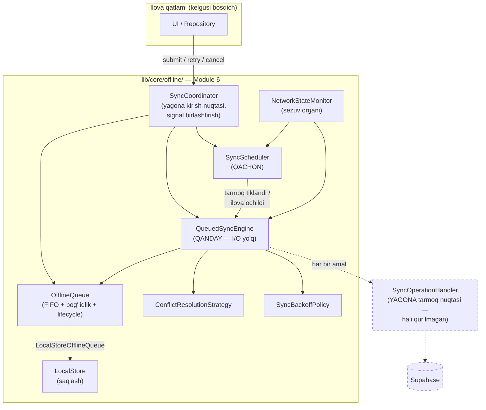
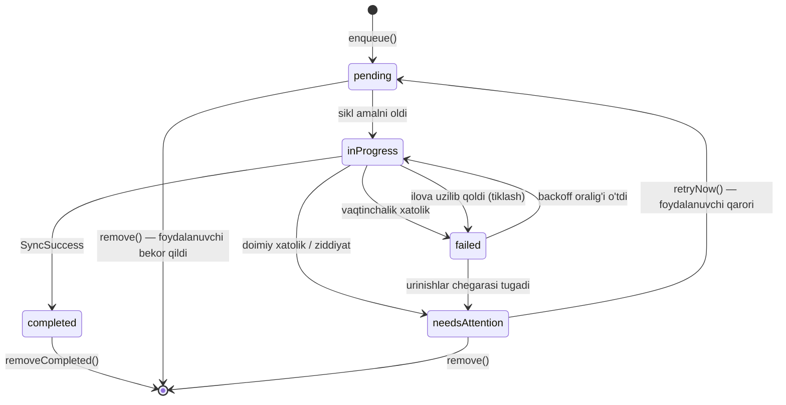

# ARCHITECTURE.md — Adolat AI tizim arxitekturasi (MVP)

Bu hujjat **faqat dizayn hujjati** — kod, SQL yoki diagramma yo'q. Maqsad: MVP doirasida tizimning yuqori darajadagi (high-level) arxitekturasini so'z bilan tasvirlab, komponentlar orasidagi mas'uliyat chegarasini aniqlashtirish. Batafsil implementatsiya tafsilotlari mavjud boshqa hujjatlarga (`docs/DATABASE.md`, `docs/SECURITY.md`, `docs/folder_structure.md`) havola qilinadi, ular bilan ziddiyatga kirmaydi.

## System Overview

Adolat AI — O'zbekiston fuqarolari va tashkilotlariga huquqiy yordam ko'rsatish, murojaat va nizolarni sun'iy intellekt yordamida tahlil qilib soddalashtirish platformasi.

MVP ikkita asosiy foydalanuvchi oqimini qo'llab-quvvatlaydi:

1. **Murojaat (appeal)** — fuqaro yoki tashkilot davlat organiga yuboriladigan murojaat/shikoyat matnini AI yordamida tayyorlaydi va uning holatini kuzatadi.
2. **Nizo (dispute)** — ikki tomon (fuqaro–fuqaro yoki fuqaro–tashkilot) o'rtasidagi kelishmovchilikni AI tarafsiz ravishda, faqat qonun va taqdim etilgan faktlar asosida tahlil qiladi (`docs/DATABASE.md`, `disputes` jadvali; `docs/DEVELOPMENT_RULES.md`, 15–16-bandlar).

Tizimda uchta foydalanuvchi roli mavjud: **Fuqaro** (`citizen`), **Tashkilot** (`organization`) va **Admin** (`admin`) — batafsil: `docs/SECURITY.md`, "Avtorizatsiya" bo'limi.

**MVP doirasidagi asosiy arxitektura talabi — Offline-First:** ilova internet aloqasi bo'lmagan yoki beqaror bo'lgan sharoitda ham to'liq foydalanish imkonini beradigan tarzda loyihalanadi. Foydalanuvchi hech qachon "internet yo'q — ilova ishlamaydi" holatiga tushmasligi shart. Bu talabning batafsil mexanizmi (lokal saqlash, sinxronizatsiya, navbat) quyida "Offline-First Architecture", "Local Storage", "Sync Engine", "Conflict Resolution" va "Network State Handling" bo'limlarida alohida hujjatlashtirilgan; bu bo'lim uni faqat tizim darajasidagi majburiy talab sifatida belgilaydi.

Texnologik asos: **Flutter** (mobil klient, Android/iOS/Web bitta kod bazasi) + **Supabase** (backend — autentifikatsiya, ma'lumotlar bazasi, fayl saqlash) + alohida **AI Service** komponenti (huquqiy tahlil).

## High-Level Architecture

Tizim uchta asosiy qatlamdan iborat:

1. **Flutter App** — foydalanuvchi bilan bevosita ishlaydigan mobil/veb klient. UI, mahalliy holat boshqaruvi va (offline-first talabiga muvofiq) lokal ma'lumotlar qatlamini o'z ichiga oladi.
2. **Supabase Backend** — markaziy backend platforma: autentifikatsiya, ma'lumotlar bazasi (PostgreSQL + Row Level Security), fayl saqlash (Storage) va imtiyozli (service role) amallar uchun serverless funksiyalar.
3. **AI Service** — huquqiy tahlil vazifasini bajaruvchi alohida mantiqiy komponent; to'g'ridan-to'g'ri klientdan emas, faqat Supabase backend orqali (service role chegarasi bilan) chaqiriladi.

Umumiy oqim: Flutter App foydalanuvchi kiritgan ma'lumotni (murojaat/nizo) Supabase orqali saqlaydi → tegishli holatga o'tganda AI Service chaqiriladi → AI natijasi (`ai_analyses`) yana Supabase orqali saqlanadi va klientga qaytariladi. Komponentlar orasidagi barcha aloqa Supabase'ning autentifikatsiya va RLS mexanizmi orqali nazorat qilinadi — hech bir komponent boshqasiga to'g'ridan-to'g'ri, tekshiruvsiz ishonch bilan murojaat qilmaydi.

Bu uch qatlamli ajratish quyidagi "Ichki Kod Arxitekturasi (Clean Architecture)" bo'limida tasvirlangan klient ichidagi Clean Architecture ajratishidan (presentation/domain/data) mustaqil, undan yuqori (tizim) darajadagi ajratishdir — ikkalasi bir-birini to'ldiradi: klient ichidagi qatlamlanish "qanday tuzilgan", tizim darajasidagi ajratish esa "kim kim bilan qanday gaplashadi" savoliga javob beradi.

## Flutter App

- **Platforma qamrovi:** bitta Dart kod bazasi orqali Android, iOS va Web'ga tarqatiladi.
- **Ichki arxitektura:** feature-first + Clean Architecture (`presentation` / `domain` / `data`) — to'liq tavsif: quyidagi "Ichki Kod Arxitekturasi (Clean Architecture)" bo'limi.
- **Holat boshqaruvi:** Riverpod — har bir feature o'z providerlariga ega, global infratuzilma providerlar (`services/`) orqali ulashiladi.
- **Marshrutlash:** GoRouter — yagona markazlashgan konfiguratsiya.
- **Backend bilan aloqa:** `supabase_flutter` klient kutubxonasi orqali to'g'ridan-to'g'ri Supabase Auth/Database/Storage'ga ulanadi; qo'shimcha tarmoq so'rovlari (agar kerak bo'lsa) `Dio` orqali amalga oshiriladi.
- **Mas'uliyat chegarasi:** Flutter App hech qachon imtiyozli (service role) amallarni bajarmaydi — u faqat foydalanuvchi nomidan, RLS bilan cheklangan huquq (`anon key` + foydalanuvchi JWT'i) orqali ishlaydi (`docs/SECURITY.md`, "API Security" bo'limi).
- **Offline-first talabiga aloqadorlik:** klient shunday loyihalanadiki, tarmoq mavjudligidan qat'i nazar foydalanuvchi interfeysi va asosiy amallar ishlashda davom etadi; bu qatlamning aniq mexanizmi quyidagi "Offline-First Architecture" va "Local Storage" bo'limlarida belgilangan.
- **Xavfsiz mahalliy saqlash:** autentifikatsiya tokenlari va boshqa nozik mahalliy ma'lumotlar `Flutter Secure Storage` orqali saqlanadi (`docs/SECURITY.md`, "JWT Security" bo'limi).

## Ichki Kod Arxitekturasi (Clean Architecture)

Adolat AI **feature-first + Clean Architecture** tamoyiliga asoslanadi. Maqsad: biznes logikani (domain) UI'dan va tashqi kutubxonalardan (Supabase, Dio) ajratib turish — shunda har bir qatlam mustaqil ravishda almashtirilishi va test qilinishi mumkin.

**Qatlamlar (har bir `features/<nom>/` ichida):**

```
presentation  →  domain  ←  data
```

- **`domain/`** — markaz. Sof Dart, hech qanday Flutter/Supabase/Dio importi yo'q.
  - `entities/` — biznes obyektlari (Freezed bilan immutable)
  - `repositories/` — abstrakt shartnoma (interface), masalan `abstract class AppealsRepository`
  - `usecases/` — bitta aniq amal (masalan `SubmitAppealUseCase`), Single Responsibility
- **`data/`** — `domain/repositories/` shartnomasini amalga oshiradi.
  - `datasources/` — Supabase/API bilan bevosita ishlaydi (`services/supabase/` dan foydalanadi)
  - `models/` — Freezed DTO (JSON serialization bilan), `domain/entities/`ga xaritalanadi
  - `repositories/` — `domain/repositories/` interfeysining implementatsiyasi, datasource xatoliklarini `Failure`ga aylantiradi
- **`presentation/`** — UI va holat boshqaruvi.
  - `providers/` — Riverpod providerlar, `usecases/`ni chaqiradi
  - `screens/` — to'liq ekranlar (GoRouter shu yerga ishora qiladi)
  - `widgets/` — shu feature'ga xos widgetlar

**Xatoliklarni qayta ishlash:** `data` qatlami `Exception` tashlaydi → `repository` implementatsiyasi uni ushlab `core/error/`dagi `Failure` sealed union'iga aylantiradi → `domain`/`presentation` faqat `Failure` bilan ishlaydi, hech qachon xom exception bilan emas.

**Holat boshqaruvi — Riverpod:** har bir feature o'z providerlarini `presentation/providers/` ichida e'lon qiladi. Global/infratuzilma providerlar (`dioClientProvider`, `secureStorageServiceProvider`) `services/` ichida joylashadi va istalgan feature tomonidan `ref.watch`/`ref.read` orqali ishlatiladi.

**Immutable modellar — Freezed:** barcha `domain/entities/` va `data/models/` klasslari `@freezed` annotatsiyasi bilan yoziladi:

```dart
@freezed
class Appeal with _$Appeal {
  const factory Appeal({
    required String id,
    required String title,
  }) = _Appeal;

  factory Appeal.fromJson(Map<String, dynamic> json) => _$AppealFromJson(json);
}
```

Generatsiya qilingan `*.freezed.dart`/`*.g.dart` fayllar `.gitignore`ga kiritilgan — ular `dart run build_runner build` orqali lokal generatsiya qilinadi (`docs/SETUP.md`, "Amaliy O'rnatish Qadamlari" bo'limiga qarang).

**Marshrutlash — GoRouter:** yagona `GoRouter` konfiguratsiyasi `router/app_router.dart`da. Har bir feature marshruti shu yerga qo'shiladi, ekranning o'zi feature ichida qoladi.

**Nega bu tuzilma?**

- **Test qilinishi oson** — `domain/` tashqi kutubxonalarga bog'liq emas, shuning uchun mock'siz unit test yozish mumkin.
- **Almashtirilishi oson** — Supabase o'rniga boshqa backend kerak bo'lsa, faqat `data/` qatlami o'zgaradi, `domain`/`presentation` tegilmaydi.
- **Katta jamoa uchun mos** — feature-first tuzilma bir nechta dasturchi parallel, bir-biriga xalaqit bermay ishlashiga imkon beradi.

### Vendor Mustaqilligi — Majburiy Qoida (ADR-006)

`docs/adr/ADR-006-hybrid-infrastructure-strategy.md`da qabul qilingan qarorga muvofiq, quyidagi qoida **majburiy** va kod review'da tekshiriladi:

- `lib/features/<nom>/domain/` va `lib/features/<nom>/presentation/` ostidagi hech qanday fayl backend-maxsus paketni (`package:supabase_flutter` va h.k.) to'g'ridan-to'g'ri import qilmaydi. Bunday import faqat `lib/features/<nom>/data/datasources/` va `lib/services/supabase/` ichida ruxsat etiladi.
- Bu — nazariy qoida emas: loyihaning barcha mavjud feature'lari (`appeals`, `disputes`, `attachments`, `ai_analyses`, `legal_reference`) shu qoidaga allaqachon amal qiladi (tekshirildi, 2026-07-28).
- **Sabab:** `docs/adr/ADR-001-data-residency.md`dagi ochiq huquqiy savol (Supabase O'zbekiston shaxsiy ma'lumotlar qonuniga muvofiqmi) hali hal qilinmagan. Bu qoida ADR-001 qanday hal bo'lishidan qat'i nazar — backend almashtirish (yoki sezgir ma'lumotni alohida infratuzilmaga ko'chirish) kerak bo'lganda **faqat `data/` qatlami o'zgarishini** ta'minlaydi.
- **Sezgir ma'lumot toifalari** (ADR-006'da to'liq ro'yxat): pasport, PINFL/JShShIR (hali sxemada yo'q, lekin kelajakda qo'shilsa shu qoidaga muvofiq loyihalanishi shart), telefon raqami (`profiles.phone_number`), yuklangan huquqiy hujjatlar (`attachments.*` + Storage), manzil. Bu toifalar boshqa ma'lumotdan texnik jihatdan ajratilmagan (hammasi hozircha Supabase'da) — faqat repository chegarasi orqali kelajakdagi ajratishga tayyorgarlik ko'rilgan.

## Supabase Backend

Supabase MVP uchun yagona backend platforma bo'lib, quyidagi xizmatlarni taqdim etadi:

- **Auth:** foydalanuvchi ro'yxatdan o'tishi, kirishi va sessiya boshqaruvi (JWT asosida) to'liq Supabase Auth tomonidan bajariladi; ilova o'z autentifikatsiya mexanizmini yozmaydi (`docs/SECURITY.md`, "Autentifikatsiya" bo'limi).
- **Database (PostgreSQL + RLS):** barcha biznes ma'lumotlari (`profiles`, `appeals`, `disputes`, `ai_analyses`, `laws` va boshqalar — to'liq ro'yxat `docs/DATABASE.md`da) shu yerda saqlanadi. Har bir jadval Row Level Security bilan himoyalangan — kirish huquqi foydalanuvchi identifikatori va roliga qarab DB darajasida cheklanadi, ilova darajasidagi tekshiruvga tayanilmaydi.
- **Storage:** murojaat/nizoga biriktirilgan dalil va hujjat fayllari (`attachments` jadvalidagi metadata orqali ko'rsatilgan haqiqiy fayl tarkibi) shu yerda, bucket darajasidagi kirish siyosati bilan saqlanadi.
- **Service role / imtiyozli amallar:** klient to'g'ridan-to'g'ri yoza olmaydigan nozik jadvallar (`ai_analyses`, `audit_log`, `case_status_history`, tizim tomonidan yuboriladigan `notifications`) faqat backend tomonidagi service role orqali to'ldiriladi — bu AI xulosasi yoki audit yozuvining soxtalashtirilishini oldini oladi.
- **AI Service bilan integratsiya nuqtasi:** murojaat/nizo tegishli holatga o'tganda (masalan yuborilgan yoki ikkala tomon fakti to'plangan), Supabase tomonidagi backend jarayoni AI Service'ni chaqiradi va natijani `ai_analyses` jadvaliga yozadi — bu aloqa klientdan butunlay yashirin.
- **Mas'uliyat chegarasi:** Supabase — tizimning yagona "haqiqat manbai" (source of truth). Klient va AI Service o'rtasidagi barcha ma'lumot almashinuvi Supabase orqali o'tadi, ular bir-biri bilan bevosita gaplashmaydi.

## AI Service

- **Vazifasi:** ikki turdagi huquqiy tahlilni amalga oshiradi — (a) murojaat uchun matnni yaxshilash va tegishli qonuniy asosni taklif qilish, (b) nizo uchun ikki tomon taqdim etgan faktlarni qonunga asoslanib, tarafsiz tahlil qilish.
- **Xolislik talabi:** AI hech qachon nizoda bir tomon foydasiga qaror chiqarmaydi va faqat qonun hamda taqdim etilgan faktlarga asoslanadi (`docs/DEVELOPMENT_RULES.md`, 15–16-bandlar). Agar nizoning faqat bir tomoni fakt taqdim etgan bo'lsa, bu holat tahlil natijasida ochiq ko'rsatiladi (`docs/DATABASE.md`, 6-jadval izohi).
- **Qonun manbai:** tahlil `laws` jadvalidagi boshqariladigan qonun moddalari lug'atiga tayanadi va iqtibos keltirilgan moddalar `ai_analysis_law_references` orqali natija bilan bog'lanadi — bu AI xulosasining tekshirilishi (traceability) mumkinligini ta'minlaydi.
- **Chaqirilish yo'li:** AI Service klient tomonidan to'g'ridan-to'g'ri chaqirilmaydi — faqat Supabase backend (service role) orqali ishga tushiriladi. Bu klientning AI so'rovini soxtalashtirishi yoki AI xulosasini chetlab o'tishi imkonini yo'qqa chiqaradi.
- **Natija va audit:** har bir tahlil natijasi (`analysis_text`, `legal_basis_summary`, `confidence_score`) qaysi model versiyasi (`model_version`) bilan hosil qilingani bilan birga saqlanadi — kelgusida audit va sifat nazorati uchun.
- **Asinxron tabiat:** huquqiy tahlil vaqt talab qiluvchi jarayon bo'lgani uchun AI Service natijasi darhol emas, keyinroq tayyor bo'lishi mumkin bo'lgan vazifadir; bu holat murojaat/nizo holati (`status`, masalan `ai_analyzing` → `ai_analyzed`) va `case_status_history` orqali kuzatiladi. Bu xususiyatning tarmoq holati va navbatga qo'yish bilan bog'liq aniq mexanizmi quyidagi "Offline-First Architecture" va "Sync Engine" bo'limlarida batafsil yoritilgan.

## Database Layer

- **Platforma:** Supabase tomonidan boshqariladigan **PostgreSQL** — MVP uchun yagona ma'lumotlar bazasi, tizimning markaziy "haqiqat manbai" (source of truth).
- **Sxema va jadvallar:** to'liq jadval ro'yxati, ustunlar, foreign key'lar va indekslar `docs/DATABASE.md`da hujjatlashtirilgan; ushbu hujjat sxemani takrorlamaydi, faqat uning tizimdagi rolini belgilaydi.
- **Kirish nazorati — Row Level Security (RLS):** har bir jadvalga kirish huquqi ilova kodida emas, DB darajasida, foydalanuvchi identifikatori (`auth.uid()`) va roli (`profiles.role`) asosida ta'minlanadi (`docs/SECURITY.md`, "Supabase RLS Security" bo'limi). Bu Database Layer'ni faqat ma'lumot saqlovchi emas, balki avtorizatsiyani ham amalga oshiruvchi qatlamga aylantiradi.
- **Yozuv huquqi ajratilishi:** foydalanuvchi to'g'ridan-to'g'ri o'zgartira oladigan jadvallar (masalan `appeals`, `disputes`ning ba'zi ustunlari) bilan faqat backend/service role yoza oladigan nozik jadvallar (`ai_analyses`, `audit_log`, `case_status_history`) o'rtasida aniq chegara mavjud.
- **Butunlik (integrity) cheklovlari:** DB darajasidagi CHECK constraint'lar (masalan "mutually exclusive FK" naqshi) ma'lumotning noto'g'ri holatga tushishini ilova kodidan mustaqil ravishda oldini oladi — bu Database Layer'ning o'zini ham bir qatlamli himoya vositasi qiladi, faqat ilova mantig'iga tayanilmaydi.
- **O'zgarmas (immutable) yozuvlar:** audit va holat tarixi jadvallari (`case_status_history`, `audit_log`) uchun `UPDATE`/`DELETE` siyosati umuman berilmaydi — bu Database Layer darajasida tarixni buzilmasligini kafolatlaydi.
- **Mantig'iy izchillik:** Database Layer offline-first talabi bilan ham bog'liq — u har doim yagona markaziy holat sifatida ishlaydi, klientdagi mahalliy ma'lumot esa u bilan keyinchalik sinxronlanadigan vaqtinchalik nusxa hisoblanadi (batafsil: quyidagi "Sync Engine" bo'limi).

## Storage Layer

- **Platforma:** Supabase **Storage** — murojaat/nizoga biriktirilgan dalil va hujjat fayllarining haqiqiy tarkibini saqlovchi xizmat.
- **Metadata va tarkib ajratilgan:** haqiqiy fayl Storage'da, unga oid metadata (`storage_path`, `file_name`, `mime_type`, `size_bytes`, egalik va bog'liqlik ma'lumoti) esa Database Layer'dagi `attachments` jadvalida saqlanadi — ikkalasi birgalikda bitta mantiqiy birlikni tashkil qiladi.
- **Kirish nazorati:** Storage bucket darajasidagi siyosat `attachments` jadvalidagi RLS egalik mantig'iga mos ravishda sozlanadi — fayl metadatasini ko'rish huquqiga ega bo'lgan foydalanuvchigina haqiqiy fayl tarkibiga ham kira oladi (`docs/SECURITY.md`, "File Upload Security" bo'limi).
- **Nomlash xavfsizligi:** fayl Storage'da foydalanuvchi kiritgan asl nom bilan emas, tizim generatsiya qilgan noyob yo'l (`storage_path`) bilan saqlanadi; asl nom faqat ko'rsatish maqsadida `file_name`da alohida yuritiladi.
- **Cheklovlar:** ruxsat etilgan fayl turlari (whitelist) va maksimal hajm chegarasi Storage Layer darajasida ta'minlanadi — bu suiiste'mol va nazoratsiz xarajat o'sishining oldini oladi.
- **Offline holat bilan bog'liqligi:** foydalanuvchi tarmoqsiz holatda biriktirgan fayl avval faqat qurilmada (mahalliy) saqlanadi va Storage Layer'ga faqat internet aloqasi tiklangach yuklanadi — bu jarayonning aniq mexanizmi quyidagi "Local Storage" va "Sync Engine" bo'limlarida tavsiflangan; Storage Layer'ning o'zi bu jarayonning yakuniy, doimiy saqlanadigan manzili sifatida xizmat qiladi.

## Authentication Flow

- **Ro'yxatdan o'tish:** foydalanuvchi telefon raqami (asosiy usul) yoki email orqali ro'yxatdan o'tadi; telefon tanlanganda Supabase Auth SMS-kod yuborib raqamni tasdiqlaydi, shundan keyingina hisob faollashadi.
- **Profil yaratilishi:** `auth.users` yozuvi hosil bo'lishi bilan bir vaqtda, klientdan alohida so'rovsiz, backend trigger/service role orqali `profiles` jadvalida mos yozuv avtomatik yaratiladi va boshlang'ich rol (`citizen` yoki `organization`, ro'yxatdan o'tish shakliga qarab) belgilanadi — foydalanuvchi o'z rolini to'g'ridan-to'g'ri tanlab/o'zgartirib yoza olmaydi.
- **Kirish (login):** foydalanuvchi telefon/email va parol bilan kiradi; Supabase Auth ma'lumotlarni tekshirib, muvaffaqiyatli bo'lsa JWT juftligini (qisqa umrli access token + uzoq umrli refresh token) qaytaradi.
- **Sessiya saqlanishi:** olingan tokenlar klient qurilmasida `Flutter Secure Storage` orqali shifrlangan holda saqlanadi (`docs/SECURITY.md`, "JWT Security" bo'limi); ilova qayta ochilganda mavjud sessiya shu tokenlar orqali tiklanadi, foydalanuvchi qayta kirish talab qilinmaydi.
- **Token yangilanishi:** access token muddati tugaganda, foydalanuvchi buni sezmagan holda, refresh token yordamida avtomatik yangi access token olinadi; refresh token ham yaroqsiz bo'lsa, foydalanuvchi kirish ekraniga yo'naltiriladi.
- **Har bir so'rovda avtorizatsiya:** Flutter App Supabase'ga yuborgan har bir so'rovda joriy JWT ilova qiladi; Database/Storage Layer tomonida RLS shu tokendagi foydalanuvchi identifikatori va joriy `profiles.role` qiymati asosida kirish huquqini qaror qiladi — klient tomonidagi rol tekshiruvi faqat UX uchun, yakuniy avtorizatsiya har doim serverda.
- **Chiqish (logout):** foydalanuvchi tizimdan chiqqanda mahalliy tokenlar to'liq tozalanadi va (agar mumkin bo'lsa) tegishli sessiya Supabase tomonida ham bekor qilinadi.
- **Offline holatdagi xatti-harakat:** ilova birinchi marta ochilganda internet talab qilinadi (autentifikatsiya markazlashgan xizmat bo'lgani sababli), ammo sessiya bir marta muvaffaqiyatli o'rnatilgach, keyingi ishga tushirishlarda mahalliy saqlangan sessiya asosida foydalanuvchi tarmoqsiz holatda ham ilovadan foydalanishni davom ettira oladi (batafsil: "Offline-First Architecture" bo'limi).

## Case Lifecycle

Murojaat (`appeals`) va nizo (`disputes`) — ikkalasi ham aniq belgilangan holatlar (status) ketma-ketligi orqali harakatlanadi; har bir o'tish `case_status_history`da qayd etiladi va tegishli tomonlarga `notifications` orqali xabar beriladi.

**Murojaat (`appeals`) holat ketma-ketligi:**

- `draft` — foydalanuvchi murojaatni yaratadi, matnni (kerak bo'lsa AI yordamida tayyorlangan qoralama asosida) tahrirlaydi; shu bosqichda faqat muallif o'zgartirish/o'chirish huquqiga ega.
- `submitted` — foydalanuvchi murojaatni yakuniy tasdiqlab, davlat organiga yuborilishi uchun taqdim etadi; shundan so'ng matn muallif tomonidan tahrirlanmaydi.
- `in_review` — murojaat ko'rib chiqilmoqda (holatni faqat `admin` yangilaydi, MVP'da avtomatik davlat organi integratsiyasi yo'q).
- `answered` — rasmiy javob (`official_response_text`) admin tomonidan qo'lda kiritilib, murojaatga bog'lanadi.
- `rejected` — murojaat rad etilgan holatda yopiladi.
- `closed` — murojaat yakunlangan, hech qanday keyingi o'zgarish kutilmaydi.

**Nizo (`disputes`) holat ketma-ketligi:**

- `open` — initiator nizoni ochadi va o'z faktlarini (`description`) kiritadi; respondent ro'yxatdan o'tgan bo'lsa, u ham shu bosqichda o'z bayonotini (`respondent_statement`) qo'shishi mumkin.
- `ai_analyzing` — ikkala tomonning (yoki mavjud bo'lgan yagona tomonning) fakti to'plangach, AI Service tahlilni boshlaydi; bu holatga o'tish backend/service role tomonidan boshqariladi.
- `ai_analyzed` — AI tahlili (`ai_analyses`) tayyor bo'lib, tomonlarga taqdim etiladi.
- `resolved` — taraflar AI tahlili asosida kelishuvga erishgan deb belgilangan.
- `closed` — nizo yakunlangan, keyingi o'zgarish kutilmaydi.

**Umumiy prinsiplar:**

- Holat o'tishlarining aksariyati (ayniqsa AI bilan bog'liq va yakuniy qarorlar) faqat backend/service role yoki `admin` tomonidan amalga oshiriladi — oddiy foydalanuvchi holatni to'g'ridan-to'g'ri o'zgartira olmaydi, faqat harakatni (masalan "yuborish") boshlab beradi.
- Har bir holat o'zgarishi `case_status_history`da o'zgarmas (immutable) yozuv sifatida saqlanadi — "qachon, kim tomonidan, qaysi holatdan qaysi holatga" savoliga to'liq javob beriladi.
- Har bir muhim o'tishda tegishli foydalanuvchi(lar)ga `notifications` orqali xabar beriladi — foydalanuvchi hech qachon o'z murojaati/nizosi holati o'zgarganidan bexabar qolmaydi (`DEVELOPMENT_RULES.md`, "No Dead End Rule").
- Offline holatda boshlangan harakatlar (masalan murojaatni yaratish yoki yuborish) darhol yakuniy holatga o'tmaydi — ular internet tiklanguncha lokal navbatda kutadi; bu jarayon "Offline-First Architecture" va "Sync Engine" bo'limlarida batafsil tavsiflanadi.

## Offline-First Architecture

Offline-first — Adolat AI uchun ixtiyoriy optimallashtirish emas, **majburiy arxitektura talabi**. O'zbekistonda internet aloqasi barqaror bo'lmagan hududlar va vaziyatlar mavjudligi hisobga olinib, ilova quyidagi asosiy tamoyil asosida loyihalanadi: **foydalanuvchi tarmoq holatidan qat'i nazar ishini davom ettira olishi shart, va hech qachon "internet yo'q — ilova ishlamaydi" degan boshi berk holatga tushmasligi kerak.**

Bu tamoyil quyidagi aniq talablar orqali amalga oshiriladi:

- **Ilova tarmoqsiz holatda to'liq ishlaydi:** interfeys, navigatsiya va asosiy amallar (ko'rish, yaratish, tahrirlash) internet mavjudligiga bog'liq bo'lmagan holda ishlashda davom etadi; internet yo'qligi ilovani bloklovchi (blocking) xatolikka olib kelmaydi.
- **Murojaat va nizolar offline yaratiladi:** foydalanuvchi yangi murojaat yoki nizoni internet bo'lmagan paytda ham to'liq kiritishi, tahrirlashi va "yuborish uchun tayyor" holatga keltirishi mumkin — bu amal mahalliy ravishda saqlanadi va internet tiklanganda avtomatik ravishda haqiqiy yozuvga aylantiriladi.
- **Fayllar vaqtincha lokal saqlanadi:** murojaat/nizoga biriktirilayotgan dalil fayllari (rasm, hujjat) avval qurilmaning o'zida saqlanadi; Storage Layer'ga yuklash faqat internet mavjud bo'lganda, fon jarayonida amalga oshiriladi.
- **AI vazifalari navbatga qo'yiladi:** agar murojaat/nizo AI tahlili talab qiladigan holatga (masalan yuborish yoki ikkala tomon fakti to'plangan holat) tarmoqsiz sharoitda yetgan bo'lsa, tegishli so'rov darhol emas — mahalliy navbatga qo'yiladi va internet qaytgach avtomatik yuboriladi; foydalanuvchiga bu holat "kutilmoqda" statusi bilan aniq ko'rsatiladi.
- **Internet qaytganda avtomatik sinxronizatsiya:** tarmoq aloqasi tiklanishi bilan barcha navbatdagi amallar (yozuvlar, fayllar, AI so'rovlari) foydalanuvchi aralashuvisiz, fon rejimida serverga yuboriladi.
- **Muvaffaqiyatsiz sinxronizatsiya qayta uriniladi:** sinxronizatsiya vaqtida xatolik yuz bersa (masalan aloqa uzilib qolsa), amal navbatdan olib tashlanmaydi — belgilangan strategiya bo'yicha (masalan ortib boruvchi kutish oralig'i bilan) qayta urinish davom etadi, toki muvaffaqiyatli yakunlanmaguncha yoki foydalanuvchi tomonidan bekor qilinmaguncha.
- **Shaffof holat ko'rsatish:** foydalanuvchi har doim o'z amalining haqiqiy holatini biladi — "lokal saqlangan / yuborilishi kutilmoqda", "sinxronlanmoqda", "serverga yetkazildi" kabi aniq belgilar orqali; hech qanday amal "jimgina yo'qolib qolgan" his-tuyg'usini uyg'otmaydi.
- **Faqat ko'rish uchun ham offline qamrov:** foydalanuvchi avval yuklab olgan/ko'rgan ma'lumotlari (o'z murojaatlari, nizolari, huquqiy kategoriyalar, qonun moddalari lug'ati) internet bo'lmasa ham mahalliy nusxadan ko'rinishda davom etadi — faqat eng so'nggi o'zgarishlar internet tiklanganda yangilanadi.

Ushbu talabning texnik amalga oshirilishi uchta bir-biriga bog'liq quyi komponentga bo'linadi — **Local Storage** (ma'lumot qayerda va qanday saqlanadi), **Sync Engine** (mahalliy va server holati qanday muvofiqlashtiriladi) va **Network State Handling** (tarmoq holati qanday aniqlanadi va ilova xatti-harakatiga ta'sir qiladi) — bular navbatdagi bo'limlarda batafsil yoritiladi.

### Offline-First komponentlari (Module 6, Phase 6A–6C)



Uzuq chiziqli bloklar — **hali qurilmagan** (Module 7+). Butun yadro "serverga qanday murojaat qilinadi" bilimini faqat `SyncOperationHandler` ortida saqlaydi.

### Navbatdagi amalning hayot davri



Ikkita muhim xossa: **`completed` va `remove()`dan boshqa hech qanday yo'l amalni navbatdan chiqarmaydi** (jimgina yo'qolish mumkin emas), va **`needsAttention` yakuniy tuzoq emas** — undan `retryNow()` orqali chiqish yo'li bor ("No Dead End Rule").

### Amalga oshirish holati (Module 6, Phase 6A–6C — 2026-07-31)

Quyidagi bo'limlarda tavsiflangan talablarning **shartnoma (kontrakt) qatlami** `lib/core/offline/`da qurildi (batafsil: [`lib/core/offline/README.md`](../lib/core/offline/README.md)). Bu — **faqat arxitektura va interfeyslar**: hech qanday HTTP/WebSocket, Supabase SDK, backend/Edge Function kodi, API kalit yoki UI o'zgarishi qo'shilmagan, yangi paket bog'liqligi ham olinmagan.

| Bo'lim | Phase 6A'da qurilgan | Hali qurilmagan |
|---|---|---|
| Local Storage | `LocalStore<T>`/`LocalStorage` shartnomasi + xotiradagi implementatsiya; `LocalDataSource<T>` va `RecordSyncStatus` | **Doimiylik (persistence)** — saqlash paketi (Drift/Isar/Hive/sqflite) tanlanmagan, ADR talab qilinadi |
| Sync Engine | `SyncEngine`/`SyncOperationHandler` shartnomalari, `PendingOperation`/`OfflineQueue` (FIFO + bog'liqlik tartibi + idempotentlik kaliti), `SyncBackoffPolicy`, `QueuedSyncEngine` (I/O'siz orkestratsiya) | Haqiqiy yuborish (`SyncOperationHandler` implementatsiyasi), fon rejimi jadvali |
| Conflict Resolution | `SyncConflict`, `ConflictResolution` (sealed), `DefaultConflictResolutionStrategy` — shu bo'limdagi to'rtala qoidaning xolis ifodasi | Ziddiyatni ANIQLASH (server javobini taqqoslash) va audit izini yozish |
| Network State Handling | **(6B)** `NetworkStatus`/`NetworkStatusChange`, `NetworkStateMonitor` shartnomasi + boshqariladigan implementatsiya; `SyncScheduler` (ishga tushish sabablari); sikl o'rtasida uzilishga reaksiya | Platforma signali manbai (paket tanlovi ADR talab qiladi) va UI ko'rsatkichi |

**Phase 6B qo'shimchalari (Network State Handling va rejalashtirish):**

- `NetworkStateMonitor` — tarmoq holati manbai; reaksiya **holatga emas, O'TISHGA** bog'langan (`NetworkStatusChange.isRestored`), shuning uchun takroriy signallar keraksiz sikl boshlamaydi.
- `SyncScheduler` — hujjatdagi barcha ishga tushish sabablarini (tarmoq tiklandi / ilova ochildi / old rejaga qaytdi / qo'lda) bitta joyga yig'adi; ilova hayot davri signali `AppLifecycleState` importisiz, oddiy metodlar orqali qabul qilinadi (offline yadro UI'dan mustaqil qoladi).
- **Backoff endi haqiqatan kutiladi:** Phase 6A oraliqni hisoblardi, lekin muvaffaqiyatsiz amal keyingi siklda darhol qayta urinilardi. 6B `SyncBackoffPolicy.isReadyForRetry()` va dvigateldagi filtr orqali *"ortib boruvchi kutish oralig'i"* talabini amalda ta'minlaydi (FIFO tartibi buzilmaydi).
- **Sikl o'rtasida tarmoq uzilishi** — qolgan amallar `pending` holida navbatda saqlanadi (`SyncReport.interruptedByOffline`), *"joriy bajarilayotgan so'rovlar xavfsiz tarzda navbatga qaytariladi"* talabiga muvofiq.
- **Uzilib qolgan amallarni tiklash** — ilova sinxronizatsiya o'rtasida to'xtasa, `inProgress`da osilib qolgan amal keyingi sikl boshida qayta urinishga qaytariladi. Bularsiz amal mangu shu holatda qolib, foydalanuvchi uchun "jimgina yo'qolgan"ga aylanardi; idempotentlik kaliti o'zgarmagani uchun qayta yuborish takroriy yozuv hosil qilmaydi.

**Phase 6C qo'shimchalari (yakunlash — 2026-07-31).** 6A/6B integratsiyasida topilgan beshta bo'shliq yopildi va navbat hayot davri to'liq yakunlandi:

| Bo'shliq (6A/6B) | Xavfi | Yechim (6C) |
|---|---|---|
| `enqueue` boshlangan amal ustiga yozardi | Ayni damda yuborilayotgan amal ikkinchi marta yuborilishi — **takroriy yozuv** | `inProgress`/`completed` amal ustiga yozilmaydi |
| Bloklangan ota-amalga bog'liq amal mangu kutardi | Foydalanuvchi uchun **jimgina yo'qolish** | Kaskad: bog'liqlar ham `needsAttention`ga o'tadi, sabab bilan |
| `needsAttention`dan chiqish yo'li yo'q edi | "Boshi berk holat" — 17–19-bandlar buzilishi | `OfflineQueue.retryNow()` + `SyncCoordinator.retryOperation()` |
| Sikl davomida kelgan sabab yo'qolardi | Yangi amallar keyingi tasodifiy sababgacha kutardi | `SyncCoordinator` signalni birlashtiradi (aynan bitta qo'shimcha sikl) |
| `PendingOperation` seriyalanmasdi | Navbatni **saqlab bo'lmasdi** — "Doimiylik" talabi bajarilmasdi | `toJson`/`fromJson` + `LocalStoreOfflineQueue` |

Qo'shimcha: bitta yozuvning ketma-ket tahrirlari bitta so'rovga birlashtiriladi (**faqat `updateRecord`** — qo'shimcha qiluvchi amallar hech qachon birlashtirilmaydi, aks holda foydalanuvchi ishi yo'qolardi).

Foydalanuvchiga ko'rsatiladigan holat (*"lokal saqlangan / yuborilishi kutilmoqda / sinxronlanmoqda / serverga yetkazildi"*) `SyncState` va `RecordSyncStatus` sifatida modellashtirilgan, lekin UI'ga hali ulanmagan (Phase 6A UI'ga tegmaydi).

Chegaralar `test/core/offline/offline_architecture_boundary_test.dart` orqali CI darajasida majburlanadi.

## Local Storage

- **Vazifasi:** Flutter App ichida, Supabase'ga bog'liq bo'lmagan holda ishlaydigan mahalliy (on-device) ma'lumot qatlami — offline-first talabining asosiy texnik poydevori.
- **Clean Architecture bilan bog'lanishi:** Local Storage `data/datasources/` ichida alohida **lokal datasource** sifatida namoyon bo'ladi, u Supabase bilan ishlaydigan **remote datasource** bilan bir xil `domain/repositories/` shartnomasini amalga oshiradi ("Ichki Kod Arxitekturasi (Clean Architecture)" bo'limiga muvofiq). Repository qatlami tarmoq holatiga qarab qaysi datasource'dan foydalanishni yoki ikkalasini qanday muvofiqlashtirishni hal qiladi — bu qaror `domain`/`presentation` qatlamlari uchun butunlay yashiringan.
- **Saqlanadigan ma'lumot turlari:**
  - Foydalanuvchi hali serverga yubormagan **qoralama va navbatdagi yozuvlar** (yaratilgan/tahrirlangan, lekin hali sinxronlanmagan murojaat va nizolar).
  - Yuklanishi kutilayotgan **fayllar** (dalil/hujjat), ularning Storage Layer'ga hali yetkazilmagan holati bilan birga.
  - Bajarilishi kutilayotgan **AI vazifalari navbati** — qaysi murojaat/nizo uchun AI tahlili so'ralgani va uning navbatdagi holati.
  - Foydalanuvchi tez-tez ko'radigan, lekin kam o'zgaradigan **ma'lumotlarning mahalliy nusxasi** (o'z profili, o'z murojaat/nizolari ro'yxati, huquqiy kategoriyalar, davlat organlari ro'yxati, qonun moddalari lug'ati) — bu offline holatda ham ma'lumotni ko'rish imkonini beradi.
  - Har bir navbatdagi elementning **sinxronizatsiya metama'lumoti** (holati — kutilmoqda/sinxronlanmoqda/xatolik, urinishlar soni, oxirgi urinish vaqti) — bu "Sync Engine" bo'limida tavsiflangan qayta urinish mexanizmi uchun zarur.
- **Maxfiy ma'lumotlar bilan chegara:** autentifikatsiya tokenlari Local Storage'ning umumiy mahalliy ma'lumotlar bazasida emas, alohida — `Flutter Secure Storage` orqali shifrlangan xotirada saqlanadi (`docs/SECURITY.md`, "JWT Security" bo'limi); ikkala mexanizm turli maqsad va turli xavfsizlik darajasiga ega bo'lgani sababli aralashtirilmaydi.
- **Doimiylik (persistence):** Local Storage'dagi ma'lumot ilova yopilib qayta ochilganda yo'qolmaydi — foydalanuvchi qurilmani o'chirib-yoqsa ham, hali sinxronlanmagan murojaat/nizo va navbatdagi vazifalar saqlanib qoladi, toki muvaffaqiyatli sinxronlangunga yoki foydalanuvchi tomonidan ataylab o'chirilgunga qadar.
- **Hajm va tozalash siyosati:** muvaffaqiyatli sinxronlangan va endi kerak bo'lmagan vaqtinchalik yozuvlar (masalan Storage'ga yuklab bo'lingan fayllarning mahalliy nusxasi) qurilma xotirasini keraksiz to'ldirmasligi uchun sinxronizatsiya muvaffaqiyatli yakunlangach mahalliy nusxadan tozalanadi.

## Sync Engine

- **Vazifasi:** Local Storage'dagi navbatdagi (hali serverga yetkazilmagan) yozuvlar, fayllar va AI so'rovlarini Supabase bilan muvofiqlashtiruvchi fon jarayoni — offline-first talabining "avtomatik sinxronizatsiya" qismini amalga oshiradi.
- **Ishga tushish shartlari:** tarmoq aloqasi mavjud bo'lmagan holatdan mavjud holatga o'tganda ("Network State Handling" bo'limiga qarang), ilova old rejaga (foreground) qaytganda va ilova ochilganda — bularning barchasida Sync Engine navbatni tekshiradi va kerak bo'lsa ishga tushadi; foydalanuvchidan qo'lda "sinxronlash" tugmasini bosish talab qilinmaydi (ixtiyoriy qo'lda ishga tushirish imkoniyati qo'shimcha bo'lishi mumkin).
- **Bajarish tartibi:** navbatdagi amallar yaratilgan tartibda (FIFO) qayta ishlanadi; bitta yozuvga tegishli bog'liq amallar (masalan avval murojaat yozuvi, keyin unga biriktirilgan fayl) mantiqiy ketma-ketlikda yuboriladi — fayl hali mavjud bo'lmagan yozuvga bog'lanib qolmasligi uchun.
- **Idempotentlik:** har bir navbatdagi amal mahalliy tomonda generatsiya qilingan barqaror identifikator bilan belgilanadi, shunda tarmoq uzilishi sababli bir xil amal ikki marta yuborilib qolsa ham, backend uni takroriy emas, bitta amal sifatida tan oladi — bu qayta urinish jarayonida ma'lumotning ikki marta yaratilib qolishining oldini oladi.
- **Muvaffaqiyatli yakunlanganda:** mos yozuv Local Storage navbatidan olib tashlanadi (yoki "sinxronlangan" deb belgilanadi), tegishli fayl mahalliy nusxasi tozalash siyosatiga muvofiq o'chiriladi, va foydalanuvchiga yangilangan holat (masalan "yuborildi") ko'rsatiladi.
- **Muvaffaqiyatsizlikda qayta urinish:** vaqtinchalik xatolik (tarmoq uzilishi, server vaqtincha ishlamasligi) holatida amal navbatda qoladi va ortib boruvchi kutish oralig'i (backoff) bilan qayta uriniladi; doimiy xatolik (masalan serverning qat'iy rad etishi — validatsiya xatosi) holatida amal "e'tibor talab qiladi" deb belgilanadi va foydalanuvchiga aniq xabar bilan ko'rsatiladi, jimgina cheksiz qayta urinilmaydi.
- **AI vazifalari navbati bilan integratsiya:** Sync Engine avval navbatdagi murojaat/nizo yozuvini serverga yetkazadi, faqat shundan keyin unga bog'liq AI tahlil so'rovini yuboradi — chunki AI so'rovi mavjud bo'lmagan yozuvga ishora qila olmaydi; AI so'rovining o'zi (backend orqali AI Service'ga) asinxron ekanligi sababli, Sync Engine uning natijasini kutmay, keyingi navbatdagi amalga o'tadi.
- **Fon rejimidagi cheklovlar:** Sync Engine platforma (Android/iOS) tomonidan fon jarayoniga qo'yilgan cheklovlarga hurmat bilan yondashadi — ilova old rejada bo'lmasa ham imkon qadar sinxronlashga harakat qiladi, lekin kafolat sifatida, ilova keyingi safar ochilganda navbat albatta qayta tekshirilishini ta'minlaydi.

## Conflict Resolution

- **Zaruriyat sababi:** foydalanuvchi tarmoqsiz holatda mahalliy nusxa ustida ishlayotganda, xuddi shu vaqt oralig'ida serverdagi haqiqiy holat boshqa yo'l bilan (masalan `admin` tomonidan yoki AI jarayoni orqali) o'zgargan bo'lishi mumkin — bu ikki holat sinxronlanganda ziddiyatga olib kelishi mumkin.
- **Egalik mantig'iga tayangan asosiy strategiya:** MVP'dagi asosiy yozuvlar (`appeals`, `disputes`) bitta muallif/tomon tomonidan tahrirlanadigan maydonlarga ega — shu sababli bir xil maydonni bir vaqtda ikki joydan (masalan ikki qurilmadan) tahrirlash ehtimoli past; asosiy diqqat foydalanuvchi–server ziddiyatiga, foydalanuvchi–foydalanuvchi ziddiyatiga emas, qaratiladi.
- **Server — yakuniy hakam (server wins on state):** murojaat/nizo **holati** (`status`) bo'yicha har doim server tomonidagi qiymat ustuvor hisoblanadi — agar foydalanuvchi offline paytda "yuborish" amalini boshlagan bo'lsa-yu, shu orada server tomonda holat allaqachon boshqa yo'nalishda o'zgargan bo'lsa (masalan admin tomonidan), mahalliy amal serverdagi haqiqiy holatni ko'rib chiqib qayta baholanadi — hech qachon serverdagi rasmiy holat mahalliy taxmin bilan jimgina ustidan yozilmaydi.
- **Foydalanuvchi tarkibi (content) — mahalliy amal ustuvor, lekin faqat ruxsat etilgan holatda:** murojaat matni yoki nizo tavsifi kabi foydalanuvchi kiritgan tarkib, agar tegishli yozuv hali tahrirlash mumkin bo'lgan holatda (masalan `draft`/`open`) bo'lsa, mahalliy versiya server tomonga yuboriladi; agar sinxronlash vaqtida yozuv allaqachon tahrirlash mumkin bo'lmagan holatga o'tgan bo'lsa (masalan `submitted`ga yoki AI tahlili boshlangan bo'lsa), mahalliy o'zgarish qabul qilinmaydi va foydalanuvchiga tushunarli tarzda xabar beriladi.
- **Hal qilib bo'lmaydigan ziddiyatda — foydalanuvchiga ko'rsatish:** avtomatik ravishda xavfsiz hal qilib bo'lmaydigan holatlarda (masalan mahalliy o'zgarish serverdagi haqiqiy holat bilan mos kelmasa), tizim taxminiy qaror qabul qilib, ma'lumotni jimgina yo'qotish yoki noto'g'ri holatga majburlash o'rniga, foydalanuvchiga vaziyatni tushuntirib, keyingi qadamni tanlash imkonini beradi ("No Dead End Rule"ga muvofiq).
- **Audit iz:** har qanday ziddiyat va uning qanday hal qilingani, agar biror yozuvga ta'sir qilsa, `case_status_history`/`audit_log` orqali kuzatiladi — bu keyinchalik nima uchun ma'lum bir sinxronizatsiya natijasi yuzaga kelganini tekshirish imkonini beradi.

## Network State Handling

- **Vazifasi:** qurilmaning joriy tarmoq holatini (bor/yo'q, va aloqa sifati) kuzatib borish va bu holatga qarab ilovaning xatti-harakatini (Sync Engine ishga tushishi, UI ko'rsatkichlari, so'rovlarni kechiktirish) boshqarish.
- **Holatlar:** ilova kamida ikkita asosiy holatni farqlaydi — **onlayn** (tarmoq mavjud, Supabase'ga so'rov yuborish mumkin) va **oflayn** (tarmoq mavjud emas yoki Supabase'ga yeta olmayapti). Ikkinchi holat ham qurilmaning tarmoqqa umuman ulanmaganini, ham qurilma ulangan-u, ammo backend'ga yeta olmayotgan holatni (masalan zaif signal, server vaqtincha ishlamasligi) o'z ichiga oladi — ilova nuqtai nazaridan ikkalasi ham bir xil "hozircha yuborib bo'lmaydi" xatti-harakatini talab qiladi.
- **Real vaqtda kuzatuv:** ilova tarmoq holati o'zgarishini fon rejimida doimiy kuzatib boradi (masalan qurilma tarmoq interfeysi holati o'zgarganda signal oladi) — foydalanuvchi holatni qo'lda yangilashi (masalan ekranni pastga tortib "refresh" qilishi) shart emas.
- **Holat o'zgarishiga reaksiya:** oflayndan onlaynga o'tganda, Sync Engine avtomatik ishga tushiriladi (`Sync Engine` bo'limi); onlayndan oflaynga o'tganda, joriy bajarilayotgan so'rovlar xavfsiz tarzda navbatga qaytariladi (agar hali serverga yetib bormagan bo'lsa) — foydalanuvchi ma'lumoti yo'qolmaydi.
- **Foydalanuvchiga ko'rsatish:** joriy tarmoq holati va navbatda kutayotgan amallar soni foydalanuvchiga interfeys darajasida (masalan holat ko'rsatkichi) aniq va tinch (bezovta qiluvchi bo'lmagan) tarzda bildiriladi — bu holat xatolik sifatida emas, ilovaning normal ishlash rejimlaridan biri sifatida taqdim etiladi.
- **So'rov davomida uzilish:** agar so'rov serverga yuborilayotgan paytda tarmoq uzilib qolsa, amal muvaffaqiyatsiz deb belgilanmaydi — u "noaniq" holatda navbatga qaytariladi va Sync Engine keyingi urinishda serverdan haqiqiy holatni tekshirib, takroriy yozuv hosil bo'lishining oldini oladi (`Sync Engine` bo'limidagi idempotentlik mexanizmi orqali).
- **Ilovaning boshqa bo'limlar bilan bog'liqligi:** Network State Handling — Offline-First Architecture'ning "sezuv organi"; u o'zi ma'lumot saqlamaydi va sinxronlamaydi, faqat Local Storage va Sync Engine'ga qachon harakat qilish kerakligini bildiradi.

## Push Notifications

- **Vazifasi:** foydalanuvchini murojaat/nizo holati o'zgarganda, AI tahlili tayyor bo'lganda yoki rasmiy javob kelganda darhol xabardor qilish — `notifications` jadvalida saqlangan xabarni qurilmaga real vaqtda yetkazish kanali.
- **Haqiqat manbai — DB, push esa faqat yetkazish kanali:** `notifications` jadvalidagi yozuv har doim asosiy va ishonchli manba hisoblanadi (`docs/DATABASE.md`, 12-jadval); push xabarnoma esa shu yozuv haqida foydalanuvchini tezroq ogohlantiruvchi qo'shimcha, "eng yaxshi urinish" (best-effort) kanaldir. Push yetib bormasa ham (qurilma o'chiq, ruxsat berilmagan, tarmoq muammosi), foydalanuvchi ilovani ochganda tegishli xabarni ilova ichidagi xabarnomalar ro'yxatidan albatta ko'radi.
- **Yuborilish yo'li:** xabarnoma yozuvi backend/service role tomonidan tegishli holat o'zgarishida avtomatik hosil qilinadi ("Case Lifecycle" bo'limi); shu yozuv asosida qurilmaga push xabarnoma yuboriladi. Klient push xabarnomani o'zi generatsiya qilmaydi va soxtalashtira olmaydi.
- **Ruxsat va foydalanuvchi nazorati:** push xabarnoma faqat foydalanuvchi tizim darajasida ruxsat bergandan so'ng yetkaziladi; ruxsat berilmagan taqdirda ham ilova to'liq ishlashda davom etadi — push faqat qulaylik, majburiy shart emas (bu talab "Offline-First Architecture"dagi "foydalanuvchi hech qachon boshi berk holatga tushmasligi" tamoyili bilan uyg'un).
- **Maxfiylik chegarasi:** push xabarnoma matnida nozik/tafsilotli ma'lumot (masalan to'liq AI xulosasi yoki hujjat mazmuni) ko'rsatilmaydi — faqat qisqa, umumiy xabar (masalan "Murojaatingiz holati yangilandi") beriladi; to'liq mazmun faqat foydalanuvchi ilovaga autentifikatsiyadan o'tib kirgach, RLS orqali tekshirilib ko'rsatiladi.
- **Chuqur havola (deep link):** xabarnomani bosish foydalanuvchini to'g'ridan-to'g'ri tegishli murojaat/nizo ekraniga yo'naltiradi — bu "No Dead End Rule" talabini qo'llab-quvvatlaydi.
- **Offline holat bilan bog'liqligi:** qurilma tarmoqsiz bo'lgan paytda yuborilgan push xabarnoma qurilma tomon operatsion tizim/xabarnoma xizmati darajasida navbatga qo'yiladi va tarmoq tiklanganda odatdagidek yetkaziladi; bu ilova darajasidagi Sync Engine'dan mustaqil, alohida mexanizm hisoblanadi. Ilova o'z navbatida, tarmoq tiklanib Sync Engine ishga tushganda, xabarnomalar ro'yxatini serverdan yangilab, push yetib kelgan-kelmaganidan qat'i nazar to'g'ri holatni ko'rsatishini kafolatlaydi.
- **MVP doirasi:** faqat push kanali qo'llab-quvvatiladi; SMS/email kabi qo'shimcha xabarnoma kanallari MVP doirasidan tashqarida qoldirilgan (`docs/DATABASE.md`, "Kelgusi bosqichlar" bo'limi).

## Error Handling

- **Umumiy tamoyil:** hech qanday xatolik foydalanuvchiga jimgina yashirilmaydi yoki tushunarsiz texnik shaklda ko'rsatilmaydi — har bir xatolik aniq tushuntirish va, imkon qadar, keyingi qadam bilan birga taqdim etiladi (`DEVELOPMENT_RULES.md`, "No Dead End Rule").
- **Qatlamlar bo'yicha xatolikni qayta ishlash:** `data` qatlami xom `Exception` tashlaydi → `repository` implementatsiyasi uni ushlab `core/error/`dagi `Failure` sealed union'iga aylantiradi → `domain`/`presentation` qatlamlari faqat tuzilgan `Failure` bilan ishlaydi, hech qachon xom exception bilan emas ("Ichki Kod Arxitekturasi (Clean Architecture)" bo'limiga muvofiq). Bu qatlamlanish xatolikni izchil va bashorat qilinadigan tarzda foydalanuvchiga yetkazish imkonini beradi.
- **Tarmoq xatoliklari — maxsus muomala:** internet yo'qligi yoki serverga yeta olmaslik oddiy "xatolik" sifatida emas, "Offline-First Architecture" va "Sync Engine" mexanizmi orqali kutilgan holat sifatida qayta ishlanadi — foydalanuvchiga qattiq xatolik ko'rsatish o'rniga, amal navbatga olinganligi bildiriladi.
- **Validatsiya xatoliklari:** foydalanuvchi kiritgan ma'lumot (masalan noto'g'ri fayl turi, bo'sh majburiy maydon) mos joyda, aniq va tuzatish yo'li ko'rsatilgan holda darhol ko'rsatiladi — bu xatolik turi serverga yuborilishidan oldin, imkon qadar klient darajasida ushlanadi.
- **Avtorizatsiya xatoliklari:** RLS tomonidan rad etilgan so'rov (masalan foydalanuvchi o'ziga tegishli bo'lmagan yozuvga kirishga urinishi) foydalanuvchiga "ruxsat yo'q" sifatida tushunarli ko'rsatiladi, lekin nima uchun aynan rad etilgani haqida ichki tizim tafsilotlari oshkor qilinmaydi (`docs/SECURITY.md`, "API Security" bo'limi).
- **Kutilmagan/server xatoliklari:** server tomonidagi kutilmagan xatoliklar foydalanuvchiga umumiy, ichki tuzilmani (DB struktura, stack trace) oshkor qilmaydigan xabar bilan ko'rsatiladi, lekin qayta urinish yoki qo'llab-quvvatlash bilan bog'lanish kabi keyingi qadam taklif etiladi.
- **Loglash va kuzatuv:** barcha ushlangan xatoliklar (foydalanuvchiga ko'rsatilgan shakldan tashqari) maxfiy ma'lumotsiz holda markazlashtirilgan monitoring tizimiga yuboriladi (`docs/SECURITY.md`, "Monitoring" bo'limi); Release build'da xom xatolik tafsilotlari yoki maxfiy ma'lumot logga yozilmaydi (`DEVELOPMENT_RULES.md`, 11-band).
- **Vaqtinchalik va doimiy xatolik farqi:** vaqtinchalik (retryable) xatoliklar — tarmoq uzilishi, server vaqtincha ishlamasligi — avtomatik qayta urinish orqali (`Sync Engine` bo'limi) hal qilinadi; doimiy (non-retryable) xatoliklar — validatsiya, ruxsat yo'qligi — darhol foydalanuvchiga ko'rsatiladi va cheksiz qayta urinilmaydi.
- **Kutilmagan ilova ichi xatoliklar:** ilova darajasidagi kutilmagan (handled bo'lmagan) xatoliklar butun ilovani to'xtatib qo'yadigan (crash) holatga olib kelmasligi uchun yuqori darajada ushlanadi va ilova imkon qadar yumshoq tarzda (graceful degradation) ishlashda davom etadi.

## Scalability

- **Klient tomoni — tabiiy gorizontal miqyoslanuvchi:** Flutter App har bir foydalanuvchi qurilmasida mustaqil ishlaydi, markaziy resursni iste'mol qilmaydi — foydalanuvchilar soni o'sishi klient arxitekturasiga bevosita yuk solmaydi.
- **Supabase — boshqariladigan (managed) miqyoslanish:** Database va Storage Layer Supabase tomonidan boshqariladigan infratuzilmaga tayanadi; ulanishlar soni, saqlash hajmi va o'tkazuvchanlik Supabase loyihasi rejasiga (tarif rejasi) qarab miqyoslanadi. MVP bosqichida maxsus qo'shimcha infratuzilma (masalan o'z serverida joylashtirilgan DB klasteri) tashkil etilmaydi.
- **RLS va so'rovlar samaradorligi:** RLS siyosatlari egalik ustunlariga (`author_id`, `initiator_id` va h.k.) asoslangani sababli, `docs/DATABASE.md`da belgilangan indekslar (masalan `(author_id, status)` composite indeks) bu siyosatlarning katta hajmdagi ma'lumotda ham samarali ishlashini ta'minlaydi.
- **AI Service — mustaqil miqyoslanuvchi komponent:** AI Service alohida mantiqiy komponent bo'lgani sababli (`High-Level Architecture` bo'limi), u qolgan tizimdan mustaqil ravishda miqyoslanishi mumkin — AI so'rovlari hajmi oshsa, faqat shu komponentga tegishli resurs oshiriladi, Flutter App yoki Database Layer'ga ta'sir qilmaydi.
- **Navbat orqali yukni tekislash (load leveling):** "Sync Engine" va "AI vazifalari navbati" mexanizmi tabiiy ravishda so'rovlarni vaqt bo'yicha tarqatadi — ko'p sonli foydalanuvchi bir vaqtda tarmoqqa qaytganda ham, barcha so'rovlar bir zumda emas, navbat tartibida serverga yetadi, bu esa server tomoniga to'satdan yuk tushishining oldini oladi.
- **Statistika va hisobot yuki ajratilgan:** og'ir hisobot/statistika so'rovlari (agar kelajakda qo'shilsa) asosiy tranzaksion yozuv-o'qish yukidan ajratilgan holda ko'rib chiqilishi kerak — MVP doirasida bunday og'ir hisobot funksiyasi yo'q, shuning uchun bu hozircha amalga oshirilmaydi.
- **MVP chegarasi:** ko'p mintaqali (multi-region) joylashtirish, o'qish uchun replika (read replica), keshlash qatlami (caching layer) kabi murakkab miqyoslash yechimlari MVP doirasidan tashqarida qoldiriladi va kerak bo'lganda `docs/IDEA_PARKING.md`ga yoziladi (`DEVELOPMENT_RULES.md`, 8-band) — foydalanuvchi hajmi buni talab qilganda alohida ko'rib chiqiladi.

## Security Architecture

Xavfsizlik Adolat AI arxitekturasida alohida qo'shimcha qatlam emas, balki yuqorida tavsiflangan har bir komponent va bo'limga singdirilgan ko'ndalang (cross-cutting) tamoyildir. Ushbu bo'lim xavfsizlikning tizim arxitekturasidagi o'rnini umumlashtiradi; barcha aniq siyosat va mexanizmlarning to'liq va yagona haqiqat manbai — **`docs/SECURITY.md`**.

- **Chuqurlashtirilgan himoya (defense in depth):** xavfsizlik bir nechta mustaqil qatlamda ta'minlanadi — autentifikatsiya (Supabase Auth), avtorizatsiya (RLS, DB darajasida), tarmoq (HTTPS/TLS), mahalliy saqlash (Flutter Secure Storage) va imtiyozli amallar chegarasi (service role). Bitta qatlamning buzilishi butun tizimni ochiq qoldirmaydi.
- **Klient — hech qachon ishonchli tomon emas:** Flutter App arxitekturada "ishonilmagan" (untrusted) komponent sifatida ko'riladi — u faqat cheklangan huquqli `anon key` va foydalanuvchi JWT'i bilan ishlaydi; yakuniy avtorizatsiya qarori har doim Database Layer (RLS) darajasida qabul qilinadi, klient tomonidagi tekshiruv faqat UX uchun (`Authentication Flow` bo'limi).
- **Imtiyozli amallar — markazlashgan chegara:** AI Service va nozik yozuvlar (`ai_analyses`, `audit_log`, `case_status_history`) faqat Supabase Backend'dagi service role orqali amalga oshiriladi — bu chegara "AI Service" va "Supabase Backend" bo'limlarida allaqachon belgilangan integratsiya nuqtasi bilan bir xil, xavfsizlik nuqtai nazaridan takrorlanadi.
- **Ma'lumot butunligi DB darajasida:** Database Layer'dagi CHECK constraint'lar va o'zgarmas (immutable) audit jadvallari ma'lumotning nafaqat ruxsatsiz o'qilishidan, balki noto'g'ri yoki soxta yozilishidan ham himoyalanishini ta'minlaydi.
- **Offline holatdagi xavfsizlik uzluksizligi:** Local Storage'da vaqtincha saqlanadigan ma'lumot (qoralama murojaat/nizo, navbatdagi fayllar) qurilma darajasidagi standart himoyaga tayanadi; sinxronlanganda esa xuddi shu RLS va service role chegaralari qo'llaniladi — offline rejim xavfsizlik talablarini "chetlab o'tish" usuli sifatida ishlatilmaydi.
- **Muvofiqlik va kuzatiladiganlik:** `audit_log` orqali nozik amallarning to'liq va o'zgarmas izi yuritiladi, bu esa xavfsizlik hodisalarini keyinchalik tekshirish (`docs/SECURITY.md`, "Audit Log Security" va "Incident Response" bo'limlari) imkonini beradi.
- **Release oldidan majburiy tekshiruv:** har bir relizdan oldin Security Audit o'tkaziladi va critical darajadagi kamchilik aniqlansa reliz taqiqlanadi (`DEVELOPMENT_RULES.md`, 22 va 24-bandlar; `docs/SECURITY.md`, "Security Checklist" bo'limi) — xavfsizlik arxitekturaga bir martalik loyihalash qarori sifatida emas, davomiy jarayon sifatida kiritilgan.

## Deployment Architecture

- **Klient tarqatish:** Flutter App bitta kod bazasidan uchta maqsadli platforma uchun quriladi — Android (APK/AAB), iOS (IPA) va Web (statik build) — har biri o'z tegishli do'kon/hosting kanali orqali tarqatiladi (`docs/SETUP.md`, "Amaliy O'rnatish Qadamlari" bo'limida tavsiflangan qurish jarayoni asosida).
- **Backend joylashuvi:** Supabase — to'liq boshqariladigan (fully managed) platforma sifatida ishlatiladi; loyiha maxsus server infratuzilmasini o'zi boshqarmaydi (o'z-serverida joylashtirish MVP doirasida ko'rib chiqilmagan).
- **Muhitlar (environments) ajratilishi:** development, staging va production uchun alohida Supabase loyihalari va tegishli kalitlar ishlatiladi (`docs/SECURITY.md`, "Secrets Management" bo'limi) — bir muhitdagi o'zgarish boshqasiga bevosita ta'sir qilmaydi.
- **Konfiguratsiya yetkazish:** muhitga xos qiymatlar (Supabase URL, anon key, API manzili) build vaqtida `--dart-define` orqali beriladi, kodga yoki versiya nazoratiga hech qachon yozilmaydi (`docs/SETUP.md`, "Amaliy O'rnatish Qadamlari" bo'limi, 6-qadam; `docs/SECURITY.md`, "Secrets Management" bo'limi).
- **AI Service joylashuvi:** AI Service Supabase Backend orqali chaqiriladigan alohida backend/serverless komponent sifatida joylashtiriladi ("AI Service" bo'limi); uning aniq ijro muhiti (masalan Supabase Edge Function yoki alohida backend xizmati) MVP doirasida implementatsiya tafsiloti hisoblanadi va ushbu hujjatda arxitektura darajasidan chuqurroq belgilanmaydi — muhim shart shuki, u har doim service role chegarasi ortida qoladi.
- **Reliz jarayoni va sifat darvozalari:** har bir reliz Security, Performance va UX auditlaridan o'tishi shart; audit natijasi 95 balldan past bo'lsa keyingi Sprint boshlanmaydi, critical xavfsizlik kamchiligi bo'lsa reliz to'xtatiladi (`DEVELOPMENT_RULES.md`, 22–24-bandlar) — bu talablar deploy pipeline'ining ajralmas qismi sifatida ko'riladi, ixtiyoriy qo'shimcha emas.
- **Versiyalash va o'zgarishlarni kuzatish:** har bir muhim o'zgarish alohida Git commit bilan saqlanadi va API/Database o'zgarishlari hujjatlashtiriladi (`DEVELOPMENT_RULES.md`, 9–10-bandlar) — bu deploy tarixining tekshirilishi va zarur bo'lganda oldingi holatga qaytarilishi (rollback) imkonini beradi.
- **MVP chegarasi:** avtomatlashtirilgan CI/CD quvur liniyasi, ko'p bosqichli staging-to-production ilgari surish (promotion) jarayoni va avtomatik rollback mexanizmi MVP doirasida majburiy emas — loyiha o'sgan sari `docs/IDEA_PARKING.md` orqali ko'rib chiqiladi.
